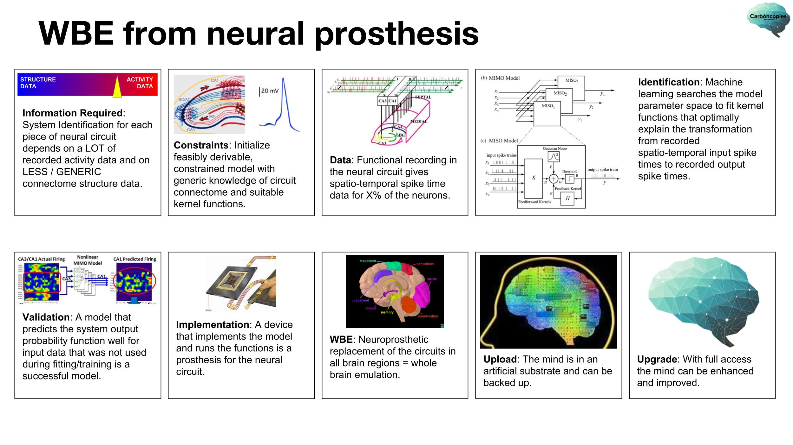
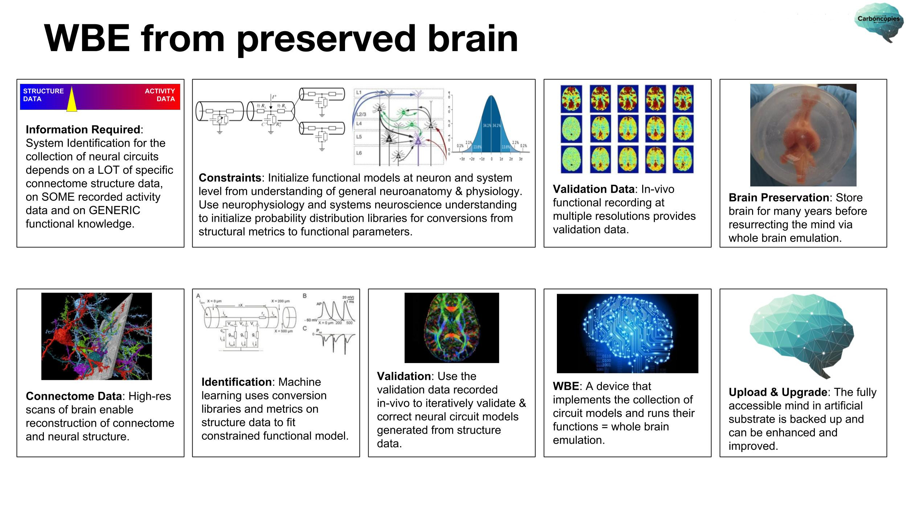

# Your Questions are Welcome!

Don't see your question about whole brain emulation, mind uploading, neural prosthesis, neural interfaces, etc, answered in the FAQ below? Please send us your question at questions@carboncopies.org.

## What is the difference between whole brain emulation and mind uploading?

Mind uploading / uploaded mind: Cognitive processes that switch from taking place in a biological brain to functioning in an engineered, artificial brain. The term is a conceptual description of a possibility.

Whole brain emulation: A technological protocol that may someday be able to reverse-engineer a biological brain in order to functionally emulate neurobiological processes on a different substrate (or "platform"). Emulation will be done in a way that will generate the cognitive experience that was achieved by the original brain.

To learn more, see our blog post on [Whole Brain Emulation](/Blog/Posts/WhatIsWholeBrainEmulation/Post/).

## What does it mean for a mind to be substrate-independent (a SIM)?

Empirical evidence in neuroscience supports the scientific theory that mental experience is generated through the neurobiological mechanisms of the nervous system.

If neural function can be recreated in a different, non-biological substrate while still producing the same meaningful results as in the original implementation, mental experience no longer depends on a single biological substrate. In that sense, the processes of the mind are then substrate-independent. Where the terms substrate-independent are insufficiently precise, we might instead say that the functions are 'portable onto multiple implementation platforms' or 'implementable in multiple operating substrates'.

Other operating substrates could possibly include software or hardware implementations. A software implementation could run on a digital computer, whereas a hardware implementation could be driven by application-specific integrated circuits (ASICs), possibly resulting in an architecture that resembles [neuromorphic](/Blog/Posts/NeuromorphicHardwareDesigns/Post/) chips. Most likely, there are effective implementations that have not yet been conceived of.

The idea that mental functions can be replicated is supported by empirical evidence. Mental functions operate on signal patterns that are generated in all modes of cognitive activity, e.g. by our senses, during memory retrieval, and during goal-oriented or conscious behavior. Targeted manipulations of the biophysical processes in neural tissue produce specific changes in these signal patterns, which in turn lead to specific changes in behavior or experience. The biophysical processes and signal operations can be described in terms of classical physics and expressed as information-processing equations. The resulting set of equations can be carried out in a computational model, which can be implemented in a multitude of ways.

We propose that there is a separation of scales for the functions of the mind. Replacing the implementation substrate is subjectively undetectable and acceptable. The nuanced arguments in this matter involve considerations such as predicting a plausible range of responses for a complex system and allowing for variability below the detection threshold or a chosen threshold (which can allow a multi-scale problem to reduce to a separation of scales problem).

Alternative operating substrates can have advantageous characteristics. For example: for new capabilities, they can greatly simplify direct monitoring of, interaction with, and modification of any aspect of any function of the mind; for reliability and safety, they can facilitate making backup copies of mental state; for improved performance, they can enable increased processing speeds.

## How is SIM related to ideas about mind uploading?

The popular term "mind uploading" is the hypothetical process of copying mental characteristics (functions of mind, including long-term memory and the experience of identity) from a particular brain to some other device where the mind can continue to function. This implies the creation of substrate-independent functions of the mind, a substrate-independent mind (SIM).

In science fiction, the term “mind uploading” is sometimes used in a slightly different context. It is meant to imply that the necessary data for a SIM is obtained from a brain to be stored as a backup, but without the implementation of an artificial brain for the SIM to function.

The detailed process involved in the implementation of a substrate-independent mind onto an artificial brain is called whole brain emulation (WBE). This process spans from data collection to the interpretation of the data as a functional model for the SIM.

## What is whole brain emulation? (WBE)

Whole brain emulation (WBE) is the technical process by which a substrate-independent mind (SIM) is derived from the neurobiology of a brain and expressed as a working model for an artificial brain. It is a reverse-engineering of the brain.

To emulate a whole brain it is necessary to know at least the neural circuit map (also known as the connectome), local dynamic response functions (typically observed through electrophysiology), and local functions governing changes in circuit structure or response functions (“memory”).

The same knowledge (and the associated data acquisition and interpretation) is essential to efforts in fundamental brain research, research and development for clinical neurotechnology, new directions in artificial intelligence, and much more. A number of prominent academic projects are dedicated to whole brain circuit mapping (e.g. the Human Brain Project) and whole brain activity mapping (e.g. the Brain Initiative). In academic parlance, the shorter term “brain emulation” is sometimes used.

## How is neural prosthesis related to whole brain emulation?

The requirements for whole brain emulation are almost identical to the requirements for the creation of accurate and medically useful cognitive neural prosthetic devices, such as the hippocampal neural prosthesis being developed at the University of Southern California.

A highly accurate and patient-specific neural prosthesis could be called a partial brain emulation, and a whole brain emulation could be called a full-brain neural prosthesis or a complete collection of patient-specific neural prostheses.

When a neural prosthesis is not patient-specific to a significant degree, such as a retinal prosthesis that the visual system learns to use, there are still many domains of research and development that overlap with those for whole brain emulation - although the relationship is less direct.

## How can mind uploading via whole brain emulation be accomplished?

At present, two primary conceptual approaches have been proposed:

1. WBE from neural prosthesis: Gradually replace each small piece of a brain with a highly accurate patient-specific neuroprosthetic device until every part of that brain has been replaced, at which point the entire brain (possibly still residing within the skull) is artificial.
2. WBE from preserved brain: Carefully preserve a biological brain, cut it into many extremely small sections, analyze each section and use the information obtained to reconstruct a working artificial brain.

The same two approaches are presented as a series of successive steps in the following diagram panels:

## Is it even possible to store brain information in order to transfer it?

Yes. Any information can be stored. Information is information is information. [Claude Shannon](https://en.wikipedia.org/wiki/Claude_Shannon) and contemporary scientists demonstrated that and many ancillary insights around 1948. Furthermore, practical storage and transfer of brain information in various quantities, at various sample rates, in various forms (e.g. brain activity, brain structure, brain physiology) and from various locations in the brain have been demonstrated many times in neuroscience and neuromedicine. Some examples include studies on brain-computer interfaces, brain scans in neurology (such as fMRI), interpretation of brain activity (work by [Jack Gallant](https://gallantlab.org/) and others), brain mapping in connectomics, [neuroprosthetics](https://en.wikipedia.org/wiki/Hippocampal_prosthesis), and many more.

 

Information storage is not particularly difficult. The main challenges are:

1. Taking the necessary accurate measurements (data acquisition from a brain).

2. Reconstructing artificial brain functions based on and fine-tuned in accordance with those measurements.

 

To understand this more easily, consider a simpler, visualizable example. Let’s assume that you wish to create a correct and working “upload” of a watch:

- You have at your disposal the computers of today and other scientific technology.
    If you can open up the watch and take careful measurements of its components, you could take all of the data and create a piece of software on a computer to emulate each of those components.
- You could tune this model using the data you collected and carry out tests to ensure that the resulting software runs, producing exactly the same output as the watch. It should tell time with the same precision (or imprecision), and it should respond the same way to presses of the buttons.

As you can see in that example, storing data is not a problem. The challenges you need to overcome are to make the necessary measurements and to construct the emulation of the watch to the specifications of that data.

# WOULD IT BE POSSIBLE TO CREATE A GENETIC TWIN (CLONE) OF A HUMAN BEING AND THEN TO UPLOAD THE MIND OF THAT HUMAN BEING INTO THE NEW PHYSICAL TWIN?

Creating a genetic clone appears to be [technologically possible](https://en.wikipedia.org/wiki/Human_cloning) today. Uploading a human mind into such a clone is not yet possible.

Setting aside all of the other challenges to mind uploading, no technology exists with which a biological brain could be forced to “rewire” its connectome into the patterns of the neural circuitry that produces another mind. In other words, there is no known way to force a cloned brain to transform into the equivalent of another brain, such as the brain of the person who provided the genetic material for cloning.

Converting from the (digital) data for an uploaded mind to an implementation of that whole brain emulation in a new biological substrate would require additional technological development. The development of this technology is not, at present, a focus area for the Carboncopies Foundation. Primarily, this is because the challenges of data acquisition and whole brain emulation are already quite formidable. Secondly, there is no evidence that mapping back to a biological brain is necessary to achieve successful mind uploading. 

# IS CARBONCOPIES ASSOCIATED WITH TRANSHUMANISM?

The Carboncopies Foundation is, at its heart, an academic organization. We are concerned with scientific research and development in the field of whole brain emulation. Carboncopies is not associated with transhumanism, and we do not speak for the transhumanist movement. Although some members adhere to transhumanist philosophy, it is not a definitive feature of our organization.

# WILL WHOLE BRAIN EMULATION INCORPORATE HORMONES OR NEUROTRANSMITTERS? IF SO, HOW WILL THIS BE POSSIBLE?

Although we do not yet know what level of detail will be required for successful whole brain emulation, it would certainly be possible to emulate the effects of neurotransmitters or hormones. Since neurochemicals can modulate the membrane potential or firing rate of neurons, they could be included as additional values in synapse models.

# IN A FUTURE WITH MIND UPLOADING, COULD I HAVE A BODY OTHER THAN HUMAN?

Mind uploading to a different type of body would be possible in principle. A change in embodiment would likely require adjustment and learning.

Imagine if your brain, with all of its present experiences, was transferred into a robot body that was not morphologically identical to your present body. You would not be accustomed to this embodiment. A range of automatic translations might be implemented so that you retain normal bodily sensations and motor control. It is likely that a new embodiment would require a period of adjustment in a similar manner to an individual receiving a new prosthetic leg.

Embodiments frequently considered for mind uploading include, but are certainly not limited to:

- A human body cloned from your original DNA.
- A robotic body of a humanoid form.
- A robotic body of a distinctly non-humanoid form, e.g. 'being' a spaceship or a robot 'swarm'.
- A virtual body in a virtual reality.

Many other embodiments are theoretically possible. Human beings already have the ability to learn and to adjust to feeling comfortable in a wide range of body extensions. Consider how natural it may feel for a sufficiently experienced driver to drive a car, to sense the boundaries of the vehicle. A seasoned kayaker may perceive their kayak as a body of sorts, and a skier may feel skies as a similar extension. Those with mirror-touch synesthesia have expansive bodily representations: their sense of touch and proprioception expands to encompass the individuals in their visual fields. For some, this extended body schema includes animals and inanimate objects as well as humans. 

# HOW CAN I VOLUNTEER TO HELP MAKE WHOLE BRAIN EMULATION AND MIND UPLOADING A REALITY?

Our team is always welcoming enthusiastic and dedicated volunteers. This is where you can shine! Our volunteers are the life of the Foundation, the driving force behind our growth and the acceleration of our activities that in turn accelerate progress towards a future with whole brain emulation.

Please visit our [Openings](/Join) page! Thank you for donating your valuable time!

# IS THERE A WAY I CAN VOLUNTEER FOR EXPERIMENTAL STUDIES OR CLINICAL TRIALS THAT HELP BRING ABOUT WHOLE BRAIN EMULATION AND MIND UPLOADING?

By law, the process of soliciting volunteer patients and engaging those patients in medical experimental studies or clinical research trials is very tightly controlled by government regulations and ethics boards. Researchers and medical professionals can conduct those experiments only within the clearly described protocols of an approved clinical study or trial and will publish a call for volunteers or directly reach out to patients when such a study is underway.

If you are interested in such studies and trials you can find published advertisements on university websites and in medical journals. You can also find clinical trials at: https://clinicaltrials.gov/ct2/search/index

When there are studies or clinical trials that relate closely to the goals of the Carboncopies Foundation, or when there are studies or trials that the Carboncopies Foundation is directly involved in, we will publish all the details on our website at carboncopies.org

# HOW MUCH WILL IT COST TO ACHIEVE WHOLE BRAIN EMULATION AND TO MAKE MIND UPLOADING AN OPTION FOR ALL?

The total cost is very hard to estimate. To know how much something costs, we need to know exactly what needs to be done in terms of resources and labor.

Much of the work on whole brain emulation involves scientific research. The outcomes of future experiments are unknown, and more research is required to determine how exactly WBE will be executed.

Instead of looking at it as an engineering project (like building a bridge), look at it as a medical science program (for example, a program that aims to understand and cure various forms of cancer). The first mind uploads will be of small animals. At some later point, human volunteers will have their minds uploaded in a controlled medical research trial. Ultimately, there will be a cautious, gradual process for mind uploading. This process and its outcomes will get better over time. When it is fully developed, the procedure will also become cheaper.

Based on the costs of other medical science programs, it is possible that the total costs involved will be in the range of multiple billions of dollars.

This would be the cost of fully developing whole brain emulation as a widely accessible technology - at this point, patients could emulate their brains as a routine option of medical care. The expenses of the Carboncopies Foundation are much more modest. Our mission is to educate, to connect researchers in new projects, and to curate the roadmap towards WBE. We are run as a volunteer supported non-profit.