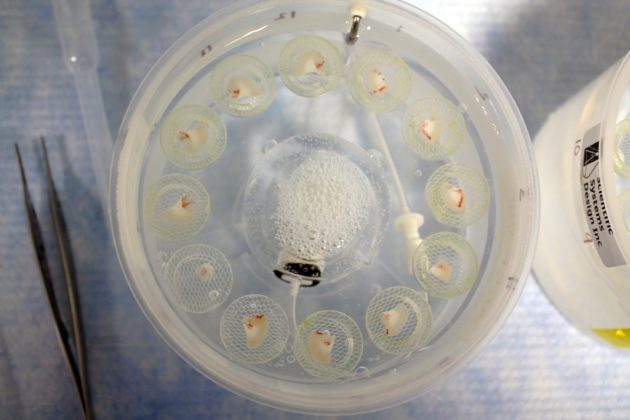

# How Pieces of Live Human Brain are Helping Scientists Map Nerve Cells
## A summary of the article by Laura Sanders reporting on the experimental project by Nick Dee

When you think of how scientists study a piece of brain tissue it is easy to imagine them pulling a pale green mass out of an old jar of formaldehyde. This picture, however, is far from the kind of experiments being undertaken at the Allen Institute for Brain Science. Nick Dee, and his team of neuroscientists, are experimenting with recently extracted brain samples still containing living cells. Studying these living brain cells is useful for understanding the cell's connections with one another. The goal for Nick and his team is to determine all kinds of neurons in a human brain as well as mapping how the cells communicate with each other.

In this article, the author observed the team experimenting with brain samples recently taken form a 41-year old woman. The piece of brain removed was targeted to be causing her severe seizures. The samples of living tissue must be taken quickly to the lab to be sliced. The samples are then put under several microscopes to look for the healthiest cells efficient for the experiments.

The first experiments involved observing the cell's behavior. Using a technique called patch-clamp a thin glass tube is latched on to selected neurons. These neurons can be given an artificial message via an electric current. The goal of this experiment is to see how the cells communicate with other cells. With a multi-station rig, with several neurons latched onto it, the neuron signals can be monitored while the electrostatic artificial signals are injected into several locations of the brain slice. The neurons that react when other neurons are given an electric pulse offer evidence that those correlating neurons communicated with each other while still inside the patient's head. During this experiment the cell shapes are mapped using dye.

Following this procedure, the nuclei from the experimented neurons are extracted. Every nucleus reveals which genes were active in the living cells just before the nuclei were extracted. These experiments have revealed appearances of rare cells that researchers believe are associated with Alzheimer's disease and psychiatric conditions called Economo neurons.

The live cell studies also observed notable differences with humans and mice. For instance, humans have a neuron called an h-channel neuron which is covered with a protein. These channels help cells respond to electrical signals. They can be affected by drugs, such as drugs for epilepsy, and could potentially be a significant building block for human high-level cognitive functions.

Documenting all of these live neuron experiments may lead to an understanding of why certain individuals suffer from certain disorders.

An important observation is that the overall number of cell types in a human cortex is very similar to that of a mouse cortex. Given this understanding, the answer for why humans are so smart, compared to animals like mice, must be something other than humans having many specialized neurons. The answer may be just the few rare neurons, such as the Economo neurons, or neuron types yet to be discovered. Other neuroscientists think our intellect may be due to cells that aren't even neurons at all such as glial cells.

The proceeding experiments on the samples, conducted weeks or months later, involve delivering genes to the live cells. Some cell samples used for this experiment are able to survive for several months. Viruses deliver the genes to the cells. These genes are responsible for making certain groups of cells glow to make them easier to study and experiment with changing their behavior. Experiments like these may lead to ways to possibilities in controlling curtain cell behavior such as the effect of Economo genes. Furthermore, these observations can also provide insight into how information flows through cells.

With living cell experiments the scientific understanding of brain function is greatly expanding. Understanding the uniqueness of the human mind is essential for constructing a complete neural network map and ultimately modeling that network. While brain samples with living cells are rare, they may hold answers to solving questions in neuroscience that non-living brain samples simply cannot.

Research projects like this one by Nick are the fundamental steps being taken to completing the goals for connectomics. Connectomics is one crucial part of Whole Brain Emulation in which completing a map of the neuron communications, as well as understanding the physical domains of consciousness, will be the base for modeling a human brain in an artificial substrate. The Carboncopies Foundation promotes this type of research.

For more information see the article in Science News: [How Pieces of Live Human Brain are Helping Scientists Map Nerve Cells](https://www.sciencenews.org/article/experiment-live-human-brain-helps-scientists-map-nerve-cells?tgt=nr)