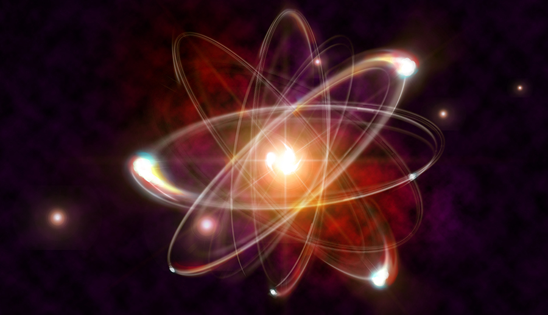

# Quantum Mechanics and Higher Brain Functions
## A review of the article by Christof Koch and Klaus Hepp

At some point in your life you may find yourself pondering your individual relevance to the world around you. You may start to question whether your disposition was a result of bad decision making, or if fate simply delt it's hand for you. You think about it until you get to the point where you're wondering if any choices you've made were a result of your own free will, or if they were all simply predetermined by the laws of physics; namely, every action produces only one other possible reaction.

Some scientists like to believe that if your brain has the properties of exhibiting quantum mechanical functions, then free will might actually be a real thing and we're not just slaves to causality. This research article, The relation between quantum mechanics and higher brain functions: Lessons from quantum computation and neurobiology, by Christof Koch and Klaus Hepp, outlines arguments against the proposition that the brain exhibits properties of quantum mechanical physics that effect the consciousness.

So, what are Quantum Mechanics? Well, in short, it claims that not everything in the universe is causally determined by the logical sense of physics as we can understand them. In classical physics, every action has an equal and opposite reaction and every action can only produce one possible reaction based on mathematically observable universal laws. In quantum mechanics, when you get down to a subatomic scale and examine the movements of subatomic particles, specifically photons, they may not follow such classical physical laws. In the realm of quantum mechanics, the movement of photons are not causally determined by the same kind of physical laws that we are accustomed to, but rather, can move in several possible directions with no cause that can be logically understood. One such phenomenon example is how light has the property to act as both a wave and a particle.

So, what are Higher Brain Functions? Higher brain functions are the functions of the brain that have complex operations that are more "self-directed" by the organism. In a human, good examples would be memory retrieval and self-awareness. In contrast, lower brain functions would be something more automatic like heart regulation or the sense of touch.

Okay, then how do these two subjects tie in together? If it is possible for subatomic particles to not be causally determined, and if the higher brain functions taking place within us operate on causes made by quantum mechanical reactions, then that could mean that our higher brain functions also are not causally determined by physical laws. This characteristic would imply that our minds are not just slaves to the never-ending cycle of action-reaction physical movements that all matter in the universe is subjected to, but rather we might actually be determining agents to the outcomes of our own lives.

Now, you might be thinking, "Well, yes, it would be great if we had some kind of free will, and that our minds are not just slaves to the laws of physics; but trying to claim that quantum mechanics is the divine source of our ability to have minds of our own seems like a desperate attempt to escape the idea that we are all just prisoners of fate." That could very well be the reason that most scientists disagree with the notion. If you're trying to find some comfort in the idea that you're just a slave to your brain's molecules with predetermined physical movements, then you may be interested in philosophical research on meaning and identity. This article, however, sticks with science and experimentation to provide arguments against the notion of quantum mechanics determining higher brain function.

The arguments in this article all involve the primary issue of the boundary between quantum mechanics and classical mechanics. There is an issue when trying to link a path from consciousness perception to quantum mechanics to physical reactions. This is because quantum mechanics cannot be operated on by an input of the classical physical sense.

Higher brain functions are understood by classical physics as a microscopically complex process of billions of firing over the cortex. Each having multiple synapses made of about a thousand different kinds of proteins. A single conscious thought involves an entire network of neurons all firing together.

This article concludes by stating that the classical interpretation of higher brain functions remains the superior scientific field, however, it is stressed that the boarder between actual quantum mechanics and classical mechanics in the subatomic scale of the brain still needs to be researched. The article ends with a comforting perspective, "To be conscious means to tell to oneself stories which allows us to function better in reality. Dysfunctions in the representation of the self lead to major psychiatric diseases. To understand one’s self will help others," (Koch and Hepp, 2007).

 

For further interest, please check out the article here:

[The relation between quantum mechanics and higher brain functions: Lessons from quantum computation and neurobiology](http://www.theswartzfoundation.org/papers/caltech/koch-hepp-07-final.pdf)

 

If you're interested in research on identity and meaning please check out these suggestions:

[On Identity: from a philosophical point of view](https://www.ncbi.nlm.nih.gov/pmc/articles/PMC3751052/) by Daniel Sollberger posted on the US National Library of Medicine National Institutes of Health

[Neural and Behavioral Evidence for the Role of Mental Simulation in Meaning of Life](https://www.ncbi.nlm.nih.gov/pmc/articles/PMC4480924/) by Adam Waytz, Hal E. Hershfield, and Diana I Tamir posted on the US National Library of Medicine National Institutes of Health
