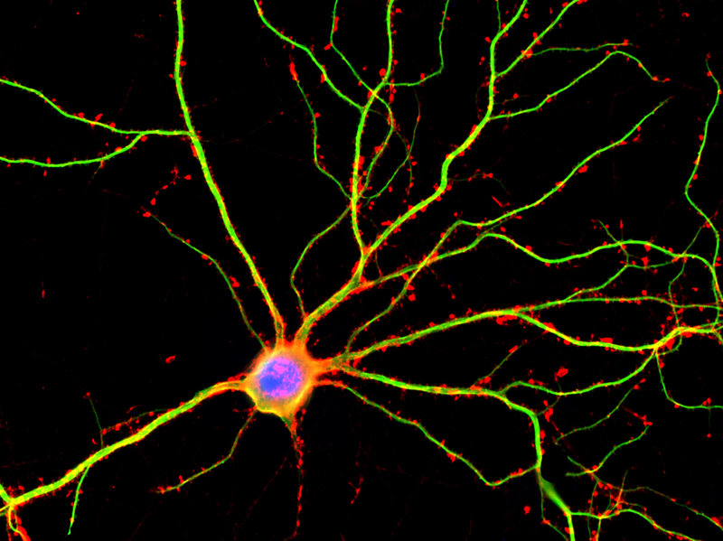

# Single Neuron Dynamics and Computation
## An Article Review on Research in Neuron Plasticity and Dendritic Arbor Anatomy by Brunel, Hakim, and Richardson

When looking at the inner workings of the brain at its most basic component, the neuron, forms the basis of the brain’s ability to send signals from one location to another.

Neurons generate the electrostatic spike that signifies neural activity.

Most people are familiar with the neuron being compared to a basic input-output signal, like an on-off switch.

More recent additions to the study of neuron dynamics, however, shed some light on how the neuron is actually more complex in that neurons need to be able to adapt the way they receive and send electrostatic signals based on different rates and magnitudes of input signals as well as the spatial properties of the signal path.

The cycle of a neuron making a spike is that the signal to the neuron is made interpretable by the temporal filter. This filter makes the information received into a linear stream of data. this information is then used by the neuron to generate the spike firing rate which releases the spike signal as a non-linear stream of information to be sent to a receiving neuron.

The point here is that not all input signals are the same. Each stage of the signal interpretation has to compensate for variances in signal strengths and rates. The output desired from a neuron is one that is linear and stable.

Neurons also have to deal with the issue of noise. Noise is the electrostatic surrounding influences apart from the main electrostatic signal. Much like trying to listen to a radio with lots of static, the neurons in the brain (specifically the kernels) need to be able to reduce the influence from electrostatic signals that are not part of the signal trying to get information from one neuron to another.

Neurons balance input signals by generating electrostatic signals to balance the amplitude rate of signals taken as input. The take away point from this part is that neurons can naturally modify their composition to optimize the information that they are receiving based on noise level and input strength. More variances come into play when differing signals are taken by dendrites (complex neuron structures for complex signal processing).

Synapses (gaps between neurons) can have characteristics that produce slow signals (100s of milliseconds) or fast signals (10s of milliseconds) based on historical properties of the synapse. This is the topic of short-term plasticity. For a synapse with depleted neurotransmitter vesicles the signal strength will be slower and for synapses with high amounts of trigger releasing abilities will produce faster signals.

Where this helps the signal balancing is by countering the high or low input signals by altering the synapse firing rate controlled by the amount of neurotransmitter vesicles. This is synaptic filtering.

As shown, neurons have plasticity characteristics that help them generate the signals based on the electrostatic environments that the neuron is subjected to.

Simulating neuron plasticity will require treating neurons as more than just basic binary transmitters.

To read the article, please follow this link: [Single Neuron Dynamics and Computation](http://www.lps.ens.fr/~hakim/14coin.pdf)
