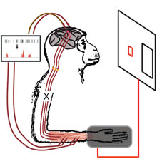

# Experimental Enhancement of Neurophysiological Function
## A summary of an opinion article by Diana Deca and Randal Koene

Enhancing brain function has long been a desirable goal by neuroscientists and trans-humanists alike. Experimental procedures using drugs, sensorimotor stimulants, and neural prostheses have shown practical results demonstrating how neural activity can be stimulated directly through influences outside a test subject's brain.

Animal studies have shown that  stimulation methods using optical and electrical signals can enhance learning speed. Micro-stimulation of a monkey's frontal eye lids can induce eye fixation. Saccadic eye movement has been determined as a visual prosthetic for neuronal activity. Inhibition of the eye movements using stimulation improved learning capabilities in the test subjects. This kind of neuromodulation via optogenetics is now a common method in animal studies of neural function manipulation.

Microstimulation of the neurons, instead of sensory stimulation, was also able to show improvements in learning capabilities. Electrical input can replace sensory input when applied directly to the neuronal network using electrodes. Electrical stimulation via electrodes in non-human primate studies was able to direct visual attention when FEF neurons were stimulated.. The effects of chronic self-stimulation through electrode activation were first demonstrated in  an experiment in which rats would pull a lever for drugs that interfere with their dopaminergic system.

The ability to control prosthetic limbs has been tested in human and non-human primates using an understanding of motor control coding and cortical mapping. Implantable devices with multi-site neural interfaces can deliver electrical signals that control other devices such as a computer cursor, television remote control, and a prosthetic hand. The next phase for this kind of testing will apply neural interfaces to higher cognitive functions to control more dynamic machine operations such as an entire prosthetic arm.

Neuroprosthetics have been developed to support memory encoding. The prosthesis was tested in rodent hippocampus and achieved enhanced memory performance. Similarly, application of the prosthetic model hippocampus to support input and output coding in hippocampal regions of non-human primates also showed improved memory and consequent improved performance in a decision task.. This procedure is currently being tested using volunteer human patients. Other prosthetic experiments include restoring motor function, emulating circuit function in the cerebellum, and retention of the eye-blink reflex in a rat subject.

Exploring the neural enhancement techniques described above provides important insight to methods for the analysis of the brain’s connectome and neural circuit function. The underlying neural mechanisms for neural stimulation are still unknown. Control of specific functions is obtainable through microstimulation and optogenetics. Neural prostheses and implants provide data that show neurophysiological substrate causality with learning and decision making. With these methods there are explanations for how neural enhancement may be possible through external sources..

To explore more advanced features of neural circuit function and the underlying mechanisms, small animal subjects (e.g. the fruit-fly dosophila, the honey bee, etc) will be tested using these same procedures. Because of these subject's more simplified connectomics, observing the underlying neural mechanisms will be easier. With greater understanding of the neural mechanisms, there will be greater potential to enhance the neural functions of primates (and humans).

For more information, please read the original article on the site of the academic journal Frontiers in Systems Neuroscience: [Experimental Enhancement of Neurophysiological Function](https://www.frontiersin.org/articles/10.3389/fnsys.2014.00189/full)