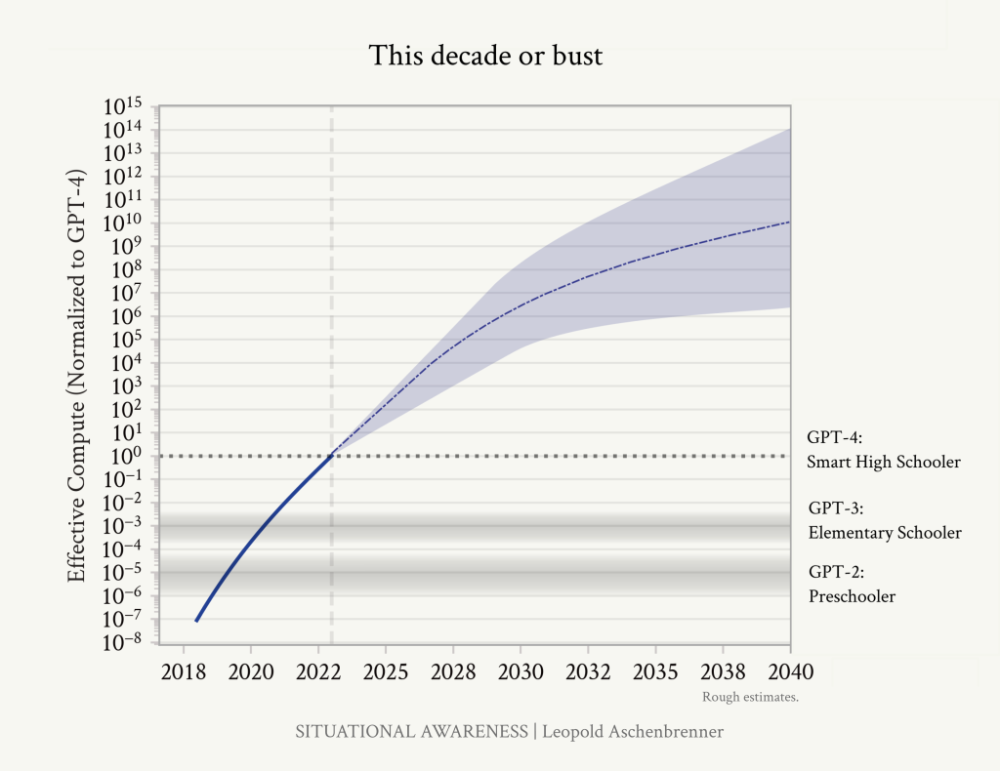
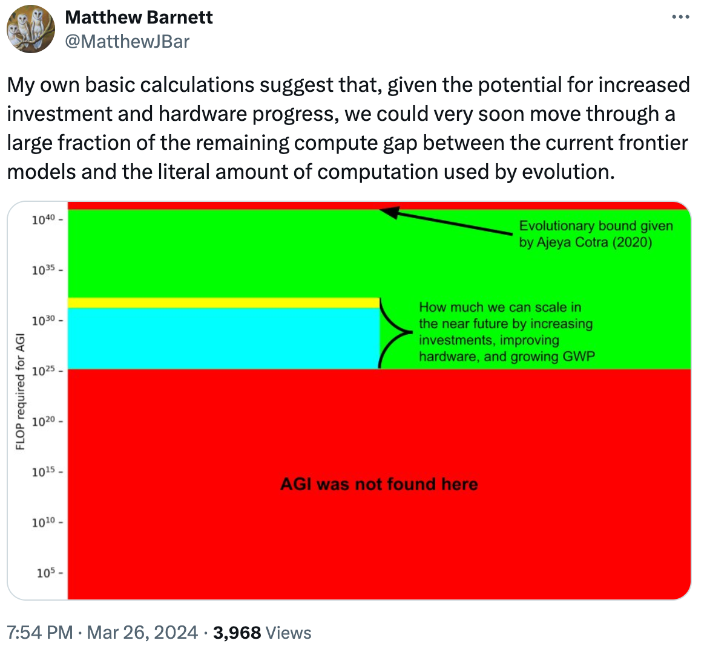

# A reason to hedge on whole-brain emulation for AGI
## Randal A. Koene, June 2024

The following is nothing but a simple argument based on one of the significant insights explained in the Addendum to the essay *“I. From GPT-4 to AGI: Counting the OOMs”* (OOM stands for “orders of magnitude”) in the series [SITUATIONAL AWARENESS](https://situational-awareness.ai/) The Decade Ahead, by Leopold Aschenbrenner (2024). For context, here is a reprint of the Addendum:

!!! quote
	**Addendum. Racing through the OOMs: It’s this decade or bust**

	I used to be more skeptical of short timelines to AGI. One reason is that it seemed unreasonable to privilege this decade, concentrating so much AGI-probability-mass on it (it seemed like a classic fallacy to think “oh we’re so special”). I thought we should be uncertain about what it takes to get AGI, which should lead to a much more “smeared-out” probability distribution over when we might get AGI.

	However, I’ve changed my mind: critically, our uncertainty over what it takes to get AGI should be over OOMs (of effective compute), rather than over years.

	We’re racing through the OOMs this decade. Even at its bygone heyday, Moore’s law was only 1–1.5 OOMs/decade. I estimate that we will do ~5 OOMs in 4 years, and over ~10 this decade overall.

	  

	*We’ve been racing through the OOMs this decade; after the early 2030s, we will face a slow slog.*

	In essence, we’re in the middle of a huge scaleup reaping one-time gains this decade, and progress through the OOMs will be multiples slower  thereafter. If this scaleup doesn’t get us to AGI in the next 5-10 years, it might be a long way out.

	- *Spending scaleup*: Spending a million dollars on a model used to be outrageous; by the end of the decade, we will likely have [$100B or $1T clusters](https://situational-awareness.ai/racing-to-the-trillion-dollar-cluster/). Going much higher than that will be hard; that’s already basically the feasible limit (both in terms of what big business can afford, and even just as a fraction of GDP). Thereafter all we have is glacial 2%/year trend real GDP growth to increase this.

	- *Hardware gains*: AI hardware has been improving much more quickly than Moore’s law. That’s because we’ve been specializing chips for AI workloads. For example, we’ve gone from CPUs to GPUs; adapted chips for Transformers; and we’ve gone down to much lower precision number formats, from fp64/fp32 for traditional supercomputing to fp8 on H100s. These are large gains, but by the end of the decade we’ll likely have totally-specialized AI-specific chips, without much further beyond-Moore’s law gains possible.

	- *Algorithmic progress*: In the coming decade, AI labs will invest tens of billions in algorithmic R&D, and all the smartest people in the world will be working on this; from tiny efficiencies to new paradigms, we’ll be picking lots of the low-hanging fruit. We probably won’t reach any sort of hard limit (though “unhobblings” are likely finite), but at the very least the pace of improvements should slow down, as the rapid growth (in $ and human capital investments) necessarily slows down (e.g., most of the smart STEM talent will already be working on AI). (That said, this is the most uncertain to predict, and the source of most of the uncertainty on the OOMs in the 2030s on the plot above.)

	Put together, this means we are racing through many more OOMs in the next decade than we might in multiple decades thereafter. Maybe it’s enough—and we get AGI soon—or we might be in for a long, slow slog. You and I can reasonably disagree on the *median* time to AGI, depending on how hard we think achieving AGI will be—but given how we’re racing through the OOMs right now, certainly your *modal* AGI year should sometime later this decade or so.

	  
	
	*Matthew Barnett has a [nice related visualization](https://x.com/MatthewJBar/status/1772819342511820995) of this, considering just compute and biological bounds.*

The Addendum does not spend a lot of time expounding on the *“or bust”* portion of the argument, but that part deserves equal attention.

The principal argument of this Addendum is fairly easy to understand: If AGI / superintelligence is not achieved by the time compute clusters have reached the $100 billion to $1 trillion cost level then achieving AGI essentially through this form of scale-up is unlikely to be cost effective (compared, for example, with hiring actual researchers instead of AGI-based researchers to do research work).

If that is the scenario that plays out then the **development of AGI will depend on other factors, such as discovering and utilizing new system and algorithm insights**, insights that may very well have to come from **the human brain**.

Whether the scenario described in the Addendum plays out or not will be apparent within a few years. **Consequently, for anyone who wishes to hedge their bets for the next decade, working on whole-brain emulation and the insights that come from that now makes a lot of sense.**

But why **whole**-brain **emulation** and not just neuroscience in general?

In this context, think of ‘whole-brain” as pointing out the importance of understanding how algorithms utilized by different parts of the brain are used in concert to achieve things that would not be possible with a single algorithm, even if that algorithm was super-charged with compute power. Don’t focus on the “deep” learning architecture of just the prefrontal cortex. Don’t focus on the way features are combined from simple-cells to complex-cells in visual cortex. Don’t focus on the way auto-associative and hetero-associative networks are combined in entorhinal and hippocampal regions for one-shot acquisition and filtering of new episodic memory. Instead, make sure to consider the cooperation between strategies.

And emulate actual circuitry at the level of detail obtained by high-resolution scans of specimen-specific brain tissue, in order to move away from purely correlational ways to make model hypotheses about brain function and towards causative circuit-level correspondence \[[see Jonas & Kording, 2017](https://journals.plos.org/ploscompbiol/article?id=10.1371/journal.pcbi.1005268)\] that can be validated, where a single thought process depending on specific learned patterns can be followed from beginning to end.
