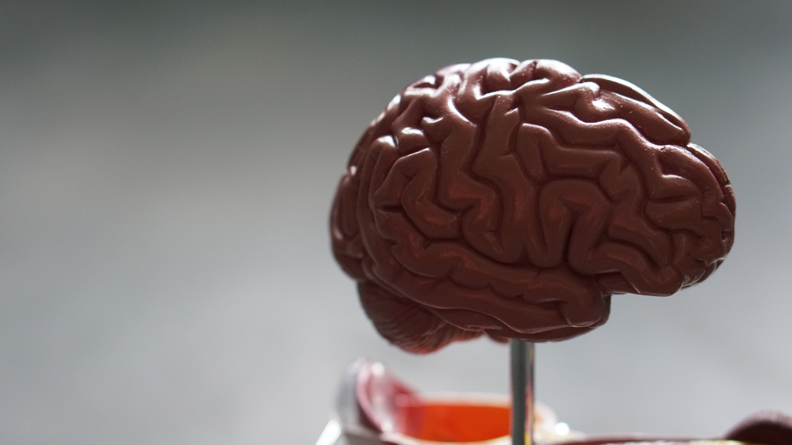

# The Neural Archives Foundation

## A Recognition to a Fellow Organization

For those who's interests have been captured by the exiting possibilities that the future of whole brain emulation has to offer, it may be no surprise that other organizations with related objectives have sprung to life in various places of the world. One such organization is helping the cause for brain preservation research by offering the public a cryogenic brain preservation service.

Founded in 2005 the Neural Archives Foundation was a response to an increasing demand for brain simulation research. Philip Rhoades and James Newton-Thomas saw value in a non-profit organization that could help people have their neural tissue to be preserved in such a way that all of the brains information that defines an individual's consciousness remains intact. Having a storage of preserved minds like this would boost reason and cause for the advancement technological means to revive the brain's consciousnesses.

Cryonics involves taking the brains of those recently deceased and preserving them in temperatures below -130 °C. The brain cells are dehydrated and compressed without losing the connections between cells necessary for brain function. When the means for achieving the revival of the preserved brains comes to fruition, the information in the brain, as designated as the individual's identity, can be uploaded and preserved onto an artificial substrate.

This method of mind uploading from a deceased brain is referred to as the post-mortem method. This is in contrast to gradual replacement mind uploading in which the brain of a living patient is gradually embedded with artificial prosthesis by which the organic tissue and artificial substrate devices communicate and function symbiotically until the organic tissue is no longer needed to complete the entire brain's functionality.

Patients who participate in this procedure by preserving their brains have high hopes that they will indeed wake up again.

The Neural Archives Foundation is based in Cowra, Australia. Their associated storage facilities are also in Australia, but for security reasons there are no further details given. For donors who wish to participate, the cost for the services provided by the storage facilities is about $30,000 in Australian currency which is the rate for storing human tissue indefinitely. The property rights of the rest of the body of the donating patient are given to the next of kin.

The Neural Archives Foundation guarantees that no experimentation will be conducted on the donor's tissue and they will guarantee the tissue will not be sold, which Australian law also upholds. They may perform an autopsy on the patient if it is in the public interest to do so.

As a non-profit organization, the NAF is also accepting donations as a means towards their cause for promoting the preservation of human brains. Their contact information is provided below.

Phone: +61 2 6342 2918 (Leave a message)

Mail:

    NAF
    PO Box 896
    Cowra NSW 2794
    Australia

Sources: http://neuralarchivesfoundation.org/ (The Neural Archives Foundation Home Page)
