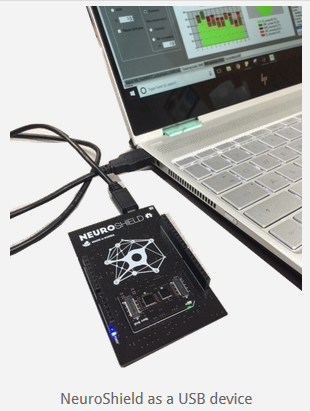

**Abolfazl Alipour**

## Historical Backgrounds

The brain is a fascinating mystery, 3 pounds of organic material that can generate consciousness, think about the origins of the cosmos, and even think about its own thinking. Making machines that can work and behave like brains is an old dream for humanity that has yet to be achieved. With the advent of computers in the 20th century, scientists started to think about the similarities and differences between brains and computers. On one hand, brains are similar to computers; they are connected to a set of sensors —our sensory organs— and process electrical signals generated by those sensors to guide our behavior by sending electrical signals to our motor organs, the same way computers process information and display outputs on the screen. On the other hand, computers do not process their sensory information the way brains do. For example, as you are reading this text, each of your eyes compresses the information through one million “streaming lines” in parallel and sends them to your visual cortex at the back of your brain. Once in your visual cortex, information is distributed and undergoes simultaneous processing in your brain to form concepts and meanings. This is different from conventional computers where information is queued in one/a few streams to be processed by one/a few central cores without being distributed across nodes. This distinction is one of several differences between brains and computers that help brains to be good at generating concepts, associations, logical relationships, etc. and computers to be good at multiplying two six digit numbers in a split second. Accordingly, scientists started to design chips and computer hardware based on our knowledge of how brains work and this approach is called the “neuromorphic engineering” [1].

Early attempts to build neuromorphic chips date back to late ’80s [2] but the first large-scale implementations only came in late 2000s [3]. Here, we will review major driving forces behind their development, major neuromorphic hardware designs and the latest technologies. At the end, we will discuss the implications of this field of research for whole brain emulation.

**Driving forces behind development of neuromorphic chips: **

## A. Necessity of power efficient brain simulators

A highly detailed simulation of the entire brain, down to the gene expression level,  needs processing power on the order of [an exaflop](https://www.nature.com/news/computer-modelling-brain-in-a-box-1.10066) (1018 operations per second) [4] which is approximately a billion average home computers running atonce and consuming the electricity of millions of households. However, best of the current supercomputers -as of November 2018- use 1 gigawatts of power to deliver the required computational power for such simulation [5] which is almost equal to output of a nuclear power plant. On the other hand, the brain only uses ~20 watts to operate [6]. Therefore, best current supercomputer uses 100 million times more power to deliver a the computational capability for detailed whole brain simulation. Accordingly, supercomputers might not be the optimal power efficient platforms for large-scale brain simulations.

Meanwhile, other scientific fields addressed a similar problem through the development of Application Specific Integrated Circuits ([ASIC](https://en.wikipedia.org/wiki/Application-specific_integrated_circuit)s). For example, Jun Makino in 2003 designed and built an application specific computer (GRAPE-6) to simulate gravitational forces between galaxies delivering the same amount of computation  (1 TFLOPs) at 1/16 the cost of a blue gene supercomputer [7].

But what is an ASIC? To understand them, we will need to define a few terms and their differences:

1. What is an IC?   IC just means integrated circuit. All different chips that we discuss in here are ICS (ASICs are ICs, FPGAs are ICs, neurmorphic chips are ICs, microprocessors are ICs.)
1. What are microcontrollers/ Microprocessors? Microprocessors typically contain one or more processing cores (arithmetic unit, program decoder, memory addressing unit, etc) and they fetch instructions and data and execute those (Von Neumann style), for example, Intel’s core i7 CPUs are microprocessors. Microcontrollers, however, contain a CPU plus RAM, ROM, and other peripheral parts on an IC, they are basically super small computers on an IC.
1. What are ASICs, exactly? These are Application Specific ICs. They can contain compute cores (that's where the line gets fuzzy), but they often just contain a bunch of highly specific digital circuits that operate without a program (the program is baked in). Sometimes ASICs can even be analog and not digital!
1. What is a FPGA? FPGAs are Field Programmable Gate Arrays. The arrays of gates are used to construct circuits, and those circuits can be reconfigured when the chip is 'flashed' and programmed 'in the field'. The need to work with a vast array of identical resources to build circuits means a little more overhead and wastage, so they are typically not quite as optimized, fast and energy efficient as microprocessors or ASICs. But they are extremely flexible and great for prototyping designs that you later bake into an ASIC (or microprocessor).
1. What is a neuromorphic IC? An IC design that focuses on using a circuit layout that emphasizes a high degree of parallelism, similar to a neural net (as in software code). The design is sometimes baked in (it is an ASIC) and sometimes it is prototyped (it is an FPGA). For example, you can get the [NM500](http://www.theneuromorphic.com/support-welcome/) (a neuromorphic IC) as either an ASIC or as a software .zip file that you use to set up a common FPGA.

Therefore, Application Specific Integrated Circuits (ASICs) seemed like intriguing solutions for implementation of neural simulations since they reduce power consumption and increase processing speed. They reduce power consumption because IC of an ASIC will contain circuits optimized for a specific set of functions, minimizing the number of steps (delay) and transistors involved (power) while carrying out the intended system operations. This has many advantages. We don't need to send any power to circuits that may be left in some sort of 'wait' cycle. We also don't need to 'simulate' the circuit operation you're trying to do by moving data into temporary buffers (registers), sending groups of them to an arithmetic unit in turn, storing temporary results, looking for results that were stored and that should be combined with this one (e.g. when input to neurons converges), carrying out another arithmetic process with more buffering of input data and temporary results to determine if a threshold was crossed, etc. Instead, we have independent pieces of circuitry that receive and operate on different parallel paths of input and that immediately (and actually) converge on another circuit that detects if a threshold is exceeded, etc. Thus, we don't need piles of complex machinery to build a high end CPU, memory, etc. Instead, we can dedicate the IC surface to doing a lot of simple things fast in parallel with minimal circuit designs. Ultimately, all of that means that the power-per-operation in an ASIC is much lower than in a general purpose CPU based system.

In other words, speed will tend to go up for 2 reasons: (1) We are actually carrying out more simple operations truly in parallel (not in turns). (2) Lower power consumption means less heat per operation, which means you can afford to raise the processing speed (clock speed) without destroying the chip.

## B. An opportunity for development of new computer architectures

Consequently, researchers started to simulate neural networks on ASICs from early 1990s (see[14-17] for examples). These chips provided something beyond just brain simulation: they also became a platform for a new - and perhaps revolutionary - computer architecture which turned into a second driving force for the development of these chips. More specifically, implementing brain-like computations at the hardware level can be a step towards creating the so called cognitive computers. These types of computers are designed to be more efficient than current Von Neumann architectures in performing brain like behaviors (both in terms of speed, power consumption, and processing capacity). Another idea behind this line of research is to use neuromorphic architectures to circumvent the [Van Neumann bottleneck problem](https://www.techopedia.com/definition/14630/von-neumann-bottleneck). In a Van Neumann architecture, because the memory and processor are separated, computations are limited by the communication bandwidth between the memory and the processor. A neuromorphic architecture can potentially solve this problem through massive parallelization.

Here, we will look at the major neuromorphic hardware projects in the past two decades. We will first survey the chips that are designed mostly for research purposes and then we will look at the more commercial oriented designs.

---

## Neuromorphic Hardware Designs

## Research-oriented Neuromorphic Chips

### 1. Neurogrid

*Graduate students Sam Fok (left) and Alex Neckar (right) hold the brain-inspired computational platform "Neurogrid that had been developed under Kwabena Boahen’s supervision in Stanford.*

One of the early successful neuromorphic chips that could simulate 1 million neurons with 1 billion synapses with 100,000 times less power consumption compared to a Blue Gene supercomputer. Neurogrid was a chip designed in 2006 for energy efficient and fast neural simulations [9], it had its first reported success in 2014 [19] It stores connectivity patterns into a memory table, and nodes on this chip can become single or multiple compartment neurons (a neuron with just a cell body or a neuron with dendrites). The chip can either simulate 1 million single compartment neurons or 100,000 ten compartment neurons. In other words, it can either simulate a lot of simple neurons or a few complex (multicompartmental) neurons. This chip is developed by Kwabena Boahen’s team at Stanford University. Boahen’s group intends to build the next version of Neurogrid called “Brainstorm” by the end of 2018. Brainstorm will be able to run [SPAUN](https://www.nengo.ai/) which is the first functioning model of the brain (accomplished with just a few million neurons). 

### 2. BrainScaleS

Brainscales was a major European project to develop a neuromorphic chip that was started in early 2011 as a successor of the [FACETS](https://www.kip.uni-heidelberg.de/vision/previous-projects/facets/) project. Different from other neuromorphic chips, this chip uses [wafer-scale integration](https://en.wikipedia.org/wiki/Wafer-scale_integration).

But what is wafer-scale integration?

Briefly, in normal chip manufacturing process, several chips are printed on a single wafer so that if one of the chips turn out to be defective, other chips can stay usable. However, finding and separating these defective chips is costly. Using an entire wafer as a single chip circumvents these cost and of course, it is extremely challenging.

However, wafer-scale integration in BrainScaleS is used for another reason:

wafer-scale integration is used to enable the dense connectivity patterns that this architecture provides [30].

On a single wafer developed by BrainScaleS project ( that has a diameter of 20 cm) there are 48 “reticles”  (the small squares visible on the below picture) and each reticle contains 8 HICANNs (High Input Count Analog Neural Network, see picture for more detail). HICANNs are the core functional units of Brainscales. Each HICANN comprises 128,000 synapses and 512 membrane patches. Similar to Neurogrid, increasing the neuronal detail reduces the number of possible simulated neurons and vice versa. However, here, the neural detail that can be adjusted is is the number of synapses per neuron. Each Brainscales’ wafer can either simulate 196,000 neurons with 256 synapses each (50 Million synapses in total) or 3000 neurons with 16,000 synapses each (~48 Million synapses) [12].

Each of the squares on the wafer is a reticle and each reticle contains 8 HICANNs. Each vertical column on the below picture (bottom right) is a HICANN. From [12-13].

    Neurons are implemented as analog circuits (see [20] for the general difference between analog and digital implementations) but synapses are designed as digital signals. See [this video](https://www.youtube.com/watch?v=nfqu-oe54qE) for a more detailed explanation. Another goal of this project is to start a new computing paradigm beyond the von Neumann architecture.

Practical Note: BrainScales support the use of PyNN for programming.

 
### 3. SpiNNaker

*The 48-node (864-core) System that is used in SpiNNaker machines (photo courtesy of the University of Manchester).*

SpiNNaker is a neuromorphic hardware project started in 2005 with first prototype chips built in 2009. A standard SpiNNaker chip is a 10x10 cm board with 18 cores (~1,000 neurons each) and the biggest SpiNNaker machine (composed of a collection of chips) can simulate 1 billion neurons. This project is led by Steve Furber’s team at the university of Manchester and it is a part of human brain project neuromorphic computing platform. In a 2012 paper, SpiNNaker group reported a successful simulation of [Izhikevich neurons](http://www.izhikevich.org/publications/spikes.htm) on spiNNakker with 100 nanojoules (nJ) per neuron per millisecond and 43 nJ per postsynaptic potential, which was the smallest quantity reported for any digital computer to the date [25]. At this rate, required power for simulation of all neurons in the brain (not synapses or postsynaptic potentials) on SpiNNakeer will be 8.6 watts (compare it to brain itself that uses 20 watts of power).

SpiNNaker is used in different applications such as building a line follower robot, representing information through spiking activity of neurons, and also applications that are not necessarily related to neuromorphic engineering such as solving partial differential equations of heat flow. It is possible to use SpiNNaker by becoming a member of the human brain project community. Interestingly, you can use PyNN to simulate neurons in SpiNNaker. More information can be found on [project’s website](http://apt.cs.manchester.ac.uk/projects/SpiNNaker/).

### 4. SyNAPSE

*DARPA SyNAPSE board with 16 TrueNorth chips*

SyNAPSE is a DARPA funded project with the aim of creating a neuromorphic architecture that can resemble functions of a mammalian brain with the same size and power consumption characteristics. Different companies and institutes are involved in this project but IBM’s [TrueNorth](https://en.wikipedia.org/wiki/TrueNorth) chip is one of the most well-known results of this project. This chip is a scalable neuromorphic chip with the end goal of building cognitive computers rather than simulating brain functions with its first prototypes revealed in 2011. Scalable means that the chips can be assembled together to form bigger chunks of neuromorphic hardware. This chip contains 4096 cores with 256 neurons each (around 1 million in total) and each neuron can have 256 synapses.

The main goal of this project is to deliver functions and perform computations on a variety of multidimensional noisy data types. For instance, energy efficient object recognition had been shown previously [22] and audio signal processing, multisensory fusion are among the goals of this project [1]. Even though the primary goal of this project is to perform computations, this project is also at the forefront of large-scale brain simulations with a simulation of 530 billion neurons in 2012. However, this simulation was performed on “a supercomputer that was simulating these neuromorphic chips” rather than the actual neuromorphic chips. Besides, Markram (head of human brain project) [criticized this simulation](http://technology-report.com/2009/11/neuroscience-expert-dr-henry-markram-on-the-ibm-cat-brain-simulation-ibms-claim-is-a-hoax/) as a public relations stunt.

## Commercial neuromorphic chips

*Google’s first Tensor Processing Unit (TPU) on a printed circuit board (left); TPUs deployed in a Google datacenter (right). From [here](https://cloud.google.com/blog/products/gcp/an-in-depth-look-at-googles-first-tensor-processing-unit-tpu).*

### 5. Google’s tensor processing units (TPU)

Google’s tensor processing units (TPU) is an ASIC developed and owned by Google for machine learning purposes using tensorflow. TPUs use a specific architecture called systolic array where data moves in the array in a pulse like fashion. This specific architecture enables the TPUs to be efficient in matrix multiplication which is a vital part of artificial neural networks. The user can program TPUs to run convolutional, LSTM models, and large, fully connected models. Conceptually, this chip is designed based on the insight that artificial neural networks are heavily using matrix multiplication operation. Therefore, a chip that can perform efficient matrix multiplication can be efficient at running artificial neural networks. This design is more focused on computational practicality rather than biological realism needed for neural simulation. More information on the architecture can be found [here](https://cloud.google.com/blog/products/gcp/an-in-depth-look-at-googles-first-tensor-processing-unit-tpu). Unfortunately, these chips are not commercially available.

### 6. Intel’s Loihee chip
[Intel’s Loihee chip](https://newsroom.intel.com/editorials/intels-new-self-learning-chip-promises-accelerate-artificial-intelligence/) is a newly developed chip that can be used for simulation of 130,000 single compartment neurons with 130 million synapses. More information [here](https://en.wikichip.org/wiki/intel/loihi#Test_board).

There are several examples of commercial neuromorphic chips that are now on the market. These chips are popular in the smartphone industry because of their object recognition capabilities. [Qualcomm](https://www.qualcomm.com/news/onq/2013/10/10/introducing-qualcomm-zeroth-processors-brain-inspired-computing), [Apple](https://www.wired.com/story/apples-neural-engine-infuses-the-iphone-with-ai-smarts/), [Huawei](https://www.digitaltrends.com/mobile/huawei-kirin-970-ai-news/), and several other manufacturers are building neuromorphic chips that are generally called Neural Processing Units.

1. [Intel’s Movidius](https://www.anandtech.com/show/11649/intel-launches-movidius-neural-compute-stick) chip which is a neuromorphic hardware on USB stick for $79. See [this video](https://www.youtube.com/watch?v=ZtgBTk7HuJU) for a demonstration of Movidius recognizing objects.
1. [NM500](http://www.theneuromorphic.com/nm500/) is a neuromorphic chip with 576 neurons that can be used for pattern recognition problems such as vision, audition, etc. More information on [neuromem website](http://www.theneuromorphic.com/). Neuromem also offers a usb stick chip (similar to Movidius) called [BrilliantUSB](http://neuromem.ai/brilliantusb/) for $89 that is composed of NM500 chips.

**Intel’s Movidius chip**

NeuroShield is a shield board featuring the NM500 chip. It supports connection to Raspberry Pi, Arduino, [PMOD](https://en.wikipedia.org/wiki/Pmod_Interface), etc. that makes it a good option for prototyping on the edge AI devices. More information [here](https://www.general-vision.com/hardware/neuroshield/).

## FPGAs

FPGAs (Field-Programmable Gate Arrays) are chips with circuits that are configurable on demand by the programmer. These chips are composed of configurable logic gates that can be used to construct neuromorphic chips. Examples of such studies are Implementation of motion perception [10], image segmentation models [11], robotic locomotion [22], and several other applications [23-24]. Unfortunately, a widely used and well accepted high level programming language that can be used to configure FPGAs as neuromorphic chips is not present yet (as opposed to spiNNaker or BrainScales that can be used for neural simulation by PyNN).

However, [NeuroFlow](https://www.frontiersin.org/articles/10.3389/fnins.2015.00516/full) is a new simulation platform that can be used with PyNN to configure FPGAs and run neural simulations. These simulations are 33.6 times the speed of an 8-core processor or 2.83 times the speed of GPU-based platforms on a 6-FPGA system. Meanwhile, we did not find codes of this project online.

Additionally, [Intel’s FPGA boards](https://www.intel.com/content/www/us/en/products/programmable.html) (formerly known as Altera) provided a good platform and support for implementation of artificial neural networks and deep learning on FPGAs. Their solutions are aimed to provide practical applications of neural networks rather than neural simulation per se. [Here](https://www.youtube.com/watch?v=XbsHsb5kSCQ) is a demonstration of AlexNet (a deep learning architecture) on one of these FPGAs. See [here](https://fpgawiki.intel.com/wiki/Intel_FPGA_Wiki) for the wiki and [here](https://software.intel.com/en-us/openvino-toolkit) for the Intel’s multiplatform computer vision solution called OpenVINO that can be used on their FPGA boards as well.

### Neuromorphic chips based on reservoir computing framework

[Reservoir computing](https://en.wikipedia.org/wiki/Reservoir_computing) framework is another interesting approach that is being used to build neuromorphic hardware. In this framework, inputs are fed into a randomly connected neural network with fixed weights and then the repertoire of the network is read by a readout unit. The network generates many results for each input at a given time point (hence called a reservoir). The readout unit can choose which output it needs for each particular computational demand by changing its connection weights with the reservoir network nodes.

**The structure of an echo state network (a type of network in reservoir computing framework), from [26]. **

These types of network are efficient in time series prediction and different designs were inspired by reservoir computing framework to build neuromorphic chips. A recent paper on this technology [27] achieved 99.9% accuracy on a time series recognition task. See [this talk](https://www.youtube.com/watch?v=5AfJaQlPWMU&list=PLF2Yn9rFDgcFQbzCzuMLxeWrq3HOfxDFw) on one of the developed technologies and [26] for a review of the topic.

There are other neuromorphic chip technologies that we have not covered in here such as:

[Eyeriss, MIT/DARPA](http://eyeriss.mit.edu/#websites)

[Zeroth, Qualcomm](https://www.qualcomm.com/news/onq/2013/10/10/introducing-qualcomm-zeroth-processors-brain-inspired-computing)

[Darwin, Hangzhou Dianzi U. & Zhejiang U.](https://www.sciencedirect.com/science/article/pii/S1383762117300231)

Readers are encouraged to check the links for more information on each of these particular designs.

## Conclusion

From a broader perspective, a whole brain emulation platform must meet a set of basic criteria:

1. It should  be able to handle a very large number of neurons and synapses in a network.
1. It should be able to emulate the spiking behavior of neurons. Similarly, it should be able to specify fair analogs of the different postsynaptic potentials, after-hyperpolarization, after-depolarization, etc.
1. It should be able to achieve an average spike frequency at least on the same order as the average in biological neurons (e.g. 100hz, rarely 1000hz) to be able to run real-time emulations.
1. It should be able to emulate spike timing dependent plasticity effects. Therefore, it should be capable of distinguishing smaller time differences than 1000 Hz, perhaps at the order of 10khz
1. It should be a power efficient platform so that it can be used for more than one brain in the world, possibly for billions of them.

Neuromorphic hardware technologies have the potential to pass these minimal criteria in the near future. In other words, neuromorphic hardware designs are the most promising technologies that can achieve real-time emulation of a whole brain at normal (or faster speeds) in a cost-effective and ecologically responsible way. This because these chips can bring down the power per neural and synaptic operation.

Among all of the mentioned technologies, it seems that FPGA based solutions are one of the interesting topics to follow in the coming years because they offer a middle ground between power, flexibility, and cost. FPGAs can be sometime more powerful than ASIC neuromorphic chips. For example, FPGA designs are reported to be able to [outperform](https://www.cnet.com/news/microsoft-project-brainwave-speeds-ai-with-fpga-chips-on-azure-build-conference/) Google’s tensor processing units. Moreover, FPGAs are more flexible than ASICs since their reconfiguration takes hours to weeks of programing while reconfiguration of ASICs needs redesigning and manufacturing a new chip. Finally, FPGAs are considerably cheaper than custom made ASICs. However, we should note that FPGAs are still less power efficient compared to ASICs.

Advancement of robotics and intelligent IoT (Internet of Things) devices will push the growth of this field on small scale of the spectrum while ambitious projects such as SyNAPSE will drive their development at a large scale.

**A simple comparison of some of the designs reviewed in this paper**

|platform|Neurogrid|SpiNNaker|BrainScales|SyNAPSE|NM500|BrilliantUSB|Google’s TPU|Intel’s Movidius|
|---|---|---|---|---|---|---|---|---|
|No. of single compartment Neurons/board*|1M 	|18K 	|196K 	|1M 	|576 	|2K 	|64K 	|Not specified, 4T operations/sec|
|No. of Synapses/board|1B 	|arbitrary ** 	|50M 	|268M 	|   |   |   |   |   |
|Neuron type|Spiking|Spiking|Spiking|Spiking|ANN type|ANN type|ANN type|ANN type|

\* all of these chips except intel movidius and BrilliantUSB have the capacity to be assembled together and form larger neural networks.  
** a single spike can propagate through an arbitrary tree to an arbitrary number of destinations within the machine

**Table of comparison between 4 different major large-scale neuromorphic projects. From Furber [1].**

***Acknowledgement***

The author would like to thank Carboncopies research team  for their support. In particular, Dr. Randal Koene, Alicia Smallwood, Dr. Keith Wiley, and Alexander McLin for their constructive feedback and suggestions on this paper. Additionally, I must thank Allen Sulzen for enhancing the design and structure of this article.

***Notes:***

Some ideas in this blog post are taken from Kwabena Boahen’s talk in UCSD, video available [here](http://thesciencenetwork.org/programs/multi-level-brain-modeling/session-1-1).

Some of the explanation methods in this text had been inspired by [artificialbrains.com](http://www.artificialbrains.com/) website which is a rich source of information on neuromorphic hardware designs.

***Footnotes:***

1. Ph.D. Program in Neuroscience & Psychological and Brain Sciences, Indiana University Bloomington, IN, USA.
1. S. Ramachandran, [TED 2007](https://www.ted.com/talks/vilayanur_ramachandran_on_your_mind)
1. Jonas et al., “Human Optic Nerve Fiber Count and Optic Disc Size.”
1. Here, a conventional computer is defined as a computer that is built based on a [Von Neumann architecture](https://en.wikipedia.org/wiki/Von_Neumann_architecture). In short, a Von Neumann architecture uses a processing unit, a control unit, memory, external mass storage, and input/output mechanisms. For example, your phone or laptop that you are using to read this article is built based on this architecture.
1. Brain-inspired multiscale computation in neuromorphic hybrid systems.
1. PyNN (pronounced 'pine') is a simulator-independent language for building neuronal network models. See [here](http://neuralensemble.org/PyNN/) for more information.
1. Spiking Neural Network Architecture
1. It is important to note that almost 70 percent of neurons in the brain are cerebellar neurons (69 billion) and only 17 billion neurons exist in the cerebrum while the major portion of cognitive processes are believed to be handled by cerebrum rather than cerebellum.
1. A [spike or an action potential](https://en.wikipedia.org/wiki/Action_potential) is the process in which the electrical charge of a neuron’s membrane sharply increases and then comes back to its resting level. Neurons use spikes to send information to each other. In a neuromorphic chip, neurons can either be modeled with the capability of generating these spikes and perform computations based on spike timing or they can be simplified as nodes that sum over inputs and send an output based on an [activation function](https://en.wikipedia.org/wiki/Activation_function) and work in a cyclic fashion. The later is directed more towards machine learning applications whereas the former is mostly used for research purposes.
1. Systems of Neuromorphic Adaptive Plastic Scalable Electronics

## References

1. Furber, Steve. “Large-Scale Neuromorphic Computing Systems.” Journal of Neural Engineering 13, no. 5 (2016): 051001. https://doi.org/10.1088/1741-2560/13/5/051001.
1. “A Silicon Model of Early Visual Processing - ScienceDirect.” Accessed December 16, 2017. http://www.sciencedirect.com/science/article/pii/089360808890024X.
1. Boahen, Kwabena. “Neurogrid: Emulating a Million Neurons in the Cortex.” In Conf. Proc. IEEE Eng. Med. Biol. Soc, 6702, 2006.
1. https://www.nature.com/news/computer-modelling-brain-in-a-box-1.10066
1. https://en.wikipedia.org/wiki/Summit_(supercomputer)
1. Sydney, L. A. M. B. "On the Evolution of Language and Brain." Eastward Flows the Great River: Festschrift in Honor of Professor William SY. WANG on his 80th Birthday (2013): 393.
1. Makino, Junichiro, et al. "GRAPE-6: Massively-parallel special-purpose computer for astrophysical particle simulations." Publications of the Astronomical Society of Japan 55.6 (2003): 1163-1187.
1. https://web.stanford.edu/group/brainsinsilicon/neurogrid.html
1. http://ieeexplore.ieee.org/abstract/document/4030636/
1. Torres-Huitzil, César, Bernard Girau, and Claudio Castellanos-Sánchez. "On-chip visual perception of motion: A bio-inspired connectionist model on FPGA." Neural networks 18.5 (2005): 557-565.
1. Girau, Bernard, and Cesar Torres-Huitzil. "Massively distributed digital implementation of an integrate-and-fire LEGION network for visual scene segmentation." Neurocomputing 70.7 (2007): 1186-1197.
1. https://www.humanbrainproject.eu/en/silicon-brains/how-we-work/hardware/
1. https://web.archive.org/web/20201008205005/https://www.humanbrainproject.eu/en/silicon-brains/how-we-work/hardware/
1. Valle M, Caviglia DD, Bisio GM. An experimental analog VLSI neural network with on-chip back-propagation learning. Analog Integrated Circuits and Signal Processing. 1996 Apr 1;9(3):231-45.
1. Eldredge, James G., and Brad L. Hutchings. "Density enhancement of a neural network using FPGAs and run-time reconfiguration." FPGAs for Custom Computing Machines, 1994. Proceedings. IEEE Workshop on. IEEE, 1994.
1. Ouali, J., and G. Saucier. "Fast generation of neuro-ASICs." International Neural Network Conference. Springer, Dordrecht, 1990.
1. Burr, James B. "Digital neural network implementations." Neural networks, concepts, applications, and implementations 3 (1991): 237-285.
1. Boahen, Kwabena. "Neurogrid: emulating a million neurons in the cortex." Conf. Proc. IEEE Eng. Med. Biol. Soc. 2006.
1. Benjamin, Ben Varkey, et al. "Neurogrid: A mixed-analog-digital multichip system for large-scale neural simulations." Proceedings of the IEEE 102.5 (2014): 699-716.
1. Benjamin, Ben Varkey, et al. "Neurogrid: A mixed-analog-digital multichip system for large-scale neural simulations." Proceedings of the IEEE 102.5 (2014): 699-716.
1. Merolla, Paul A., et al. "A million spiking-neuron integrated circuit with a scalable communication network and interface." Science 345.6197 (2014): 668-673.
1. Guerra-Hernandez, Erick Israel, et al. "A FPGA-based neuromorphic locomotion system for multi-legged robots." IEEE Access 5 (2017): 8301-8312.
1. Cassidy, Andrew, Andreas G. Andreou, and Julius Georgiou. "Design of a one million neuron single FPGA neuromorphic system for real-time multimodal scene analysis." Information Sciences and Systems (CISS), 2011 45th Annual Conference on. IEEE, 2011.
1. Cassidy, Andrew, et al. "FPGA based silicon spiking neural array." Biomedical Circuits and Systems Conference, 2007. BIOCAS 2007. IEEE. IEEE, 2007.
1. Sharp, Thomas, et al. "Power-efficient simulation of detailed cortical microcircuits on SpiNNaker." Journal of neuroscience methods 210.1 (2012): 110-118.
1. Kudithipudi, Dhireesha, et al. "Design and analysis of a neuromemristive reservoir computing architecture for biosignal processing." Frontiers in neuroscience 9 (2016): 502.
1. Dion, Guillaume, Salim Mejaouri, and Julien Sylvestre. "Reservoir computing with a single delay-coupled non-linear mechanical oscillator." Journal of Applied Physics 124.15 (2018): 152132.
1. Schemmel, Johannes, et al. "A wafer-scale neuromorphic hardware system for large-scale neural modeling." Circuits and systems (ISCAS), proceedings of 2010 IEEE international symposium on. IEEE, 2010.1. 