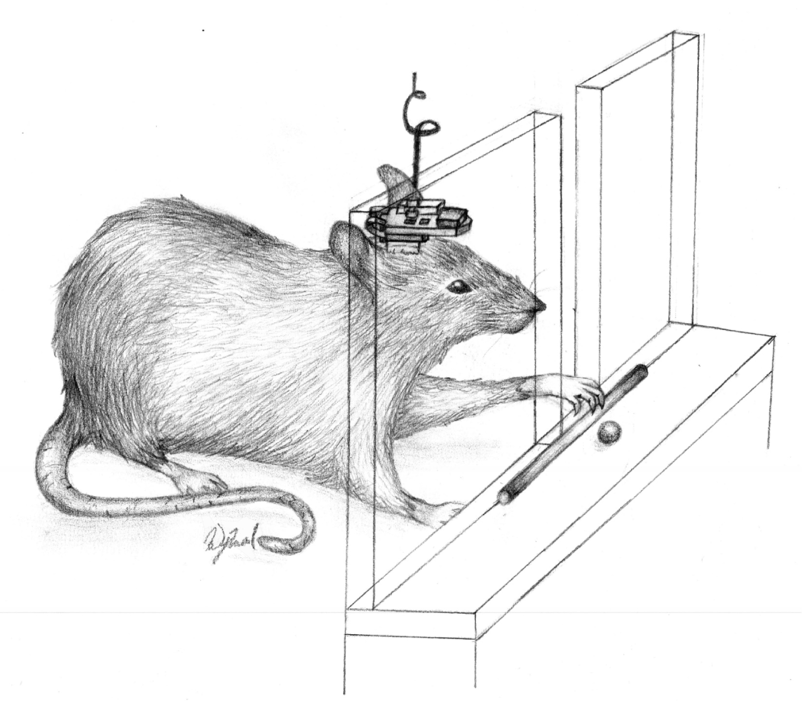

# Restoration of Function After Brain Damage Using a Neural Prosthesis
## A summary of the proof-of-concept testing for repairing neural pathways using prostheses by Guggenmos, Azin, Barbay, Mahnken, Dunham, Mohensi, and Nudo

Most often neural prosthesis are associated with giving people superhuman like abilities such as controlling machines by thought or adding the seemingly infinite information of the internet to your memory. It's important to remember that neural prosthesis have a more immediate purpose to serve in the near future by helping those who suffer from brain damage.

Repairing the functionality of a damaged human brain using neural prosthesis is still several years away, yet the technological capabilities have already been proven to exist and the field of research in neural prosthesis is growing.

A collaboration effort was made with the Departments of Molecular and Integrative Physiology and Biostatistics and the Landon Center on Aging at the Kansas University Medical Center, and the Department of Electrical Engineering and Computer Science at Case Western Reserve University. They have conducted experiments testing the hypothesis that brain injury recovery can be aided by using neural prostheses to bridge communication pathways between distant locations in the cerebral cortices of rat test subjects.

Rats with damaged cerebral cortexes, in the primary motor region, were given the experimental microelectrode prosthesis. The rat's brain damage disrupted the communication between the motor and somatosensory areas causing impaired reaching and grasping abilities. The prosthesis delivered spike triggering electrical stimulation to their somatosensory cortex over a period of two weeks. Noticeable improvements in grasping and reaching developed by the first week and, by the second week, reaching and grasping capabilities were indistinguishable to how the rats were observed before brain damage.

This experiment has shown evidence that the communication pathways between the two locations in the rat's cerebral cortex was treated by the stimulation of the microelectrode neural prosthesis. Therefore, this experiment also provides evidence for the capability to treat neural pathway communication inhibitions in human brains by the facilitation of neural prosthesis.

This prosthesis is classified as a closed-loop neuroprosthetic microdevice. The importance of this prosthesis has all to do with spike stimulation in the brain. A spike is the observable electrostatic operation in the brain when neurons send signals among each other. When a communication pathway between locations in the brain or groups of neurons is inhibited by damage to the brain tissue it is impossible for electrostatic signals to be transferred between those groups of neurons to allow neural activity to function normally. The prosthesis is an artificial communication pathway to replace the damaged tissue. Being a closed-loop means that electrostatic signals can be sent and received between groups of neurons as they would be naturally, without damage to the pathway.

For a prosthesis to be efficient enough to be implanted into a human patient, it must be capable of much greater precision and reliability than the experimental prosthesis used in this test; however, the first human brain prosthesis for repairing damaged neural pathways will still operate using the same functionality of spike stimulation.

For complete details please see the article which is posted on the site for Proceedings of the National Academy of Sciences of the United States of America:

Restoration of Function After Brain Damage Using a Neural Prosthesis

