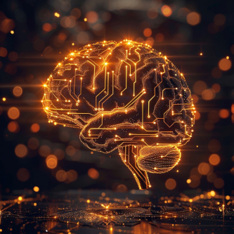

# Why Whole Brain Emulation isn't a threat to humanity

*Article Written by Jason Wong, June 2024*

Terminator’s SKYNET was first initially seen by the public on October 26, 1984. It has been roughly 40 years since then and we still do not have sentient artificial intelligence. This has not stopped a large anti-AI public sentiment from rising, however we at Carboncopies believe that it is only a matter of time before we are able to unlock a controllable and safe, fully digitized consciousness. We are attempting to recreate consciousness by creating a one to one mapping of an already existing person’s brain. So, with all that being said, is there anything to be feared? Should you worry about giant metal robots attempting to eradicate all life on earth?

The short answer is no.

With almost a 100% certainty, a whole brain emulation will not be taking over the world or destroying it. Let me explain:  

## Factor 1: “If a person has unlimited time, what’s stopping them from doing whatever they want?”

With almost a 100% certainty, a whole brain emulation will not be taking over the world or destroying it. Let me explain:  

As mentioned before, we are attempting to recreate a human brain. What that means is that the digitized human brain will be mapped with the exact same amount of brain tissue, neurotransmitters, and synapses as roughly you and I. What that means is that even if someone who was digitized wanted to do bad things, things would still take that said long time. In the time that the person would take to do bad things, there would already be either an established justice system or people-ran justice system (like in the American wild west) to prevent these actors from doing wrong. 

They are also limited by the fact motivation is fickle. It's hard to believe that even if someone had an eternity to plot something, they would be able to stay motivated to do so for that long. 

## Factor 2: “Couldn’t a bad person duplicate themselves and become exponentially smarter?”

If the person was able to duplicate themselves, they wouldn’t suddenly become smarter or more dangerous to humanity. Imagine if you had to work with a hundred clones of yourself. You still wouldn’t necessarily be able to suddenly understand nuclear physics, or calculus right away. Even if one version of myself was able to, it’s not likely every clone of myself would understand it. Another thing to consider is that the brain is an unbelievably powerful machine. If a person wanted to simulate millions of clones of themselves, it would cost a pretty penny to power and maintain the machines used to keep each clone alive and store gathered data.

## Factor 3: “What would happen if a bad person boosted their digital brain processing speed by X amount. Does that change anything?”

We currently do not understand how amplifying the digital brain would affect a digitized person’s mind, however if you recall what was said above, it is believed that one would just get bored of the task and want to do more enjoyable things. For example It’s very difficult to stay mad at someone for more than a few hours or days, imagine how much anger it would take for a person to go through hundreds if not thousands of years of existence with the sole purpose of destroying humanity. Humans generally are not like that; we typically like going to the beach, eating pumpkin pie, or going snowboarding, not hurting others. However if a truly evil person was dead-set on causing destruction, they would light up like a beacon on the map because of their extraordinary power consumption and suspicious acquisition of computing hardware unless they were based in the few super data centers around the world which are constantly monitored. 

## Conclusion

We at Carboncopies do not believe that there is any threat of large scale violence coming from a Whole Brain Emulation. There are many limiting factors on possible bad actors. The entire emulation process in its early stages will be open-source and very tightly watched over by the smartest people in the field. There is nothing to fear as long as we remain intelligent about how we create this and vigilant after we create it. 

!!! quote

    The oldest and strongest emotion of mankind is fear, and the oldest and strongest kind of fear is fear of the unknown.  
    \- H.P. Lovecraft 

