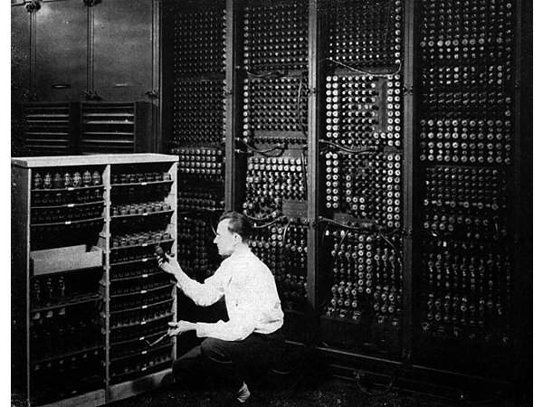

# What Will the First Substrate Independent Mind Look Like?

## A Theoretical Projection Article by Michael Ulrich

Whole Brain Emulation continues to gain traction in research and development. Whether it be in the advancements in neural prostheses, more precise connectomic mapping, or strictly in artificial intelligence; more effort is being focused on  engineering research instead of solely philosophical debates. If this trend continues, there will be a point where the first facility is established to conduct official testing of human brain emulation. After that, the first successful emulation will be made marking the day where human evolution takes another giant leap forward. It is easy, and exciting, to let one’s mind imagine all the possibilities for whole brain emulation advancements and what that could mean for divergent evolutionary paths. However, it helps one’s realistic perspective and guides one's foresight to have a sensible projection of what a substrate independent mind will be on a physical level in regards to aspects such as material, size, limitations, and it’s responsibility to sustain the mind of it’s emulated human host. This article will theorize what the first substrate-independent mind might physically look like and what its limitations will be.
## The road to emulation is a gradual incline with many stages and milestones.

Undeniably, the first case of a successful emulated human mind will have a huge impact on the world and make its mark in our history books. It will also likely be far less sudden and unexpected than we might tend to imagine. Building an emulation is best done in stages. For example, treating each section of the brain as separate emulation projects would be easier to focus on than tackling the entire brain at once. There will be successful emulations of sections of the brain before they can operate as one complete operating substrate. Even emulating a handful of neurons at biophysical precision is a daunting task and every group of neurons in the brain have their own unique operations. Furthermore, emulating animal brains will come before a human emulation. Progress will be marked by emulations of animal brains with increasing cognitive complexity. This is why subjects such as the fruit fly drosophila and the nematode worm Caenorhabditis elegans are prime initial emulation subjects. It will also be a massive cooperation effort. Teams from all over the world are already working on various research and development projects that ultimately help get us to whole brain emulation.  The more cooperation, the better. Progress toward the first successful human emulation will be very gradual. Therefore, when the day comes to witness the first successful human emulation it will be more like a sigh of relief for all the hard work rather than some grander surprise.
## So, what does this first successful emulation look like physically?

Some things to consider are the similarities to a modern day computer and what that includes. The default consensus is that the structure of the substrate is built with similar features of a modern day computer. Now, this might seem redundant to note as it is obvious to anyone familiar with the concept of mind uploading, but it really is important to keep this in mind: that a new type of computer is really all that it is. Nothing about the substrate, to enable the emulated mind, should be any concept too foreign to wrap one's head around. So, given that the information of a person's mind is huge (big data) the substrate may have a large size compared to that of modern day computers. There are other possible outcomes of what computing capabilities will be like in the future by the time that whole brain emulation is realized. The size of the computer required to store all the data necessary for an emulated brain may be very small. It is hard to predict what computer sizes will be like based on how much information they can hold. It could also likely need a huge power source depending on how the methods for power consumption has advanced for computing. It will likely be made of circuits housed in silicon surrounded by wires, power supplies, cooling devices, and encased in a well-sealed metal containment. Imagine the size of the first computers in the 1970s. It may be realistic to project that the first successful emulation substrate could be the size of several rooms when considering that if the substrate were built today, it would need this much space. In the facility in which this substrate will be, it will likely be monitored and maintained around the clock by scientists and engineers. The facility would have a security team, well regulated temperature and humidity controls for the environment, be a high level cleanroom, and likely be located in an area with a high concentration of engineering organizations (like Silicon Valley).

## How can we know when a test is successful?

There is also the question of how we test the success of an emulated mind. Imagine how the scenario will be when the first successful whole brain emulation is observed. The immediate imagined scenario that plays in my head is this: The donated patient's brain is fully scanned, the room-sized substrate has been built, the lead scientist presses the button to download the code that constructs the patient's mind simulation program in the hardware of the substrate; once the download is complete, the scientist says to the mind, "Mr. Smith, can you hear me?" A few seconds later, there is text written on the scientist's screen that says, "Yes." This may be far from what will take place when the first successful emulation is observed, but it tries to remain within a reasonable and somewhat likely portrayal of how the event will unfold.

It is not unreasonable to project that the emulated mind will have to provide the observers with feedback that communicates a level of cognition similar to the levels of cognition of the host patient prior to the scanning of the original organic brain. Assuming that the patient's original mind now operates within the substrate, that patient would likely need to willingly give feedback to the observing scientists to provide as much data as possible that this is indeed a successful emulation. The task of recognizing some level of distinguishable personality will be limited by the capabilities of the substrate. This may be limited by the ability to recognize the unique personality of a patient by the physical features of their original body (such as facial expressions, mannerisms, and tone of voice), given that their mind now resides in a room-size box-shape computer. As a proposition, maybe a voice producing device with code capable of replicating voice patterns unique to an individual may provide a means for the scientists to observe some level of recognizable personality that is unique to that of the emulated patient. There is also the possibility that the lifespan of the first emulated mind will be very short, perhaps even only a few seconds. This could be an accepted risk for patients volunteering to undergo the first emulation procedure with the understanding that this procedure is also testing many aspects of sustainability. It would still be a monumental accomplishment in whole brain emulation, even if the patient’s emulation was sustained for only a short time.

## From projection to construction

A successful first emulation will likely be done with a substrate that is crude, experimental, expensive, highly monitored, fragile, and assembled with computer components that are familiar to what is manufactured today. It will also likely have a large spatial volume and high power consumption (assuming that computing capabilities at the time when whole brain emulation is realized is similar to that of today). While a completed successful first emulation on a substrate independent mind is a theory based on reason, it serves as a blueprint to fill in the gaps. While research and development is absolutely essential for real progress toward a working emulation, theory and philosophy provide goals and milestones to aim to reach. Keeping in mind that the first successful emulation will not be surprising, epic, or pandemonium-inducing, can help encourage those working to realize the first successful emulation without anxiety or hesitation. As with every scientific breakthrough in human history, whole brain emulation will just happen, and it will be normal.