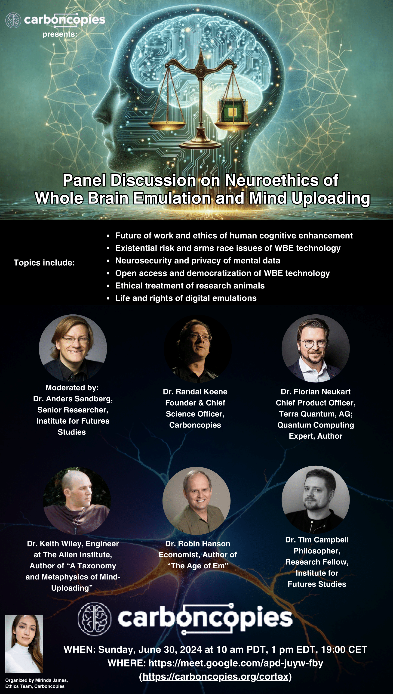

# Livestream Event

Our upcoming experts panel event on the Neuroethics of Whole Brain Emulation is
on Sunday, June 30, 2024 at 10 am PDT (1 pm EDT, 19:00 CET).

To participate in the event live, please join the Google Meet session at
http://meet.google.com/apd-juyw-fby

Audience participation is possible during Q&A intervals after each topic.

Visit our Ethics site at https://sites.google.com/carboncopies.org/ethics for
more information.

For more information about past events, please visit our [event page](/Events) page.

Please stay informed by joining us on Facebook, Twitter, and more, see our [contact page](/Contact).
