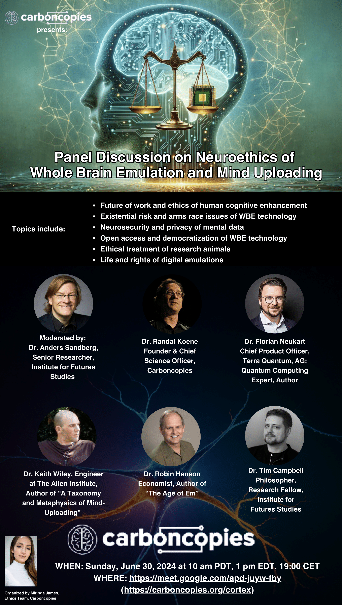
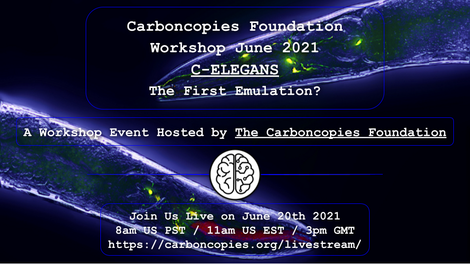
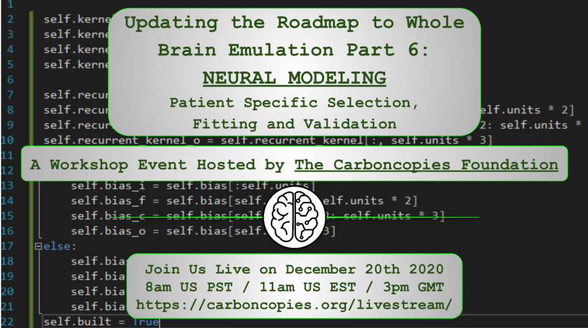
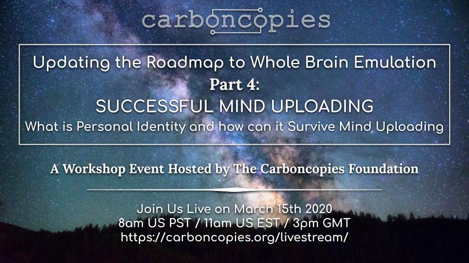
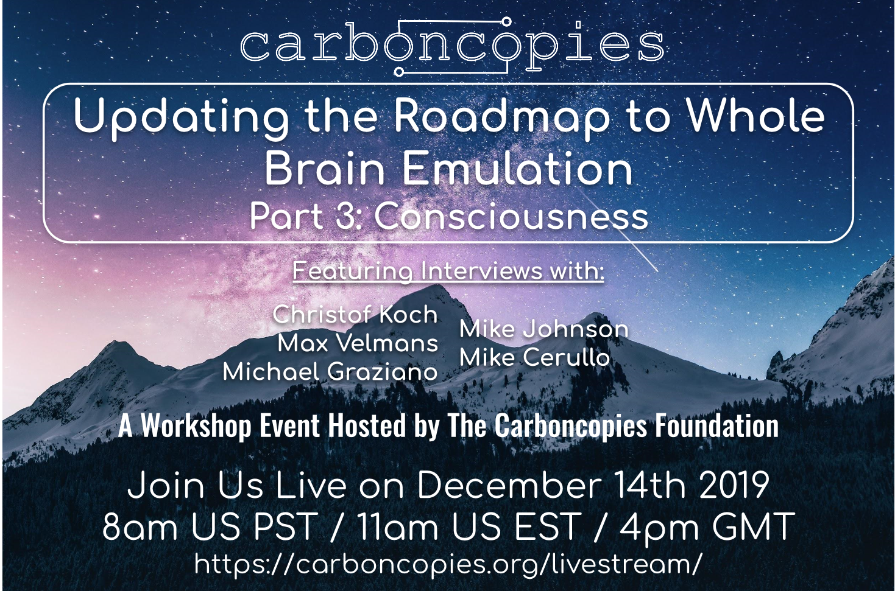
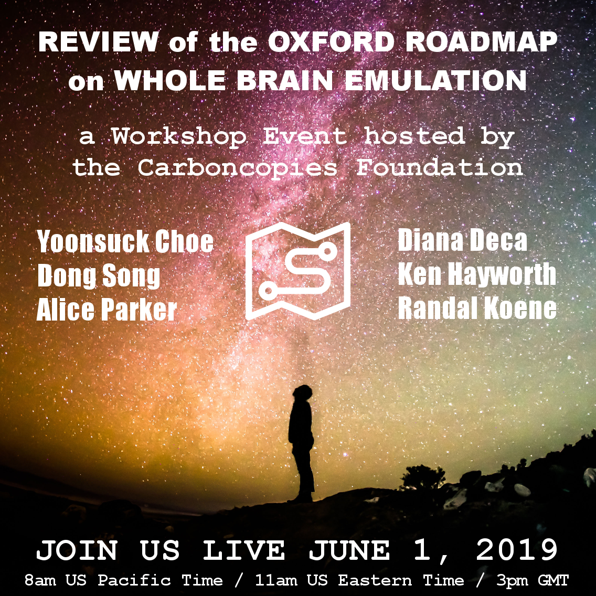
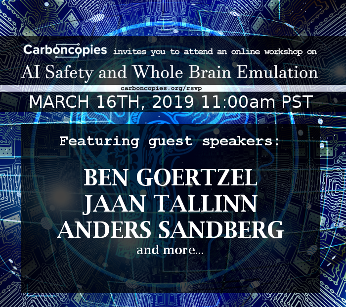
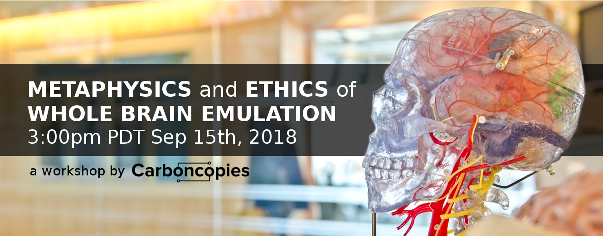
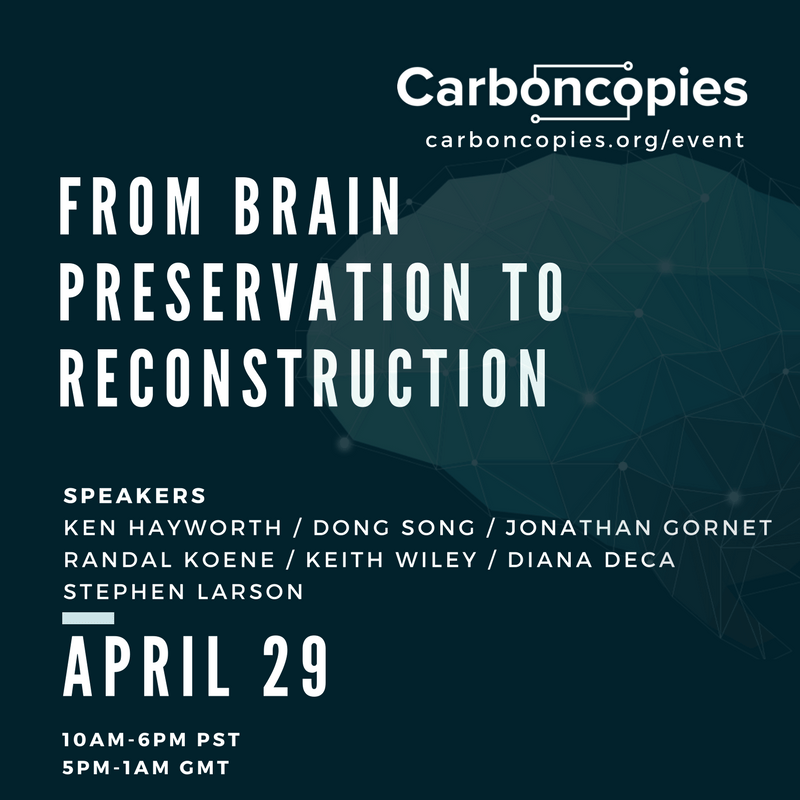
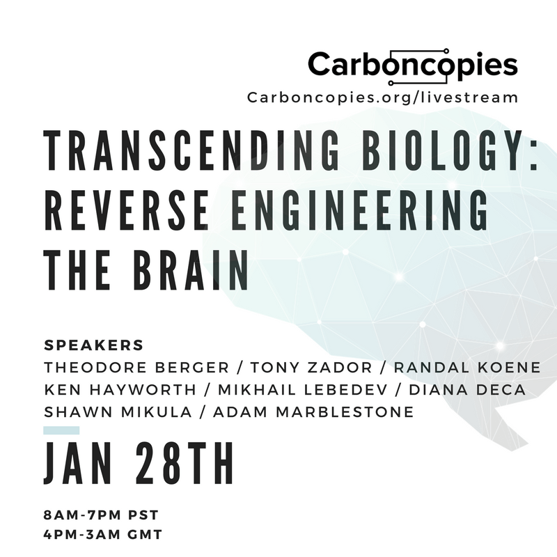

# Events

## Neuroethics of Whole Brain Emulation Panel Discussion, June 30, 2024

<iframe width="560" height="315" src="https://videos.carboncopies.org/embed?m=OXjb7f8dw" frameborder="0" allowfullscreen></iframe>

## Carboncopies Foundation Workshop, June 2021
### C-ELEGANS
#### The First Emulation?

The nematode C. Elegans is a primary subject for neural connectome mapping and experimentation because of its connectome features.

It is a good way to study methods to scan and model. This is because it is a simple organism with a tiny connectome of 302 neurons always connected in the same way.

In this workshop we will discuss the implications of C. Elegans research including the current C. Elegans modeling challenges, current connectomic mapping and modeling advances, and counter arguments against C. Elegans being an effective precursor to human connectome research.

## Carboncopies Foundation Fall 2020 Workshop, December 20, 2020
### Updating the Roadmap to Whole Brain Emulation Part 6: NEURAL MODELING
#### Patient Specific Selection, Fitting and Validation

This event was hosted online and the archived event page can be found [here](/Events/Workshops/Topic/UpdatingRoadmap/Part6).

## Carboncopies Foundation Winter 2020 Workshop, March 15, 2020
### Updating the Roadmap to Whole Brain Emulation Part 4: SUCCESSFUL MIND UPLOADING What is Personal Identity and How Can It Survive Mind Uploading

This event was hosted online and the archived event page can be found [here](/Events/Workshops/Topic/UpdatingRoadmap/Part4).

## Carboncopies Foundation Fall 2019 Workshop, December 14, 2019
### Updating the Roadmap to Whole Brain Emulation Part 3: Consciousness

This event was hosted online and the archived event page can be found [here](/Events/Workshops/Topic/UpdatingRoadmap/Part3).

## Carboncopies Foundation Summer 2019 Workshop, September 21, 2019
### Updating the Roadmap to Whole Brain Emulation Part 2: Where We Go From Here

This event was hosted online and the archived event page can be found [here](/Events/Workshops/Topic/UpdatingRoadmap/Part2).

## Carboncopies Foundation Spring 2019 Workshop, June 1, 2019
### Updating the Roadmap to Whole Brain Emulation Part 1:
#### Review of the Oxford Roadmap on Whole Brain Emulation

This event was hosted online and the archived event page can be found [here](/Events/Workshops/Topic/UpdatingRoadmap/OxfordRoadmapReview).

## Carboncopies Foundation Winter 2019 Workshop, March 16, 2019
### AI safety and Whole Brain Emulation

This event was hosted online and the archived event page can be found [here](/Events/Workshops/Topic/AISafety). A transcript of this event is also available.

## Carboncopies Foundation Summer 2018 Workshop, September 15, 2018
### Metaphysics and Ethics of Whole Brain Emulation

This event was hosted online and the archived event page can be found [here](/Events/Workshops/Topic/MetaphysicsEthics).

## Carboncopies Foundation Spring 2018 Workshop, April 29, 2018
### From Brain Preservation to Reconstruction

This was a hybrid San Francisco Bay Area + Online workshop.

The archived workshop page with links to summary and videos is [here](/Events/Workshops/Topic/BrainPreservationToReconstruction).

## Carboncopies Foundation 2018 Winter Workshop, Jan 28, 2018
### Transcending Biology: Reverse engineering the brain

This was a hybrid San Francisco Bay Area + Online workshop.

The archived workshop page with links to summary and videos is [here](/Events/Workshops/Topic/ReverseEngineering).
