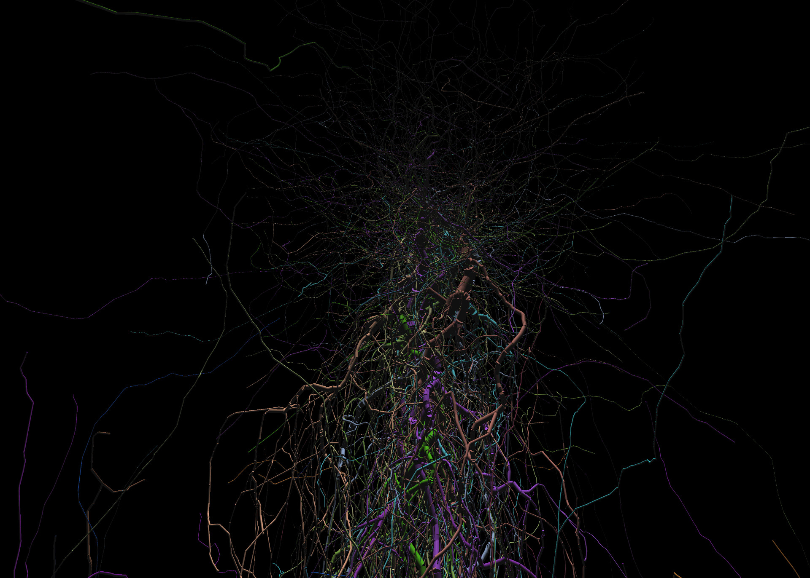
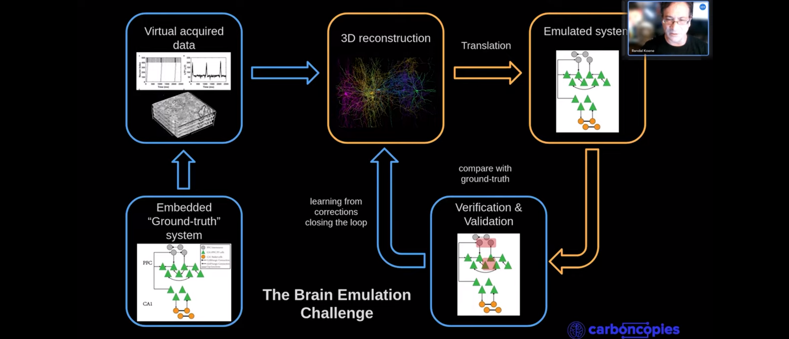
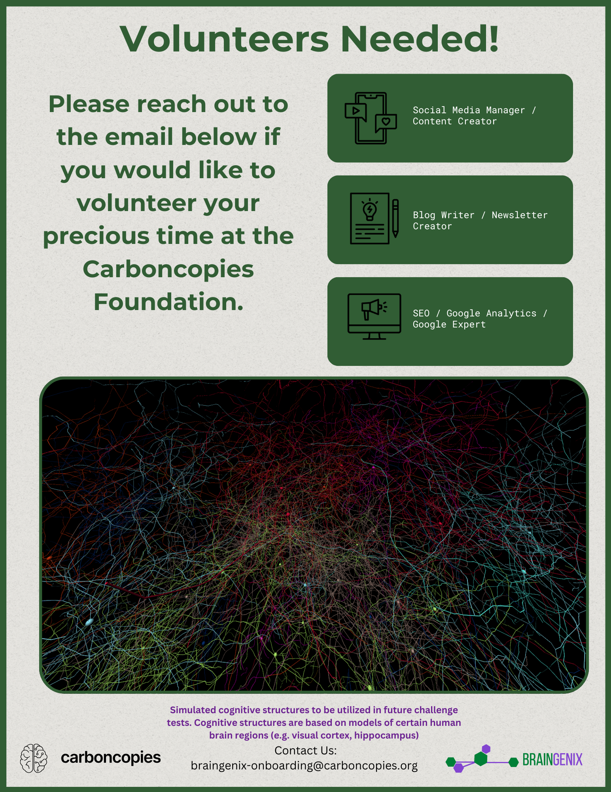

# Carboncopies Foundation Newsletter: July-August, 2024

*Read Length 4~ minutes*

Welcome to the second edition of the CarbonCopies Newsletter! For this edition we would like to highlight our progress made towards the [Virtual Brain Platform Challenge](https://videos.carboncopies.org/view?m=yY1QRzTQA) and also our Micro-Workshop held on 8/4/2024.

---

## BrainGenix / VBP updates:

In the past two months our developers have focused on integrating the Netmorph Platform (Netmorph is a software that stimulates neuronal growth, to generate biologically plausible neurons) into the Virtual Brain Platform challenge. We focused on integrating [Netmorph](https://pubmed.ncbi.nlm.nih.gov/19672726/) because it is one of key checkboxes leading up to the launch of the challenge. You will be pleased to know that progress is moving at a swift pace.

Small Excerpt of Three Neural Populations from Netmorph via (neuronal emulation system) NES

---

## Micro-Workshop on 8/4/2024

We would like to thank all of the attendees of our "Micro-Workshop". During the workshop Dr. Koene discussed in detail the Virtual Brain Platform Challange, and held an insightful Q&A session at the end. If you would like to view a recording of the micro-workshop [Click Here!](https://www.youtube.com/watch?v=eq-MZDTozKU)

---

## Creation of the CarbonCopies Foundation Discord Server!

Just this month we revitalized our server and it is now an area of discussion for all things neuroscience and whole brain emulation! Everyone is completely free to join and we you all [Here](https://discord.gg/quqzV4P4Z4), We hope to see you there! 

---

## Recent Blogs 

[How Could Whole Brain Emulation Affect Us?](https://carboncopies.org/Blog/Posts/WBEHowCouldItAffectUs/Post/) Hannah Price, August 2024

[What is Whole Brain Emulation](https://carboncopies.org/Blog/Posts/WhatIsWholeBrainEmulation/Post/) Hannah Price August, 2024

---

## Featured Scientific Publications

[Software in science is ubiquitous yet overlooked](https://www.biorxiv.org/content/10.1101/2023.12.07.570537v2), Hocquet Alexandre, et al.

[The NeuroML ecosystem for standardized multi-scale modeling in neuroscience](https://hal.science/hal-04630568), Sinha Ankur, et al.

[Tools for connectomic reconstruction and analysis of a female Drosophila ventral nerve cord](https://www.biorxiv.org/content/10.1101/2022.12.15.520299v2.full), Averzado Anthony, et al.

[Circuit analysis of the Drosophila brain using connectivity-based neuronal classification reveals organization of key communication pathways](https://direct.mit.edu/netn/article/7/1/269/113338/Circuit-analysis-of-the-Drosophila-brain-using), Mehta Ketan, et al.

[Nanoscale volumetric fluorescence imaging via photochemical sectioning](https://www.biorxiv.org/content/10.1101/2024.08.01.605857v1), Wang Wei, et al. April 28, 2024

[Reconstruction of motor control circuits in adult Drosophila using automated transmission electron microscopy](https://www.cell.com/cell/fulltext/S0092-8674%2820%2931683-4), Jasper S. Phelps, et al.

---

---

## Stay Connected With the Carboncopies Foundation

[Subscribe to our Newsletter](https://forms.gle/cBrUDkcvKDy7kcjz7){ .md-button }

Check out our social media here: [X/Twitter](https://x.com/carboncopiesorg), [Facebook](https://www.facebook.com/groups/carboncopies/), [Linkedin](https://www.linkedin.com/company/carbon-copies/), [Youtube](https://www.youtube.com/channel/UCuNZLgW-6Xcp6wfyb2Y_Thw), [Discord](https://discord.gg/quqzV4P4Z4).

If you want to support the work being done at the CarbonCopies Foundation please consider [Donating](https://carboncopies.org/Donate/).

