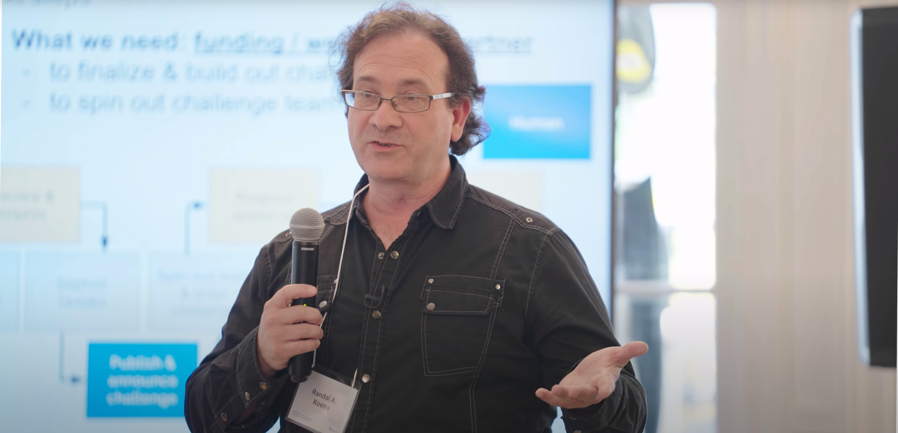
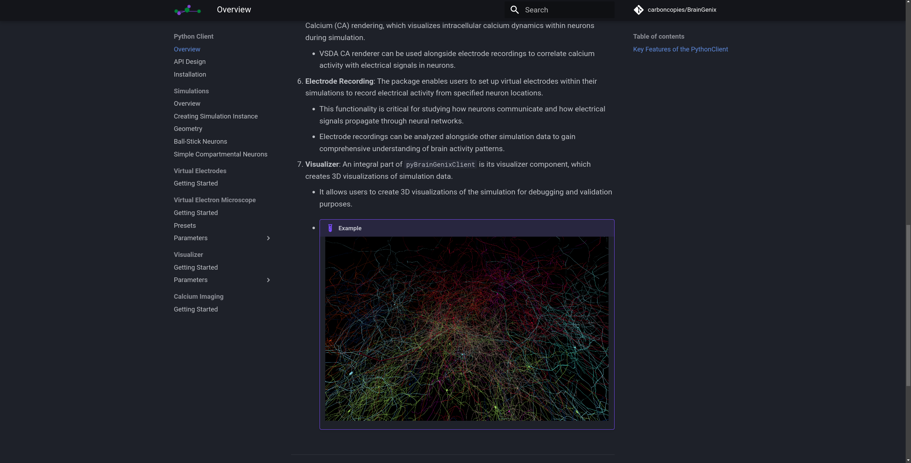
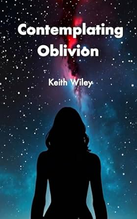

 
# Carboncopies Foundation Newsletter: May - June, 2024

*Read Length ~6 minutes*

We are very pleased to announce the revival of our newsletter. For this edition we would like to highlight our introduction of the Brain Emulation Challange, alongside our president Dr. Koene who presented at the [2024 Forsight Whole Brain Emulation Conference](https://foresight.org/2024-foresight-neurotech-bci-and-wbe-for-safe-ai-workshop/).

---

## BrainGenix / Virtual Brain Platform Updates

### Introducing the Brain Emulation Challange

The Brain Emulation Challenge is one of the principal research projects currently ongoing at the Carboncopies Foundation. The Challenge aims to address the principal remaining hurdle to whole brain emulation: How to **translate** collected brain data to a working model that is a verifiably correct emulation of the biological source. Our Challenge offers a way for every lab or researcher working on methods of such Translation to compete and test their performance.

Neuroscientists need ways to test methods using well understood data sets and concrete validation metrics, just like computer vision methods in AI that are tested on artificial data (e.g. ImageNet) before being tested in the real world.

For our Challenge:

1. We generate neural circuits that carry out specific cognitive I/O functions, such as autoassociative memory or visual feature composition. We generate the detailed morphology of such a circuit using Netmorph, a neural outgrowth modeling platform developed by Randal Koene ((Netmorph, 2009)[https://pubmed.ncbi.nlm.nih.gov/19672726/]).
2. We then embed the meaningful cognitive circuit within further detailing of artificial neural tissue (e.g. add glia, vasculature, etc).
3. Using the BrainGenix Neural Emulation System (NES), we construct the completed artificial neural tissue model in 3D and carry out virtual data acquisition. We produce electron microscopy image data sets, calcium imaging data sets, and electrode recordings. These data sets are similar to the ones that researchers expect to obtain form biological samples.
4. A challenge taker receives the virtual data, but not the underlying model. It is their task to reconstruct neural circuits within the data as they would in the case of a natural data set. We expect from them a proposed emulated neural system and the methods they used to derive it.
5. We then evaluate the submission by comparing the structure of the proposed system with that of the original, and by comparing the I/O function of the emulation with that of the cognitively meaningful circuit that was hidden in the virtual tissue data. The best score is received if the underlying function is fully recovered. Challenge takers receive an error report with which to improve their methods.

The process is described with more context in the video that introduces our challenge:

<iframe width="560" height="315" src="https://videos.carboncopies.org/embed?m=yY1QRzTQA" frameborder="0" allowfullscreen></iframe>

Development of the Brain Emulation Challenge has proceeded at a good clip over the past year. We are still a few months shy of a proper launch, and we we're hoping to secure funding for challenge prizes. At this time, we are able to generate meaningful circuits with Netmorph and are about to test data generation from virtual tissue containing those circuits.

For an example of a small autoassociative neural circuit generated with Netmorph for use in the Challenge, see here:

<iframe width="560" height="315" src="https://videos.carboncopies.org/embed?m=JhUaaxbC5" frameborder="0" allowfullscreen></iframe>

To learn more about the challange please see our [website](https://braingenix.org/Challenge/Overview/) and [Gitlab](https://gitlab.braingenix.org/carboncopies/virtual-brain/BrainEmulationChallenge).

## 2024 Whole Brain Emulation Workshop

Dr. Randal A. Koene speaking at the Whole Brain Emulation conference hosted by the Foresight Institute in Berkeley, California. To view Dr. Koene's Presentation Click here - https://foresight.org/summary/randall-a-koene-an-mvp-of-the-wbe-challenge-whole-brain-emulation-workshop-2024/

---

## Carboncopies Website Update

The Carboncopies website was recently overhauled to improve the user experience and to provide a more streamlined interface. Formerly the website was run through WordPress, but now relies on MkDocs, an open source website framework  hosted through our own servers. We updated our website with the intention to be modern, functional, and extremely fast.

Interested in checking it out? Click here - https://Carboncopies.org

---

## BrainGenix Website Update

With the updating of the Carboncopies website, we decided that it was time to give the BrainGenix website a shiny polish. Using the same framework, MkDocs, we remodeled **BrainGenix.org.** For the update we prioritized clear communication about what BrainGenix offers and designed our website to ensure easy navigation of our software.

Interested in checking it out? Click here - https://BrainGenix.org

---

## Video Streaming Platform

Through the usage of MediaCMS, an open source video streaming platform that we run locally we have been able to create a Youtube-like platform run completely by us.

Interested in checking it out? Click here - https://videos.carboncopies.org

---

## Recent Blogs

[A reason to hedge on whole-brain emulation for AGI](https://carboncopies.org/Blog/Posts/HedgeOnWholeBrainEmulation/Post/) Randal Koene, June 18, 2024

[Why Whole Brain Emulation isn't a threat to humanity](https://carboncopies.org/Blog/Posts/ShouldYouBeScared/Post/)
Jason Wong, June 6, 2024

---

## Volunteers Needed

---

## Featured Scientific Publications

[Comparative prospects of imaging methods for whole-brain mammalian connectomics](https://arxiv.org/abs/2405.10488v1), Logan Thrasher Collins, Randal Koene

[Light-microscopy based dense connectomic reconstruction of mammalian brain tissue](https://www.biorxiv.org/content/10.1101/2024.03.01.582884v1.abstract), Tavakoli, et al.

---

## CCF Board Member Keith Wiley's Recent Book Release

After 10 months of much anticipated release Contemplating Oblivion, by Dr. Keith Wiley, has finally been released and is available for read! The book follows Lysandra a million year old person who seeks new conscious experiences, she eventually discovers something about consciousness that might change everything...

Click [here](https://www.amazon.com/dp/B0D9C5MJZT/) to find out more

---

## Stay Connected With the Carboncopies Foundation

[Subscribe to our Newsletter](https://forms.gle/cBrUDkcvKDy7kcjz7){ .md-button }

Check out our social media here: [X/Twitter](https://x.com/carboncopiesorg), [Facebook](https://www.facebook.com/groups/carboncopies/), [Linkedin](https://www.linkedin.com/company/carbon-copies/), [Youtube](https://www.youtube.com/channel/UCuNZLgW-6Xcp6wfyb2Y_Thw).

If you want to support the work being done at the CarbonCopies Foundation please consider [donating](https://carboncopies.org/Donate/).

