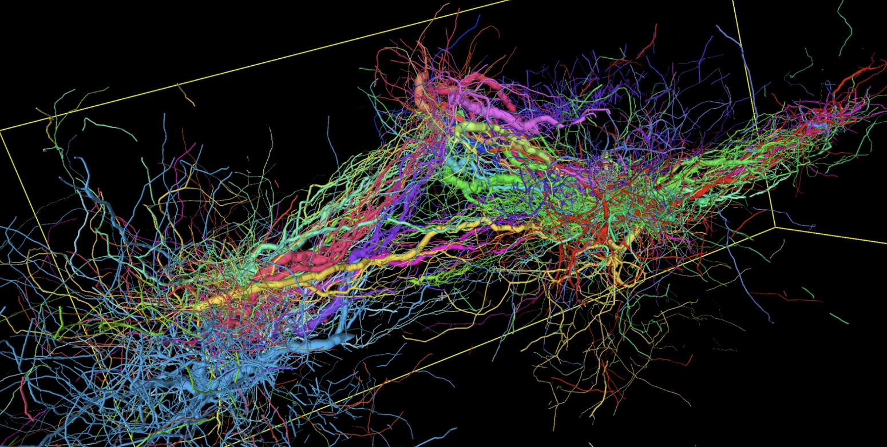

# BrainGenix: Accelerating WBE Research and Clinical Neuroscience

BrainGenix is an open-source project focused on advancing **whole brain emulation (WBE)** research and clinical neuroscience. Its core mission is to provide a **modular, reproducible stack** that researchers can use on their own hardware. All code is open-source and freely available under the **AGPL-3.0 license**, promoting fairness and accessibility.

---

## Key Components & GitLab Locations

The BrainGenix platform consists of several key components, each with a specific purpose. All repositories are public, licensed under AGPL-3.0, and include documentation, and example workflows.

| Component | Purpose | GitLab Repo |
| :--- | :--- | :--- |
| NES – Neuronal Emulation System | Executes biologically-realistic neuronal simulations | `https://gitlab.braingenix.org/carboncopies/BrainGenix-nes` |
| API – BrainGenix API Server | Unified REST/JSON interface for all services | `https://gitlab.braingenix.org/carboncopies/BrainGenix-API` |
| ERS – Environment Rendering System | Generates virtual environments and sensory translation for emulations | `https://gitlab.braingenix.org/carboncopies/BrainGenix-ERS` |
| EVM – Evaluation Metrics | Quantifies accuracy of participant emulations in the Brain Emulation Challenge | `https://gitlab.braingenix.org/carboncopies/BrainGenix-EVM` |
| STS – Scan Translation System | Converts EM, electrophysiology, and other scan data into NES-compatible models | `https://gitlab.braingenix.org/carboncopies/BrainGenix-STS` |
| VSDA – Virtual Scan Data Acquisition | Simulates data acquisition pipelines for testing and training | `https://gitlab.braingenix.org/carboncopies/BrainGenix-VSDA` |

