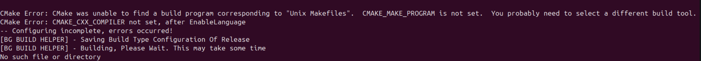

# BrainGenix API Endpoint Installation & Configuration


## Prerequisites

Before starting, ensure you have a somewhat modern version of `git` installed on your machine.

## Quick Start Guide

This quick start guide will get you up and running with an instance of the BrainGenix-API in as few commands as possible.

!!! warning

    As of 2024-05-23, Ubuntu 24.04 is not supported and will not work.


!!! note

    A detailed version of this guide is coming soon.


The first thing we need to do, is get the API cloned on your machine. Then we will enter the Tools directory within the repo.

```bash
git clone https://gitlab.braingenix.org/carboncopies/BrainGenix-API.git && cd BrainGenix-API/Tools
```

At this point you really only need to do two things. Firstly, you need to run the setup script to get vcpkg bootstrapped and all dependencies installed. After that, you merely need to build the program.

!!! warning

    Using too many threads to build the program at once can make your machine run out of memory. We advise setting this to the same number of CPU cores as your machine has, or if unknown, using 6 as a safe default assumption.

```bash
./Setup.sh
./Build.sh 20 Release
```

Fantastic, assuming nothing went wrong, you should now be able to use the Run script to get your instance up and running.

```bash
./Run.sh
```

### Creating Debian Package (Optional)

For easier deployment across multiple systems, you can create a Debian package (.deb file) by executing:
```bash
./Package.sh
```
This will generate a `.deb` file in the `Artifacts` directory that you can use to install NES on Debian-based systems without manually running setup or build commands.

The `.deb` package will automatically start NES with a systemd service, simplifying future use.


## Configuration
The API configuration file can be found at `/etc/BrainGenix/API/API.cfg` (if using the debian package) or at `Binaries/API.cfg` (in the repository root if running locally). Edit this file as needed before starting the service:

- Set the desired port number (default is 8000).
- Adjust other settings as necessary (e.g., database connection details).
- Do not enable HTTPS yet.


## Troubleshooting

If you got an error that looks like the following, then you need to make sure your setup script finished fully without errors.



Also, if your build fails with a `no such file or directory` error, make sure to `./Clean.sh` then rebuild.


## Enabling HTTPS/SSL Support

!!! note

    We assume you're using the debian package when setting up SSL support. If you're not, the configuration paths will change.


To secure your API endpoint with Let's Encrypt/Certbot:  

1. **Setup HTTP**: Install the API without enabling HTTPS by editing the configuration file appropriately.  
2. **Run Certbot**: Use Certbot with a webroot path of `/` as we serve `/.well-known/acme-challenge/*`. Make sure you have root permissions.  
3. **Obtain SSL certs**: After Certbot verifies your domain ownership, edit your `/etc/BrainGenix/API/API.cfg` file to point to the generated SSL certificate and private key files.  
4. **Enable HTTPS**: Update `UseHTTPS=false` in your configuration file to `UseHTTPS=true`.  
5. **Restart service**: Run `sudo systemctl restart BrainGenix-API.service` to apply changes.  
6. **Verify**: Check server status using `systemctl status BrainGenix-API.service` and ensure it's running correctly. If there are issues, adjust configuration as needed.  


---

*This documentation is provided by BrainGenix, a division of Carboncopies Foundation R&D. BrainGenix is a platform focused on advancing the field of whole-brain-emulation and computational neuroscience. BrainGenix is part of the CarbonCopies Foundation, a 501\(c)3 non-profit organization dedicated to researching and promoting whole brain emulation. Learn more about CarbonCopies at https://carboncopies.org. For any queries or feedback regarding BrainGenix projects or documentation, please write to us at contact@carboncopies.org.*