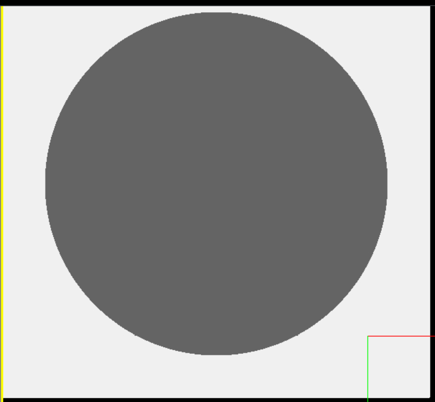
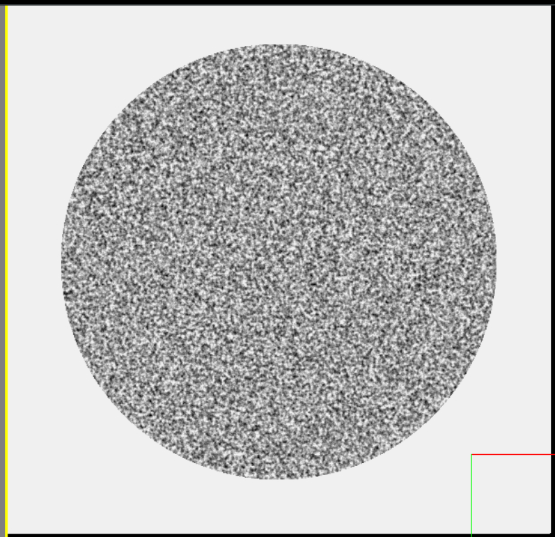
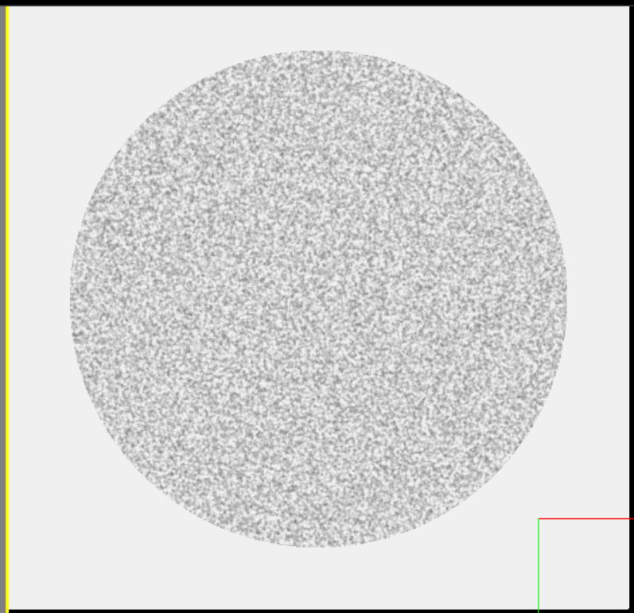
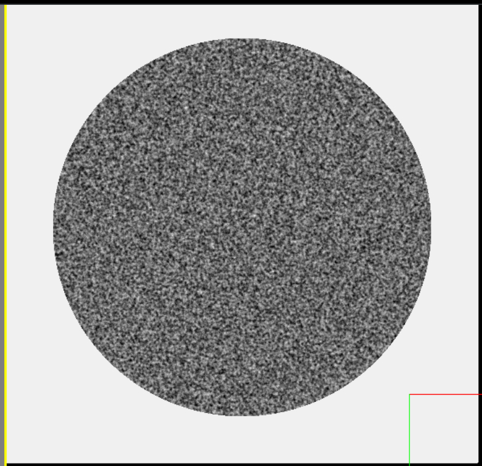
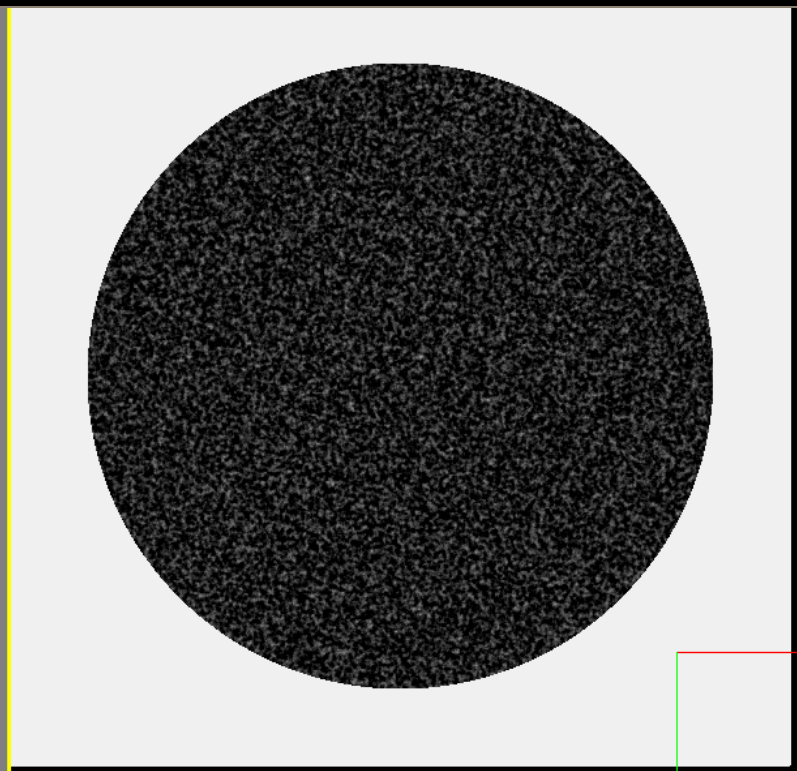
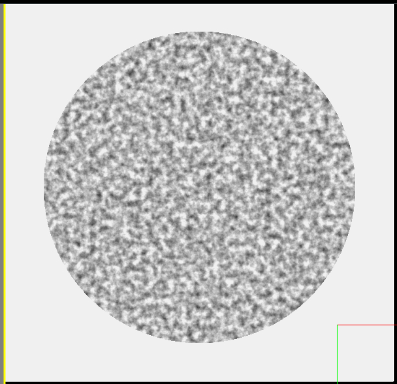
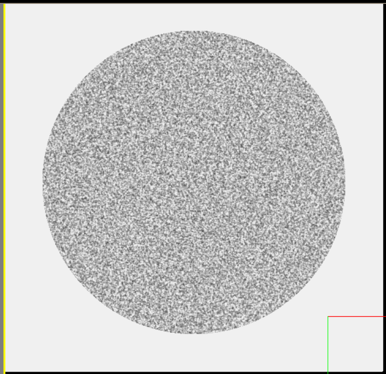

!!! note

    For this section of the guide, we will be disabling all other effects in order to clearly show each option.

    Unless otherwise noted, the following configuration was used as a base for this demo:

    ```python

    EMConfig.GenerateImageNoise = False
    EMConfig.EnableGaussianBlur = False
    EMConfig.EnableInterferencePattern = False

    ```


### Cell Interiors

Currently, we use simple perlin noise to simulate the interiors of cells.
In the future, we are planning to procedurally generate cell structures (mitochondria, ER, etc), however this is not yet implemented.

To enable/disable/adjust the perlin noise options, the following parameters may be used:


| Parameter              | Description                          |
| :--------------------- | :----------------------------------- |
| `GeneratePerlinNoise`       | Enable or disable the entire perlin noise feature |
| `NoiseIntensity`       | How bright and dark the noise will be (contrast) |
| `SpatialScale`    | How much to compress/expand the noise texture |
| `DefaultIntensity`    | What the default intesnity of each filled voxel is - used as the final color if noise is disabled |


!!! example

    === "GeneratePerlinNoise"

        Setting `GeneratePerlinNoise` to `False` results in the following image:

        

        Here is the configuration used for this image.

        ```python
        EMConfig.GeneratePerlinNoise = False
        ```

    === "NoiseIntensity"

        The noise intensity describes how much the brightness of each pixel varies from the default brightness (intensity) due to perlin noise.

        ---

        Setting it to 200 will result in the following image:
        

        ```python
        EMConfig.NoiseIntensity = 200
        ```

        ---

        Likewise, setting it to 100 will result in the following image:
        

        ```python
        EMConfig.NoiseIntensity = 100
        ```


    === "DefaultIntensity"

        The default intensity describes what the baseline brightness for each pixel will be in filled regions.
        Larger values closer to 255 will result in brighter base images, and lower values will likewise lower this.

        ---

        Setting it to 180 will result in the following image:
        

        ```python
        EMConfig.DefaultIntensity = 180
        ```

        ---

        Likewise, setting it to 100 will result in the following image:
        

        ```python
        EMConfig.DefaultIntensity = 100
        ```

    === "SpatialScale"

        The SpatialScale value alters how large or fine the perlin noise that is generated appears.

        Higher values mean smaller noise grains, and lower values mean larger grains.

        ---

        Setting it to 10 will result in the following image:
        

        ```python
        EMConfig.SpatialScale = 10
        ```

        ---

        Likewise, setting it to 40 will result in the following image:
        

        ```python
        EMConfig.SpatialScale = 40
        ```


---

*This documentation is provided by BrainGenix, a division of Carboncopies Foundation R&D. BrainGenix is a platform focused on advancing the field of whole-brain-emulation and computational neuroscience. BrainGenix is part of the CarbonCopies Foundation, a 501\(c)3 non-profit organization dedicated to researching and promoting whole brain emulation. Learn more about CarbonCopies at https://carboncopies.org. For any queries or feedback regarding BrainGenix projects or documentation, please write to us at contact@carboncopies.org.*