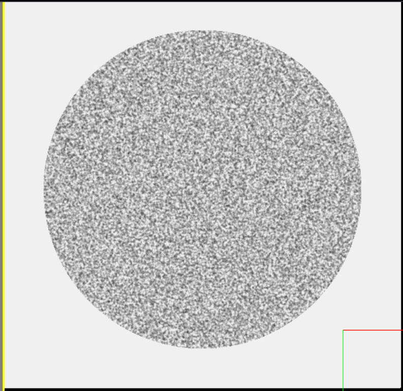
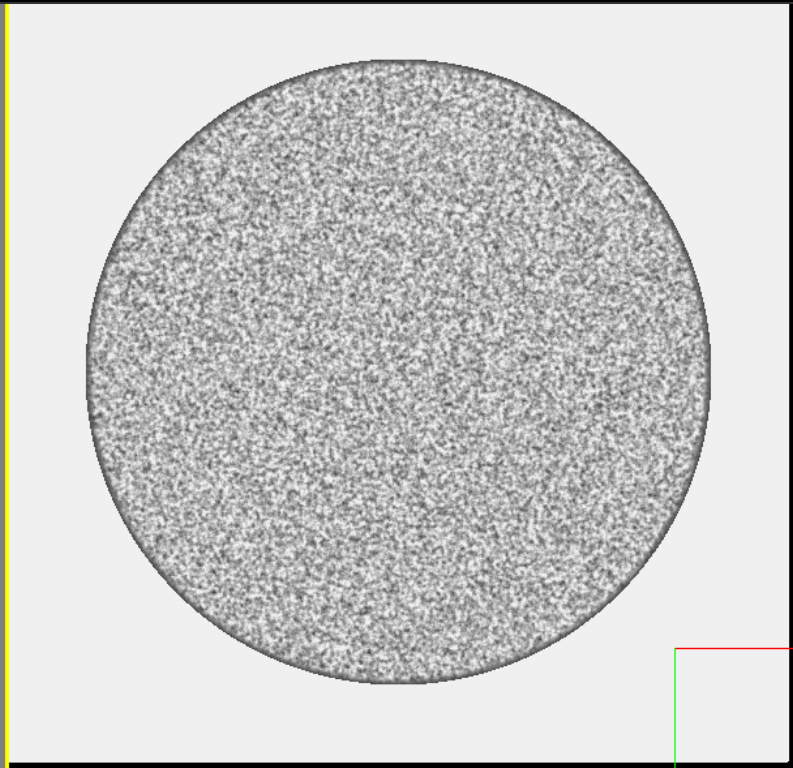
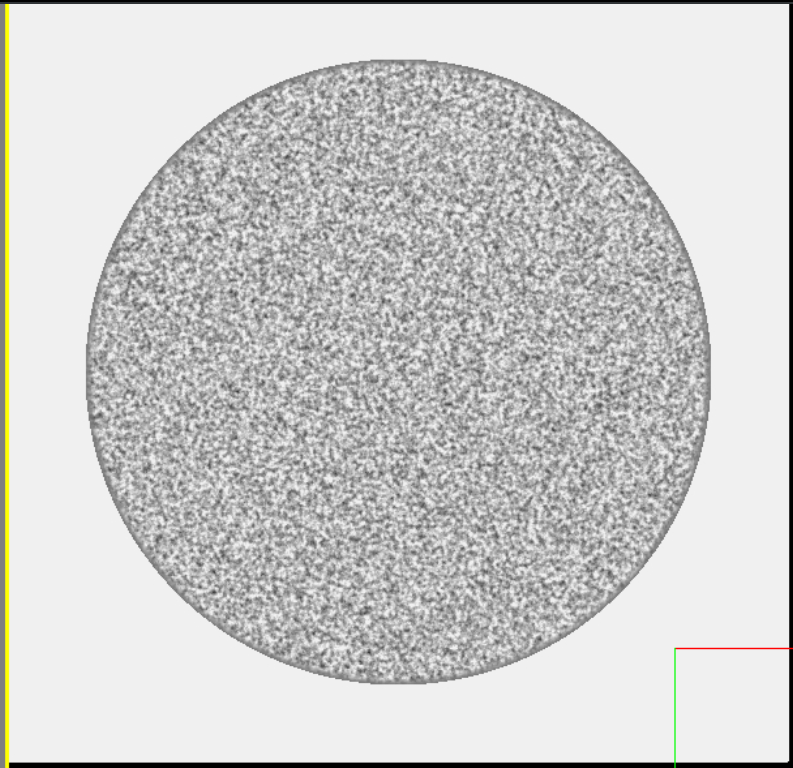
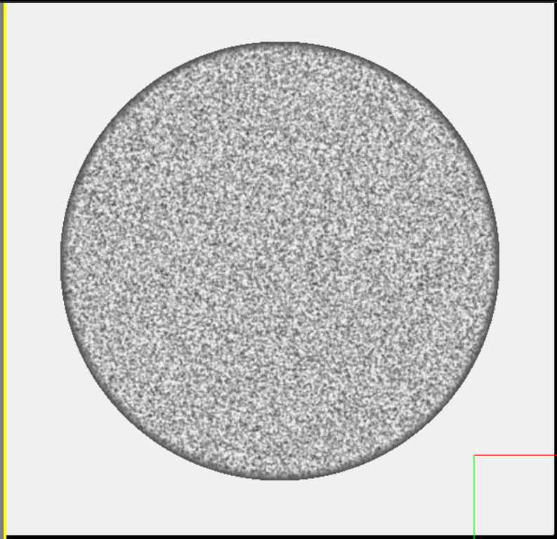

# Membrane Outlines

!!! note

    For this section of the guide, we will be disabling all other effects in order to clearly show each option.

    Unless otherwise noted, the following configuration was used as a base for this demo:

    ```python

    EMConfig.GenerateImageNoise = False
    EMConfig.EnableGaussianBlur = False
    EMConfig.EnableInterferencePattern = False

    ```


Real Electron Microscopes create dark outlines where cell membranes are due to the staining process, the Virtual Microscope supports this as well. 


| Parameter              | Description                          |
| :--------------------- | :----------------------------------- |
| `RenderBorders`       | Enable or disable the rendering of cell membrane outlines |
| `BorderEdgeIntensity`       | Intensity of the voxels at the edge of the border - lower values will darken the borders |
| `BorderThickness_um`       | How many microns thick is the border |


!!! example

    Please note that for these examples, we use the following base configuration.

    ```python
    EMConfig.BorderEdgeIntensity = 75
    EMConfig.BorderThickness_um = 0.06
    ```

    === "RenderBorders"

        Setting `RenderBorders` to `False` results in the following image:

        ---

        Setting it to `False` will result in the following image:
        

        ```python
        EMConfig.RenderBorders = False
        ```

        ---

        Likewise, setting it to `True` will result in the following image:
        

        ```python
        EMConfig.RenderBorders = True
        ```

    === "BorderEdgeIntensity"

        Border intensity describes how light or dark to make the membrane outline - lowering this number closer to zero will make them more intense.

        ---

        Setting it to 120 will result in the following image:
        

        ```python
        EMConfig.BorderEdgeIntensity = 120
        ```

        ---

        Likewise, setting it to 20 will result in the following image:
        

        ```python
        EMConfig.BorderEdgeIntensity = 20
        ```


    === "BorderThickness_um"

        The border thickness describes how wide the membrane outline should be - higher numbers will make a larger outline.
        You probably don't want to make this more than `0.06um`.

        ---

        Setting it to `0.1um` (very thick and for demonstration purposes) will result in the following image:
        

        ```python
        EMConfig.BorderThickness_um = 0.1
        ```

        ---

        Likewise, setting it to `0.03um` will result in the following image:
        

        ```python
        EMConfig.BorderThickness_um = 0.03
        ```


---

*This documentation is provided by BrainGenix, a division of Carboncopies Foundation R&D. BrainGenix is a platform focused on advancing the field of whole-brain-emulation and computational neuroscience. BrainGenix is part of the CarbonCopies Foundation, a 501\(c)3 non-profit organization dedicated to researching and promoting whole brain emulation. Learn more about CarbonCopies at https://carboncopies.org. For any queries or feedback regarding BrainGenix projects or documentation, please write to us at contact@carboncopies.org.*