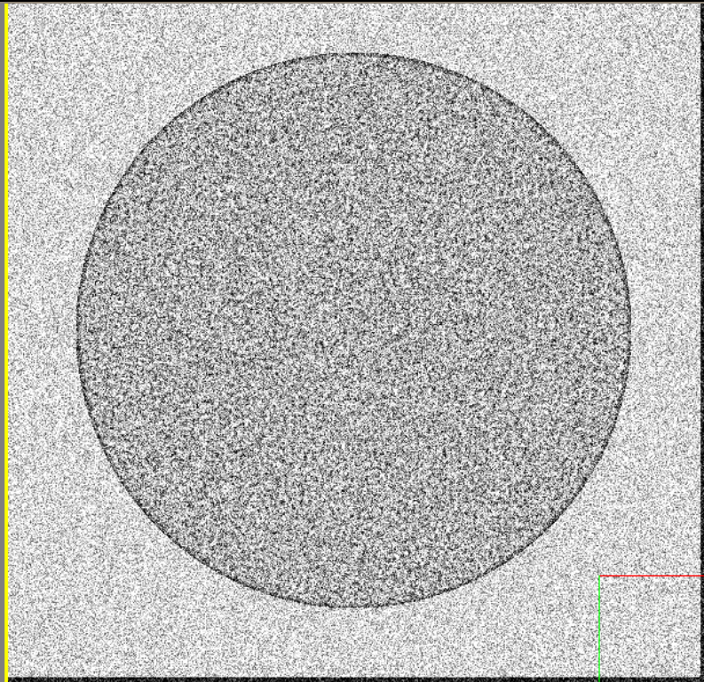
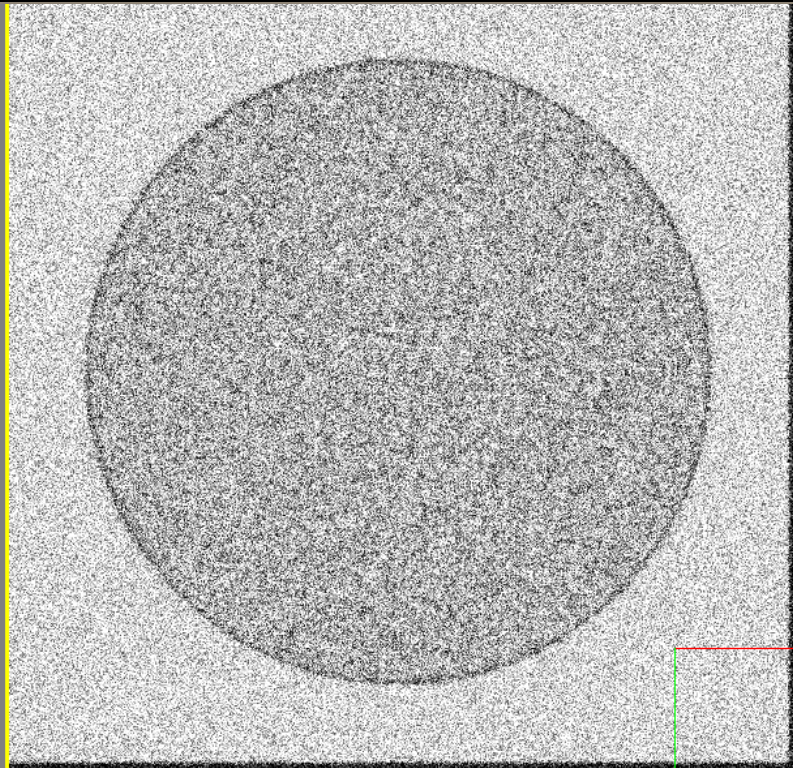
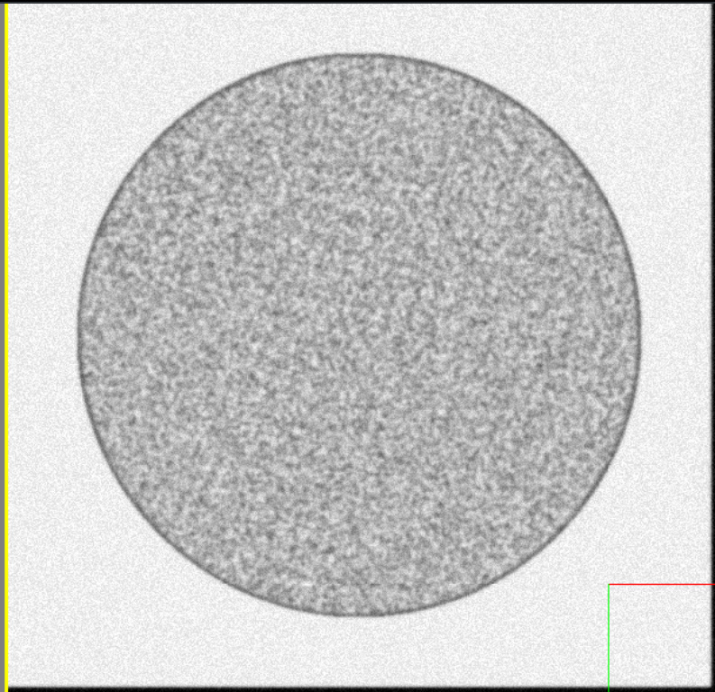
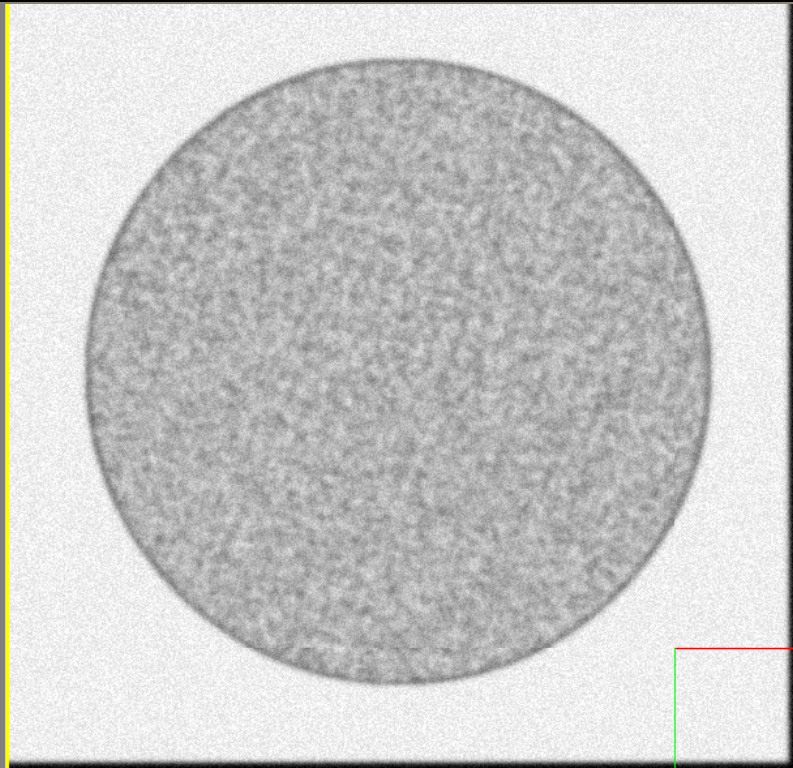

# Microscope Blur


!!! note

    For this section of the guide, we will be disabling all other effects in order to clearly show each option.

    Unless otherwise noted, the following configuration was used as a base for this demo:

    ```python

    EMConfig.EnableInterferencePattern = False

    ```

The Virtual microscope has the following options to apply blur to generated images.


| Parameter              | Description                          |
| :--------------------- | :----------------------------------- |
| `EnableGaussianBlur`       | Enable or disable blurring of the image |
| `GuassianBlurSigma`       | Set the amount of blur to be applied |


!!! example

    === "EnableGaussianBlur"

        Enable or disable the generation of image noise.

        ---

        Setting `EnableGaussianBlur` to `False` results in the following image:

        

        ```python
        EMConfig.EnableGaussianBlur = False
        ```

        ---

        Likewise, setting it to `True` will result in the following image:
        

        ```python
        EMConfig.GuassianBlurSigma = 1.2675
        EMConfig.EnableGaussianBlur = True
        ```


    === "GuassianBlurSigma"

        The BlurSigma value defines how intense the blur effect is, with higher values providing increasing amounts of blur.

        ---

        Setting it to 1.1 will result in the following image:
        

        ```python
        EMConfig.GuassianBlurSigma = 1.1
        ```

        ---

        Likewise, setting it to 1.9 will result in the following image:
        

        ```python
        EMConfig.GuassianBlurSigma = 1.9
        ```


---

*This documentation is provided by BrainGenix, a division of Carboncopies Foundation R&D. BrainGenix is a platform focused on advancing the field of whole-brain-emulation and computational neuroscience. BrainGenix is part of the CarbonCopies Foundation, a 501\(c)3 non-profit organization dedicated to researching and promoting whole brain emulation. Learn more about CarbonCopies at https://carboncopies.org. For any queries or feedback regarding BrainGenix projects or documentation, please write to us at contact@carboncopies.org.*