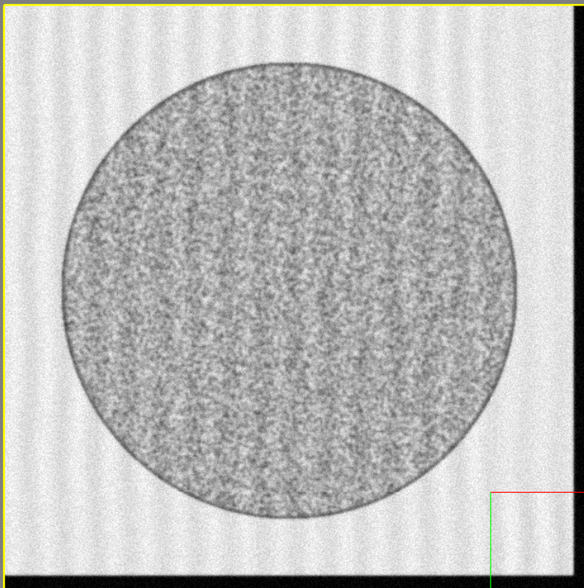
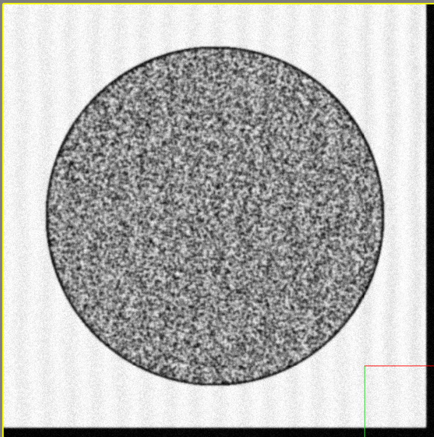
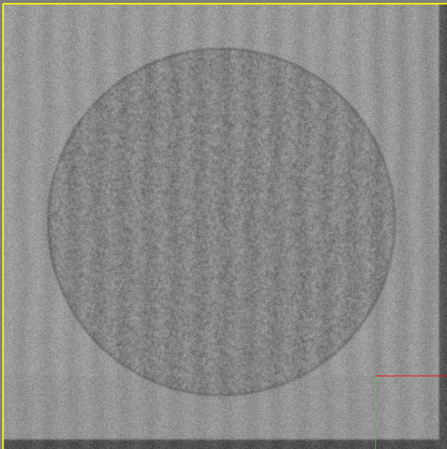
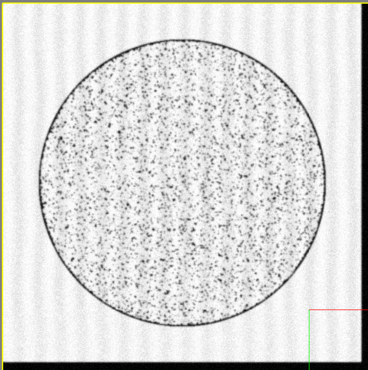
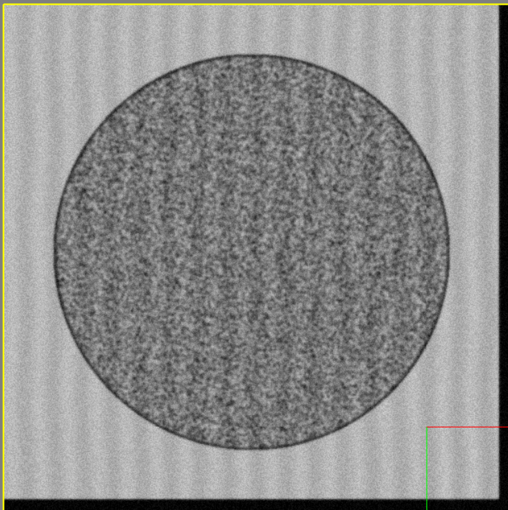
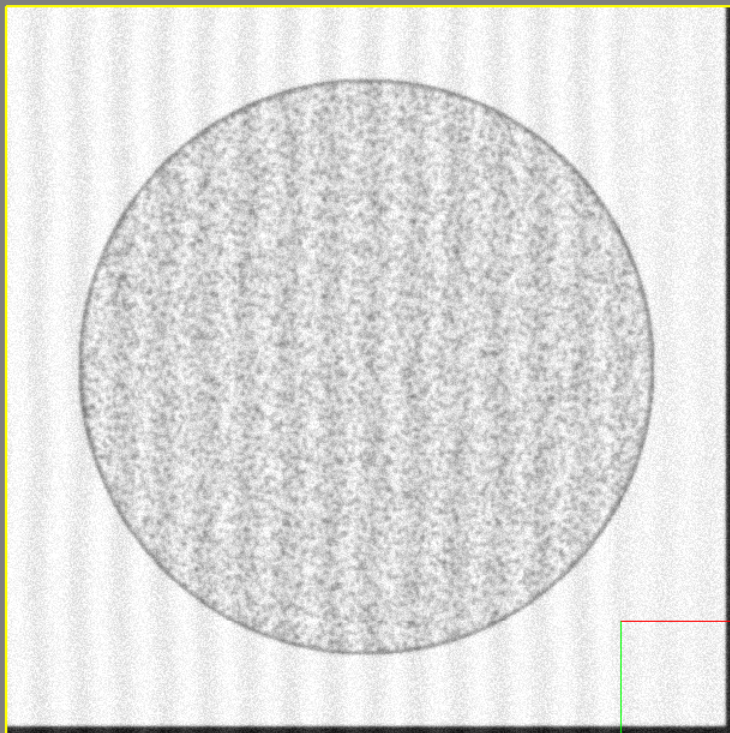
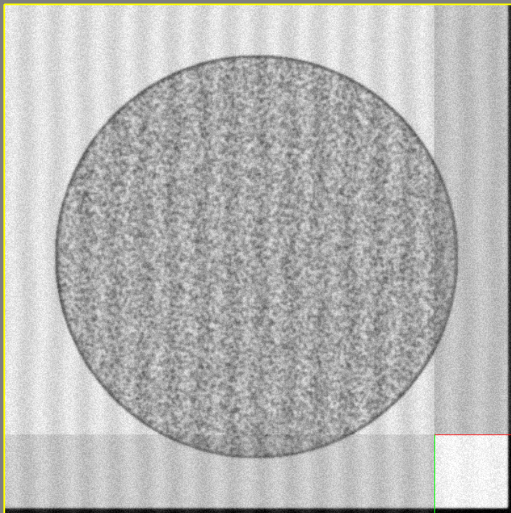
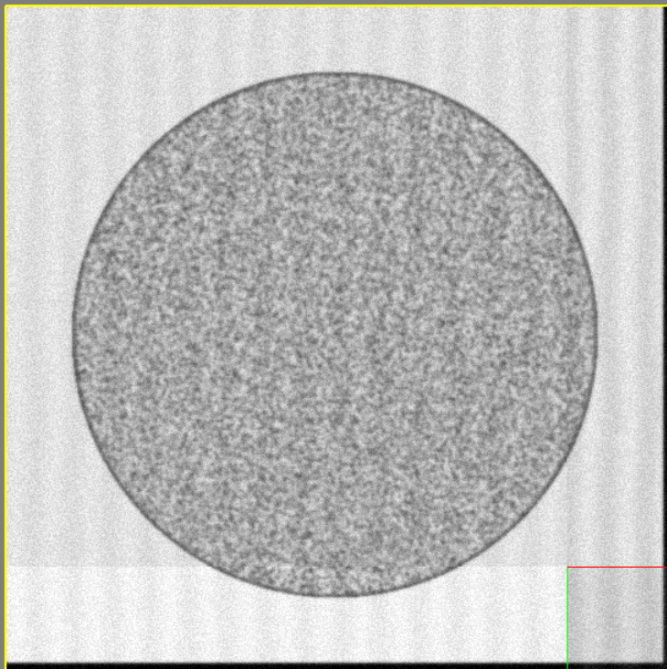
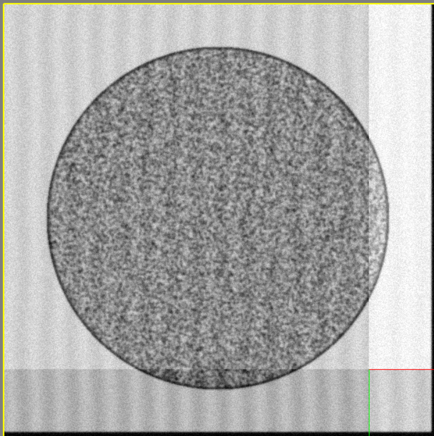
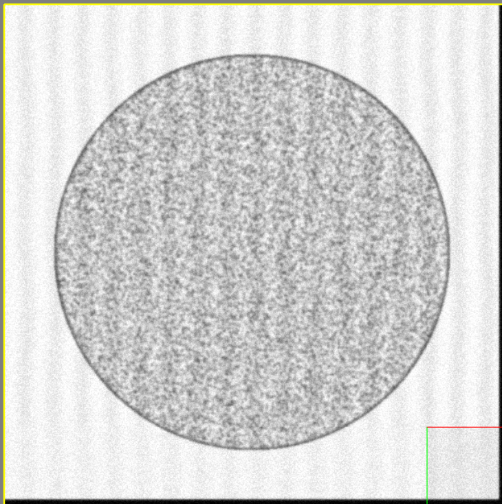

# Microscope Contrast / Brightness


The Virtual Microscope supports a few configuration options regarding the addition of noise to generated images.


| Parameter              | Description                          |
| :--------------------- | :----------------------------------- |
| `AdjustContrast`       | Enable or disable adjusting contrast and brightness|
| `Contrast`       | Allows the microscope contrast to be adjusted, larger than 1 increases it, less than 1 decreases it |
| `Brightness`    | Add or subtract from the intensity of the final image, positive values brighten, negative values darken |
| `ContrastRandomAmount`    | Random range to multiply the contrast by for variation between images |
| `BrightnessRandomAmount`    | Positive/negative amount that brightness can be varied between images |


!!! example

    === "AdjustContrast"

        Enable or disable the whole contrast/brightness adjustment step.

        ---

        Setting `AdjustContrast` to `False` results in the following image:

        

        ```python
        EMConfig.AdjustContrast = False
        ```

        ---

        Likewise, setting it to `True` will result in the following image:
        

        ```python
        EMConfig.AdjustContrast = True
        ```


    === "Contrast"

        Contrast allows the darkest darks and brightest brights to be exaggerated or muted.

        ---

        Setting it to 0.3 will result in the following image:
        

        ```python
        EMConfig.Contrast = 0.3
        ```

        ---

        Likewise, setting it to 2.0 will result in the following image:
        

        ```python
        EMConfig.Contrast = 2.0
        ```


    === "Brightness"

        Brightness just provides an offset to the colors in the final image.

        ---

        Setting it to -50 will result in the following image:
        

        ```python
        EMConfig.Brightness = -50
        ```

        ---

        Likewise, setting it to 50 will result in the following image:
        

        ```python
        EMConfig.Brightness = 50
        ```

    === "ContrastRandomAmount"

        Amount to vary the contrast between images by.


        ---

        Setting it to 0.5 will result in the following image:
        

        ```python
        EMConfig.ContrastRandomAmount = 0.5
        ```

        ---

        Likewise, setting it to 0.1 will result in the following image:
        

        ```python
        EMConfig.ContrastRandomAmount = 0.1
        ```

    === "BrightnessRandomAmount"

        This value specifies how much to randomize per-image brightness changes.

        ---

        Setting it to 80 will result in the following image:
        

        ```python
        EMConfig.BrightnessRandomAmount = 80
        ```

        ---

        Likewise, setting it to 20 will result in the following image:
        

        ```python
        EMConfig.BrightnessRandomAmount = 20
        ```


---

*This documentation is provided by BrainGenix, a division of Carboncopies Foundation R&D. BrainGenix is a platform focused on advancing the field of whole-brain-emulation and computational neuroscience. BrainGenix is part of the CarbonCopies Foundation, a 501\(c)3 non-profit organization dedicated to researching and promoting whole brain emulation. Learn more about CarbonCopies at https://carboncopies.org. For any queries or feedback regarding BrainGenix projects or documentation, please write to us at contact@carboncopies.org.*