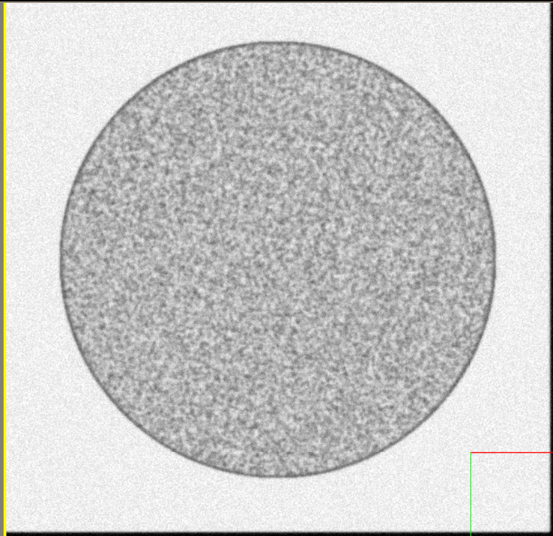
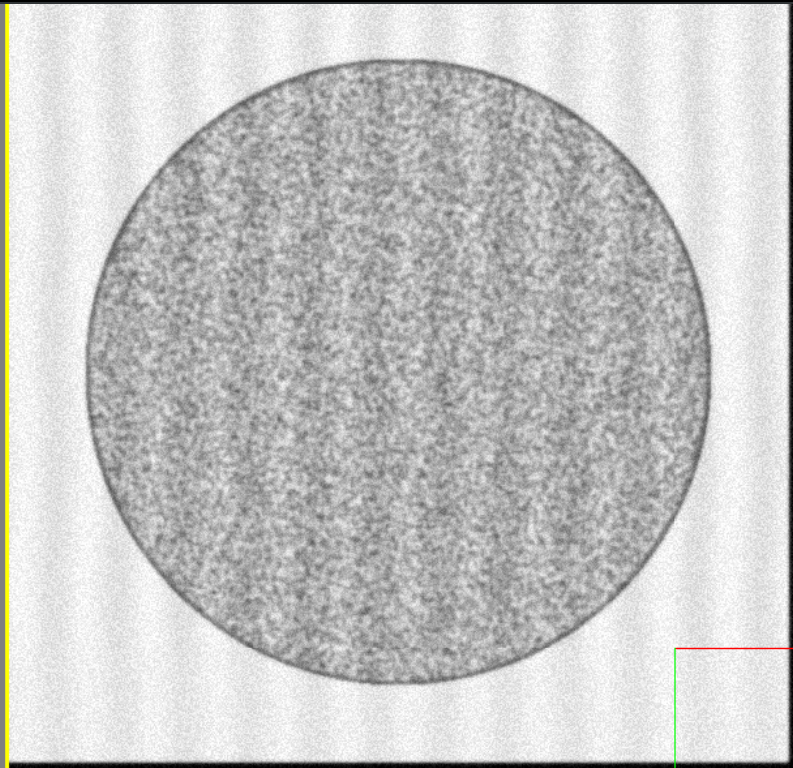
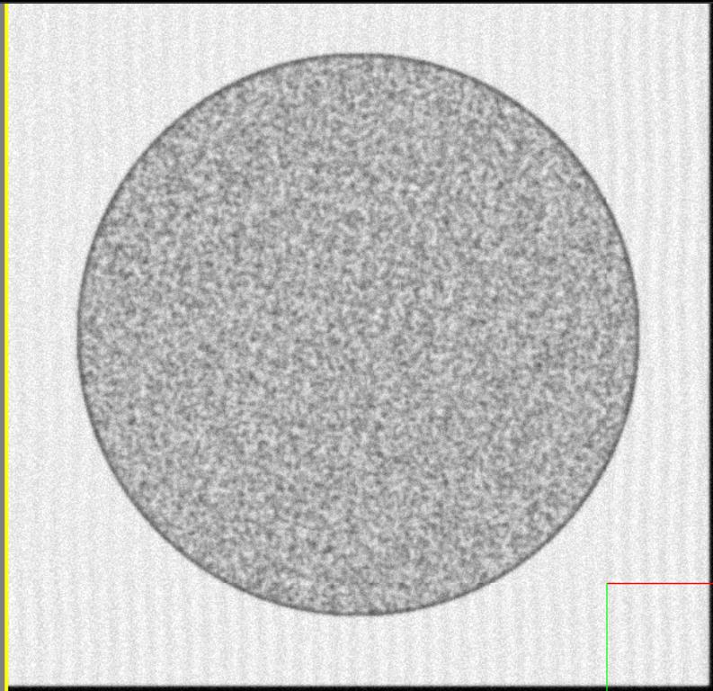
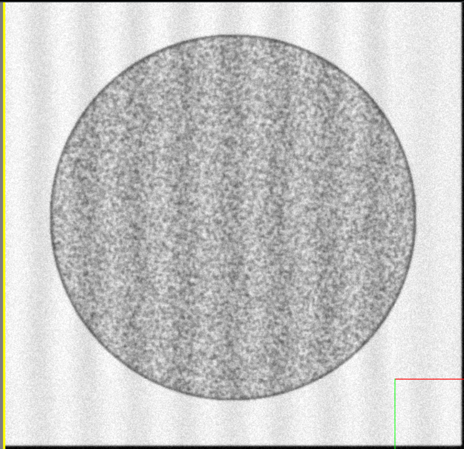
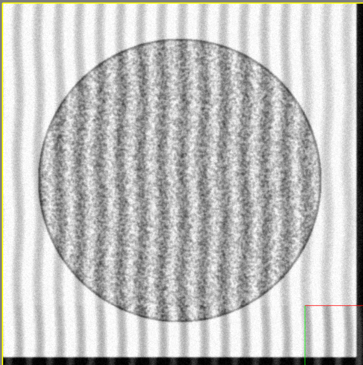
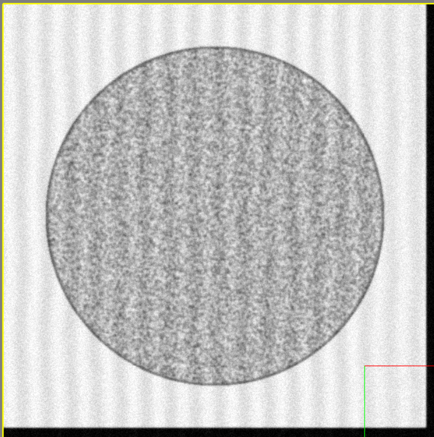
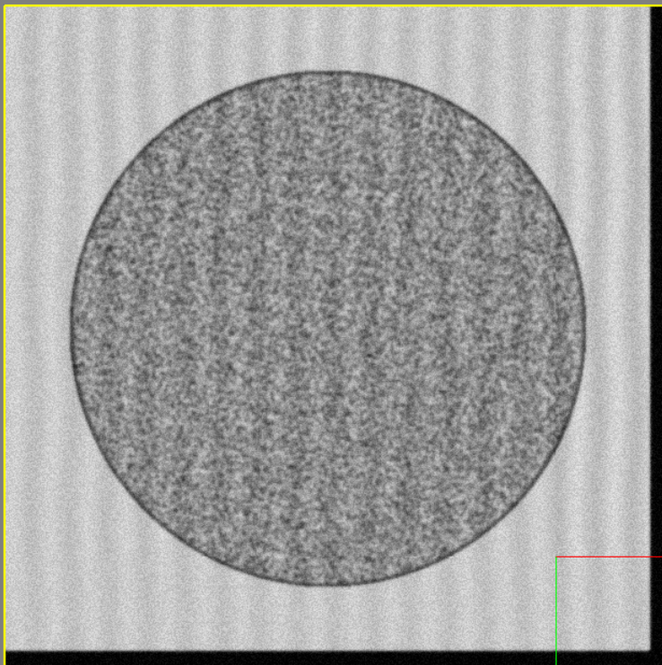
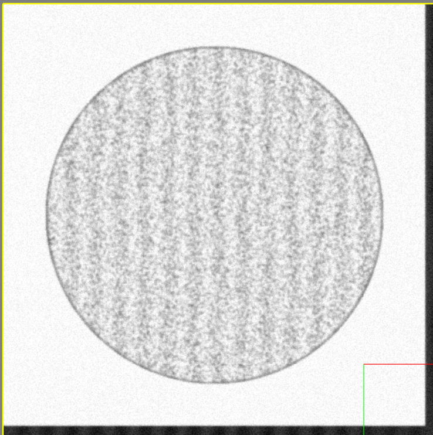

# Microscope Interference Patterns


!!! note

    For this section of the guide, we will be disabling all other effects in order to clearly show each option.


The Virtual Microscope supports a few configuration options regarding the addition of interference patterns to generated images.


| Parameter              | Description                          |
| :--------------------- | :----------------------------------- |
| `EnableInterferencePattern`       | Enable or disable the generation of interference patterns |
| `InterferencePatternXScale_um`       | Set the number of lines per unit of x distance |
| `InterferencePatternAmplitude`    | Set the color variation from interference patterns (larger means brighter peaks and darker valleys) |
| `InterferencePatternBias`    | Set the intensity bias for interference patterns, 0 indicates do not change, positive means brighter, negative darker |
| `InterferencePatternWobbleFrequency`    | Set the number of y-axis wobbles per unit of y distance |
| `InterferencePatternYAxisWobbleIntensity`    | Set the size of the y-axis wobbles |
| `InterferencePatternStrengthVariation`    | Set the amount that the intensity of interference patterns is randomized image-to-image |
| `InterferencePatternZOffsetShift`    | Enable or disable randomization of patterns between layers |


!!! example

    === "EnableInterferencePattern"

        Enable or disable the generation of interference patterns.

        ---

        Setting `EnableInterferencePattern` to `False` results in the following image:

        

        ```python
        EMConfig.EnableInterferencePattern = False
        ```

        ---

        Likewise, setting it to `True` will result in the following image:
        

        ```python
        EMConfig.EnableInterferencePattern = True
        ```


    === "InterferencePatternXScale_um"

        The X Scale determines how frequent the vertical lines from the interference pattern are.

        ---

        Setting it to 40 will result in the following image:
        

        ```python
        EMConfig.InterferencePatternXScale_um = 40
        ```

        ---

        Likewise, setting it to 10 will result in the following image:
        

        ```python
        EMConfig.InterferencePatternXScale_um = 10
        ```


    === "InterferencePatternAmplitude"

        This sets amount that the colors vary from peak to valley.

        ---

        Setting it to 25 will result in the following image:
        

        ```python
        EMConfig.InterferencePatternAmplitude = 25
        ```

        ---

        Likewise, setting it to 0 will result in the following image:
        

        ```python
        EMConfig.InterferencePatternAmplitude = 6
        ```


    === "InterferencePatternBias"

        Brightens or darkens the interference pattern.

        ---

        Setting it to -40 will result in the following image:
        

        ```python
        EMConfig.InterferencePatternBias = -40
        ```

        ---

        Likewise, setting it to 40 will result in the following image:
        

        ```python
        EMConfig.InterferencePatternBias = 40
        ```


---

*This documentation is provided by BrainGenix, a division of Carboncopies Foundation R&D. BrainGenix is a platform focused on advancing the field of whole-brain-emulation and computational neuroscience. BrainGenix is part of the CarbonCopies Foundation, a 501\(c)3 non-profit organization dedicated to researching and promoting whole brain emulation. Learn more about CarbonCopies at https://carboncopies.org. For any queries or feedback regarding BrainGenix projects or documentation, please write to us at contact@carboncopies.org.*