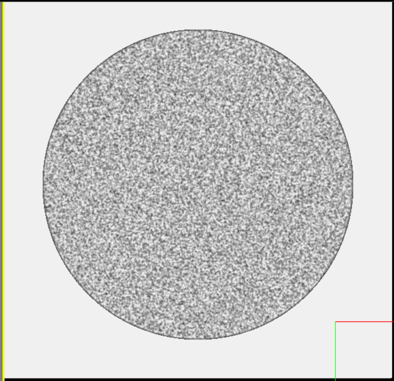
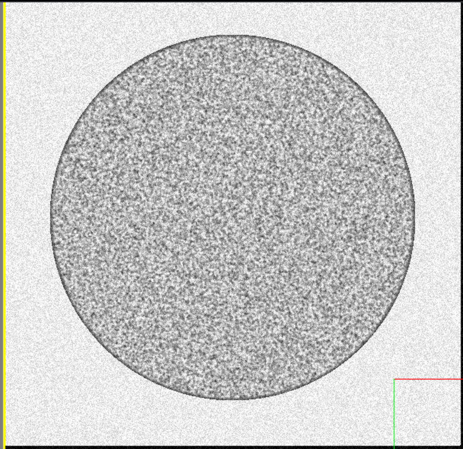
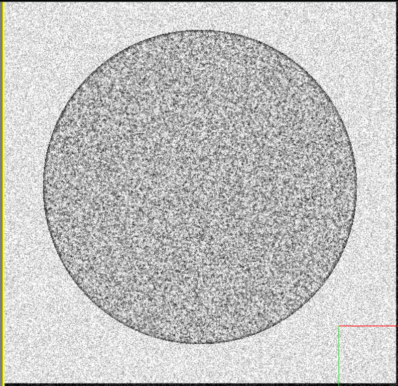
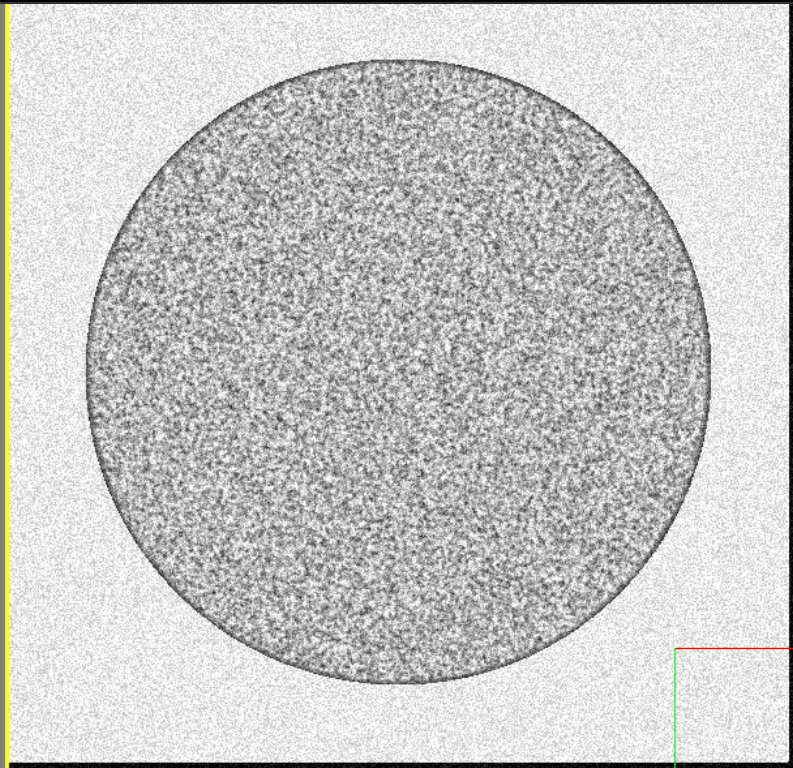
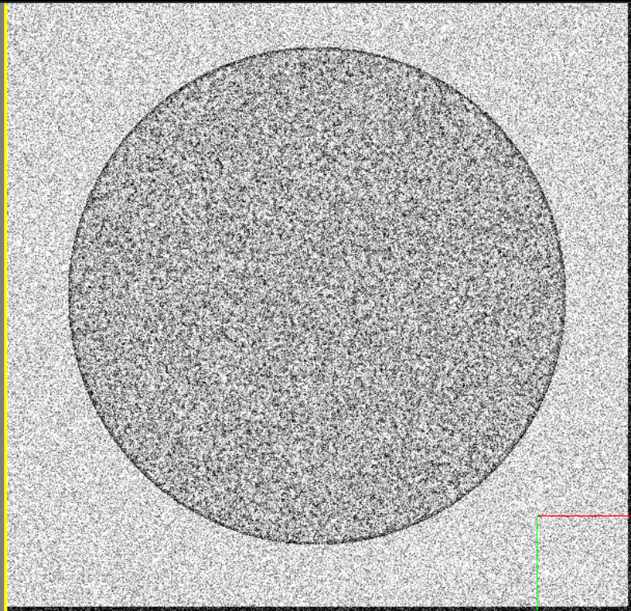
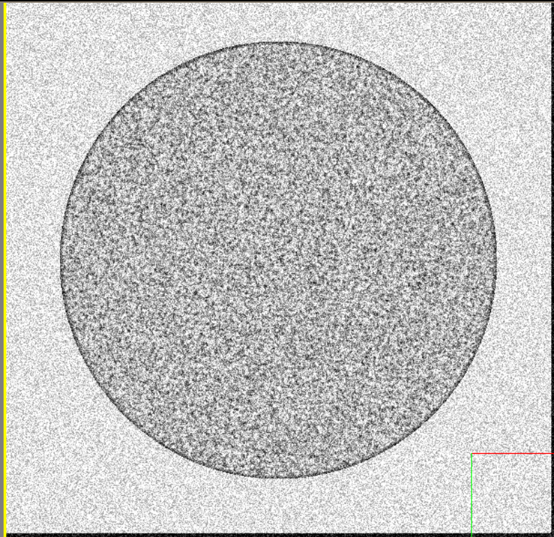
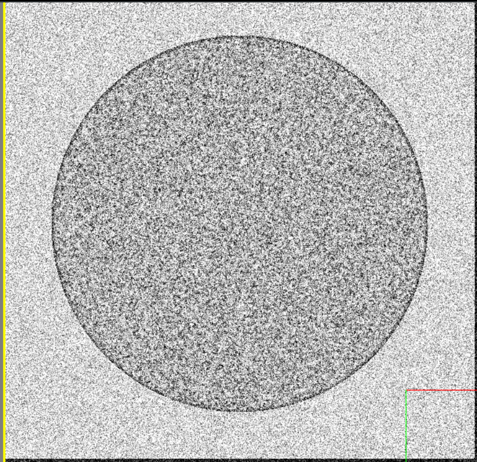

# Microscope Noise

!!! note

    For this section of the guide, we will be disabling all other effects in order to clearly show each option.

    Unless otherwise noted, the following configuration was used as a base for this demo:

    ```python

    EMConfig.EnableGaussianBlur = False
    EMConfig.EnableInterferencePattern = False
    EMConfig.BorderEdgeIntensity = 70
    EMConfig.BorderThickness_um = 0.05

    ```


The Virtual Microscope supports a few configuration options regarding the addition of noise to generated images.


| Parameter              | Description                          |
| :--------------------- | :----------------------------------- |
| `GenerateImageNoise`       | Enable or disable the generation of noise |
| `ImageNoiseIntensity`       | Set the amount of noise to be generated, higher means more extreme noise |
| `PreBlurNoisePasses`    | Number of iterations to generate noise prior to blurring images |
| `PostBlurNoisePasses`    | Number of iterations to generate noise after blurring images |


!!! example

    === "GenerateImageNoise"

        Enable or disable the generation of image noise.

        ---

        Setting `GenerateImageNoise` to `False` results in the following image:

        

        ```python
        EMConfig.GenerateImageNoise = False
        ```

        ---

        Likewise, setting it to `True` will result in the following image:
        

        ```python
        EMConfig.ImageNoiseIntensity = 80
        EMConfig.GenerateImageNoise = True
        ```


    === "ImageNoiseIntensity"

        The image noise intensity value describes the amount of noise - higher numbers will indicate a more visible noise effect.

        ---

        Setting it to 180 will result in the following image:
        

        ```python
        EMConfig.ImageNoiseIntensity = 180
        ```

        ---

        Likewise, setting it to 100 will result in the following image:
        

        ```python
        EMConfig.ImageNoiseIntensity = 100
        ```


    === "PreBlurNoisePasses"

        This sets the number of times to add noise prior to blurring the image.

        ---

        Setting it to 1 will result in the following image:
        

        ```python
        EMConfig.PreBlurNoisePasses = 1
        ```

        ---

        Likewise, setting it to 0 will result in the following image:
        

        ```python
        EMConfig.PreBlurNoisePasses = 0
        ```

    === "PostBlurNoisePasses"

        Post blur passes specify how many times to add noise after the blurring step.

        ---

        Setting it to 1 will result in the following image:
        

        ```python
        EMConfig.PostBlurNoisePasses = 1
        ```

        ---

        Likewise, setting it to 2 will result in the following image:
        

        ```python
        EMConfig.PostBlurNoisePasses = 2
        ```


---

*This documentation is provided by BrainGenix, a division of Carboncopies Foundation R&D. BrainGenix is a platform focused on advancing the field of whole-brain-emulation and computational neuroscience. BrainGenix is part of the CarbonCopies Foundation, a 501\(c)3 non-profit organization dedicated to researching and promoting whole brain emulation. Learn more about CarbonCopies at https://carboncopies.org. For any queries or feedback regarding BrainGenix projects or documentation, please write to us at contact@carboncopies.org.*