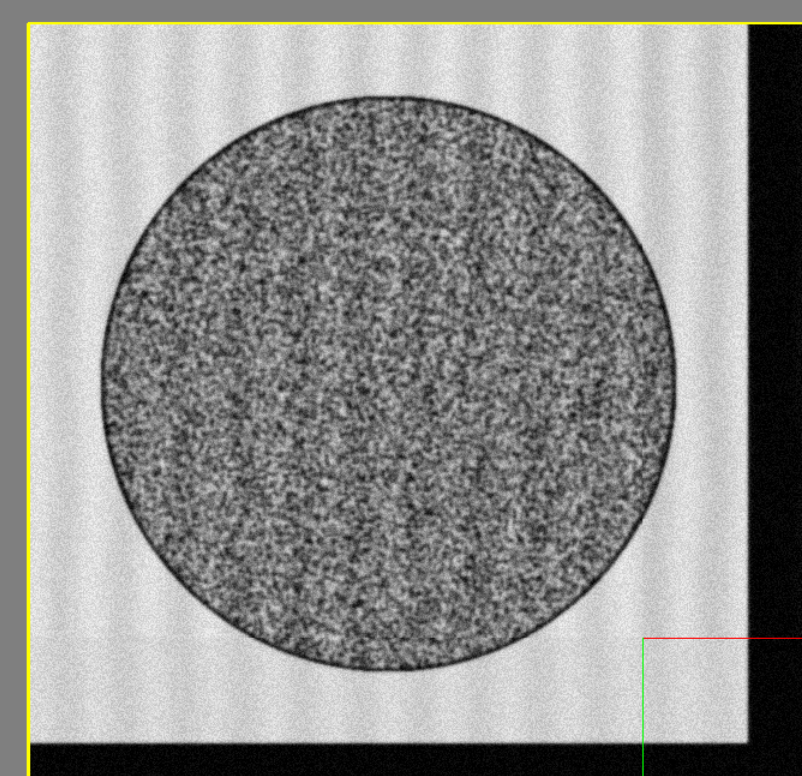
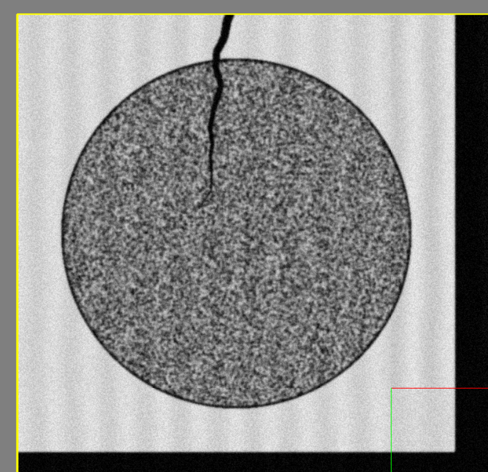
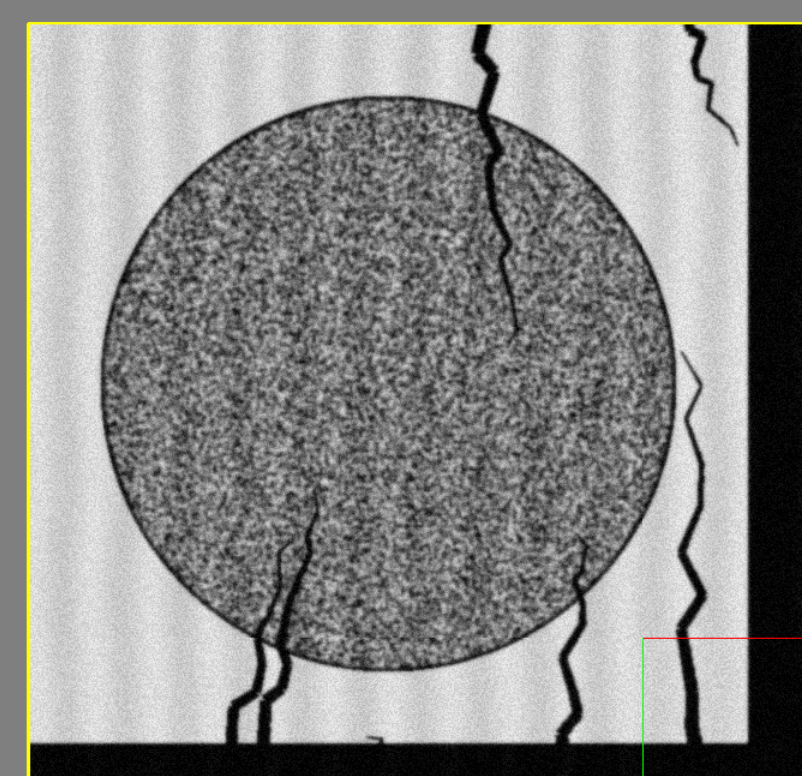
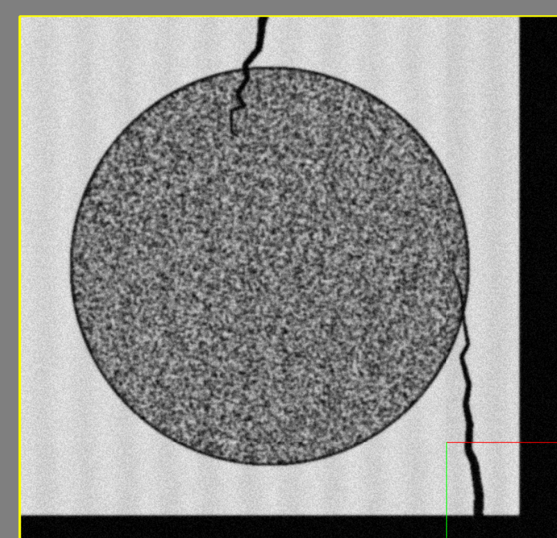
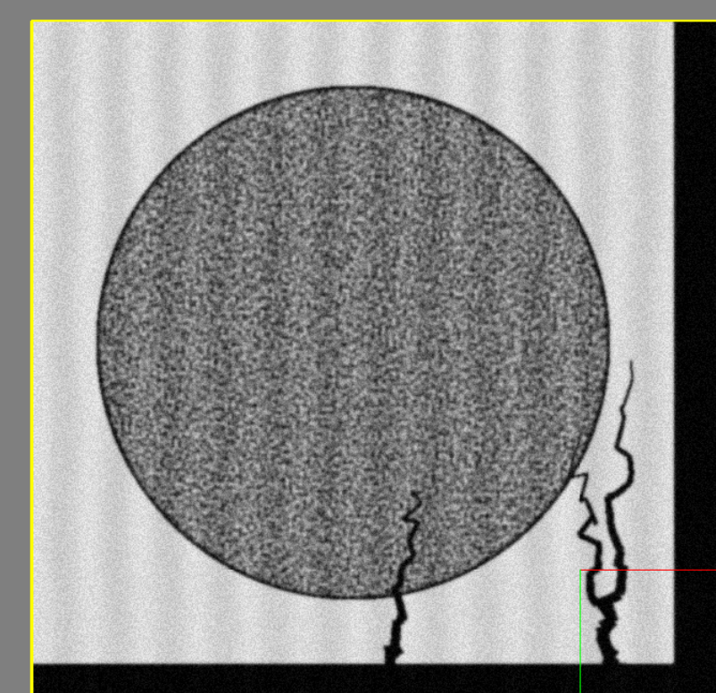
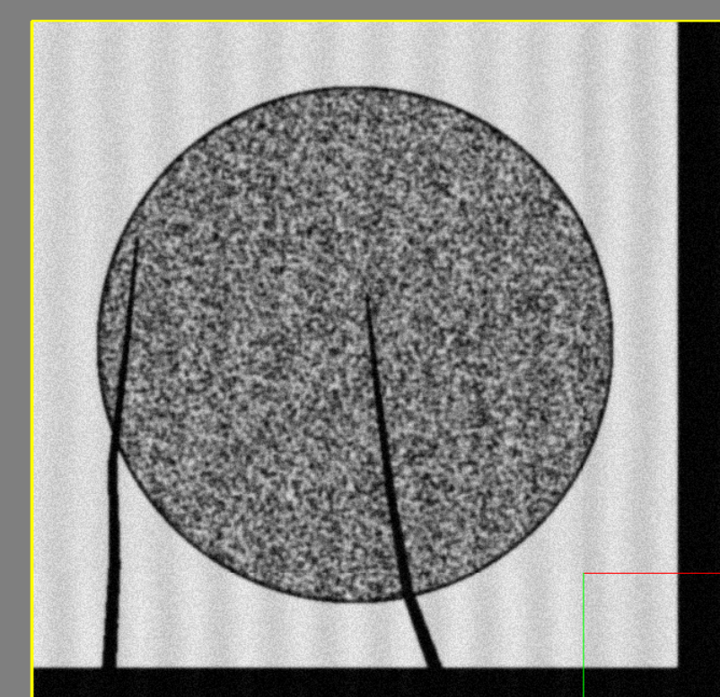

# Sample Tearing


We're able to simulate basic sample tears with the Virtual Microscope system.

Currently, we don't do anything fancy where the tears would shift over parts of the sample, it's merely an effect that's written on top of the images.

This feature has quite a few configuration options, so we will go over them here.


| Parameter              | Description                          |
| :--------------------- | :----------------------------------- |
| `TearingEnabled`       | Enable or disable the generation of sample tears |
| `TearNumPerSlice`       | Set the baseline amount of tears per subregion slice |
| `TearNumVariation`    | Determine the range for sample variation, 1 would mean baseline amount +/- 1 |
| `TearNumSegments`    | Determine how many line segments each tear is made of |
| `TearMinimumLength_um`    | Set the minimum length for a tear, in microns |
| `TearMaxDeltaY_um`    | Set the maximum change in y position for this tear |
| `TearMaxDeltaX_um`    | Set the maximum change in x position for this tear |
| `TearPointJitterXMax_um`    | Maximum amount to move each segment in the x position in microns |
| `TearPointJitterXMin_um`    | Minimum amount to move each segment in the x position in microns |
| `TearPointJitterYMax_um`    | Maximum amount to move each segment in the y position in microns |
| `TearPointJitterYMin_um`    | Minimum amount to move each segment in the y position in microns |
| `TearStartSize_um`    | Set the size of the tear in microns where it starts from |
| `TearEndSize_um`    | Set the size of the tear in microns where it ends |


!!! note

    Due to the number of options in this feature, not all options will have an example screenshot.


!!! example

    === "TearingEnabled"

        Enable or disable the generation of image noise.

        ---

        Setting `TearingEnabled` to `False` results in the following image:

        

        ```python
        EMConfig.TearingEnabled = False
        ```

        ---

        Likewise, setting it to `True` will result in the following image:
        

        ```python
        EMConfig.TearingEnabled = True
        ```


    === "Setting Tear Numbers"

        This section covers how to set the number of tears.

        The baseline number of tears, `TearNumPerSlice` specifies how many tears each subregion slice will have as a baseline.
        To vary this with randomness, use the `TearNumVariation` option to add randomness.

        ---

        Setting `TearNumPerSlice` to 3 will result in the following image:
        

        ```python
        EMConfig.TearNumPerSlice = 180
        ```

        ---

        Likewise, setting it to 1 will result in the following image:
        

        ```python
        EMConfig.TearNumPerSlice = 100
        ```


    === "Changing Tear Shape"

        You can change the shape of the tears by altering the number of segments, and the jitter per segment.

        More segments will allow for more complex shapes - however having too high of a jitter with many segments will cause undesirable results.

        If you wish for a less linear tear shape, increasing the jitter will result in a more jagged tear.

        Additionally, changing the size of the tear's width can be accomplished via the `TearStartSize_um` and `TearEndSize_um` parameters.
        

        ---

        Setting `TearNumSegments` to 1 will result in the following image:
        

        ```python
        EMConfig.TearNumSegments = 30
        ```

        ---

        Likewise, setting it to 0 will result in the following image:
        

        ```python
        EMConfig.TearNumSegments = 5
        ```

        ```

        Finally, if you wish to change the direction of the tear, playing with `TearMaxDeltaY_um` and `TearMaxDeltaX_um` will change the direction of travel for the tears.


---

*This documentation is provided by BrainGenix, a division of Carboncopies Foundation R&D. BrainGenix is a platform focused on advancing the field of whole-brain-emulation and computational neuroscience. BrainGenix is part of the CarbonCopies Foundation, a 501\(c)3 non-profit organization dedicated to researching and promoting whole brain emulation. Learn more about CarbonCopies at https://carboncopies.org. For any queries or feedback regarding BrainGenix projects or documentation, please write to us at contact@carboncopies.org.*