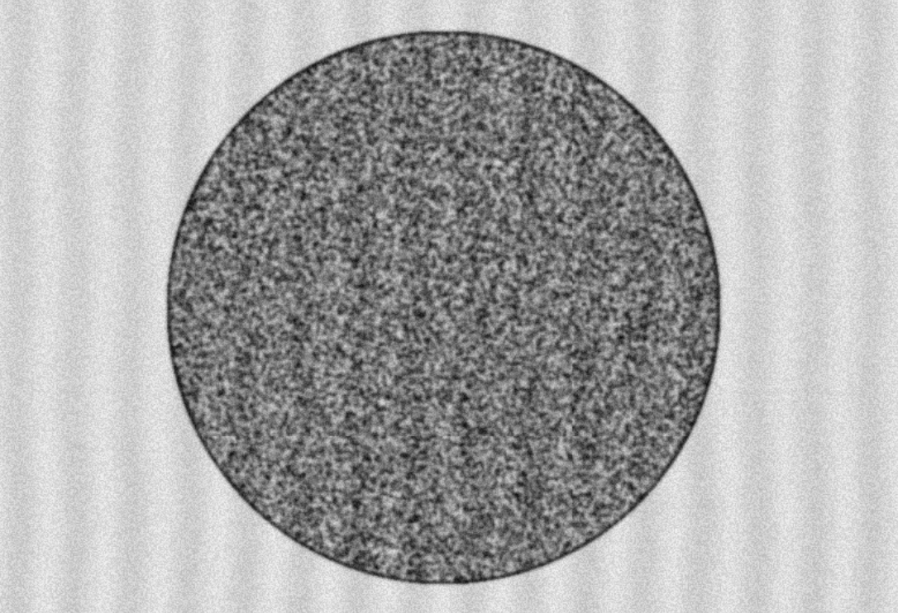
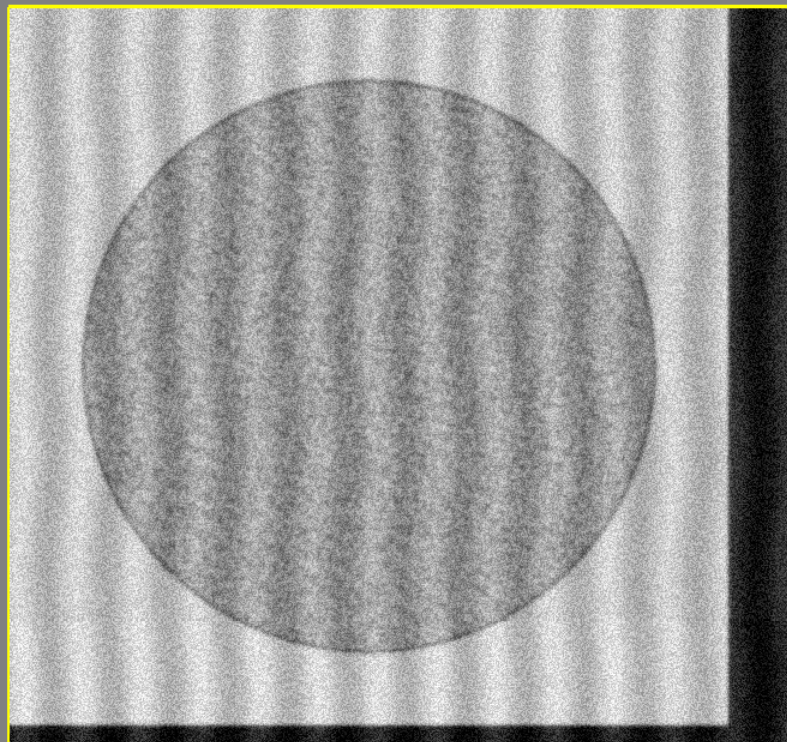

# EM Rendering - Presets

In this guide, we will cover each of the different presets provided by BrainGenix. You can of course, use these presets as a base and tweak them to your liking and use case.

## Examples

We assume that you have already setup a simulation and created one or more compartments that you wish to render.


=== "Default"

    The base preset is just a starting point and is not modeled off of any specific microscopes.

    To use this, simply do the following:

    ```python
    EMConfig = NES.VSDA.EM.Configuration()
    EMConfig.PixelResolution_um = 0.01
    EMConfig.ImageWidth_px = 512
    EMConfig.ImageHeight_px = 512
    EMConfig.SliceThickness_um = 0.02
    EMConfig.ScanRegionOverlap_percent = 0
    EMConfig.MicroscopeFOV_deg = 50
    EMConfig.NumPixelsPerVoxel_px = 1
    VSDAEMInstance = MySim.AddVSDAEM(EMConfig)
    ```
    

    Which yields:

    


=== "KrapMicroscope"

    The Krap preset is a starting point for a bad microscope - where there is a lot of noise, interference patterns, out-of-focus, etc.

    To use this, simply do the following:

    ```python
    EMConfig = NES.VSDA.EM.KrapMicroscope()
    EMConfig.PixelResolution_um = 0.01
    EMConfig.ImageWidth_px = 512
    EMConfig.ImageHeight_px = 512
    EMConfig.SliceThickness_um = 0.02
    EMConfig.ScanRegionOverlap_percent = 0
    EMConfig.MicroscopeFOV_deg = 50
    EMConfig.NumPixelsPerVoxel_px = 1
    VSDAEMInstance = MySim.AddVSDAEM(EMConfig)
    ```
    

    Which yields:

    


---

*This documentation is provided by BrainGenix, a division of Carboncopies Foundation R&D. BrainGenix is a platform focused on advancing the field of whole-brain-emulation and computational neuroscience. BrainGenix is part of the CarbonCopies Foundation, a 501\(c)3 non-profit organization dedicated to researching and promoting whole brain emulation. Learn more about CarbonCopies at https://carboncopies.org. For any queries or feedback regarding BrainGenix projects or documentation, please write to us at contact@carboncopies.org.*