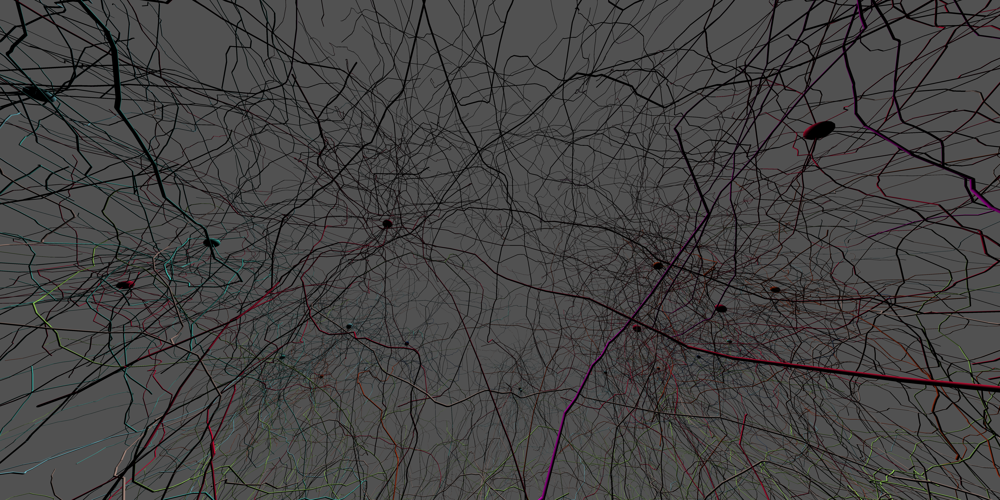
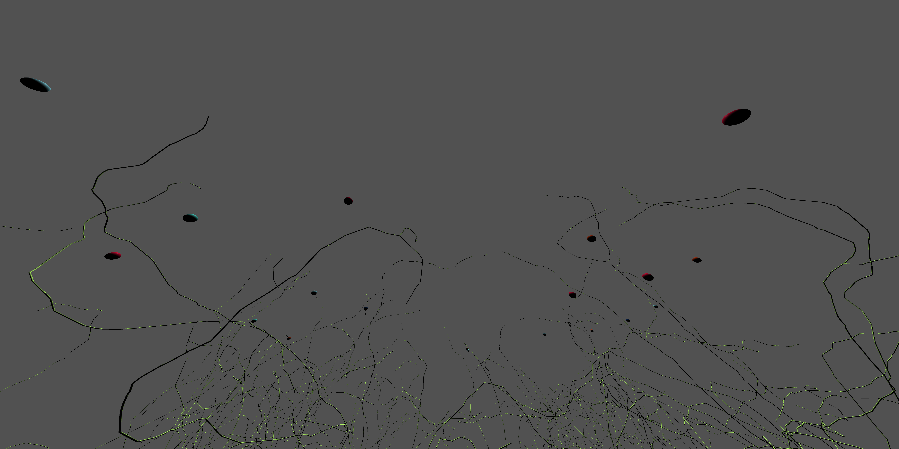

# Visualizer - Filtering Shown Neurons

It's possible to select which neurons are shown when visualizations are rendered using an optional parameter.

This section discusses how to do that.


| Parameter      | Description                          |
| :---------- | :----------------------------------- |
| `Optional_VisibleNeuronIDs`       | Optional list of neuron IDs that if present will only be shown |

!!! note

    The soma for other neurons will also be shown, but not the compartments or synapses.


---


Let's say we are building a large scale network and have the following output without any filtering.



That output could be generated from something like this:

```py
# NOTE: This example assumes you already have a simulation and client setup 
VisualizerJob = BrainGenix.NES.Visualizer.Configuration()
VisualizerJob.ImageWidth_px = 8192
VisualizerJob.ImageHeight_px = 4096

# Render In Circle Around Sim
Radius = 500
Steps = 10
ZHeight = -550

for Point in PointsInCircum(Radius, Steps):
    VisualizerJob.CameraFOVList_deg.append(110)
    VisualizerJob.CameraPositionList_um.append([Point[0], Point[1], ZHeight])
    VisualizerJob.CameraLookAtPositionList_um.append([0, 0, -1000])

Visualizer = Simulation.SetupVisualizer()
Visualizer.GenerateVisualization(VisualizerJob)

Visualizer.SaveImages(f"{YOUR_SAVE_DIRECTORY_HERE}/Visualizations/0", 2) # Save images two at a time
```


!!! info

    By adding the filter configuration line, you can select which neuron(s) to show:

    === "Single Neuron By ID"
        If you want to select for a single neuron and you know it's ID, do this:
        
        ```py
        VisualizerJob.Optional_VisibleNeuronIDs = [1] # Show neuron with ID 1
        ```

    === "Multiple Neurons By ID"
        If you want to select for a multiple neurons and you know their IDs, do this:

        ```py
        VisualizerJob.Optional_VisibleNeuronIDs = [0, 1] # Show neuron with IDs 0,1
        ```
    === "Single Neuron By Object"
        Alternatively, if you want to select for a neuron by the object, `ExampleNeuron`, do this:

        ```py
        VisualizerJob.Optional_VisibleNeuronIDs = [ExampleNeuron.ID] # Show example neuron only
        ```

    === "Multiple Neurons By Object"
        Alternatively, if you want to select for multiple neurons by the objects, `ExampleNeuron1` and `ExampleNeuron2`, do this:

        ```py
        VisualizerJob.Optional_VisibleNeuronIDs = [ExampleNeuron1.ID, ExampleNeuron2.ID] # Show example neurons
        ```


So for our example, updating our visualizer job configuration to include the new filter (as follows) results in the following image.



```py
# NOTE: This example assumes you already have a simulation and client setup 
VisualizerJob = BrainGenix.NES.Visualizer.Configuration()
VisualizerJob.ImageWidth_px = 8192
VisualizerJob.ImageHeight_px = 4096

## ONLY SHOW NEURON 1, DISABLE OTHERS (EXCEPT FOR THEIR SOMA) ##
VisualizerJob.Optional_VisibleNeuronIDs = [1] 

# Render In Circle Around Sim
Radius = 500
Steps = 10
ZHeight = -550

for Point in PointsInCircum(Radius, Steps):
    VisualizerJob.CameraFOVList_deg.append(110)
    VisualizerJob.CameraPositionList_um.append([Point[0], Point[1], ZHeight])
    VisualizerJob.CameraLookAtPositionList_um.append([0, 0, -1000])

Visualizer = Simulation.SetupVisualizer()
Visualizer.GenerateVisualization(VisualizerJob)

Visualizer.SaveImages(f"{YOUR_SAVE_DIRECTORY_HERE}/Visualizations/0", 2) # Save images two at a time
```


---

*This documentation is provided by BrainGenix, a division of Carboncopies Foundation R&D. BrainGenix is a platform focused on advancing the field of whole-brain-emulation and computational neuroscience. BrainGenix is part of the CarbonCopies Foundation, a 501\(c)3 non-profit organization dedicated to researching and promoting whole brain emulation. Learn more about CarbonCopies at https://carboncopies.org. For any queries or feedback regarding BrainGenix projects or documentation, please write to us at contact@carboncopies.org.*