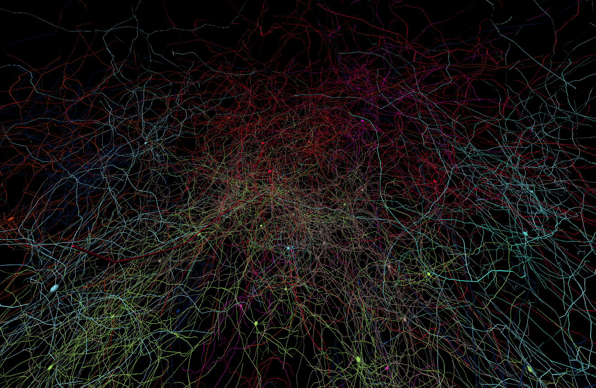
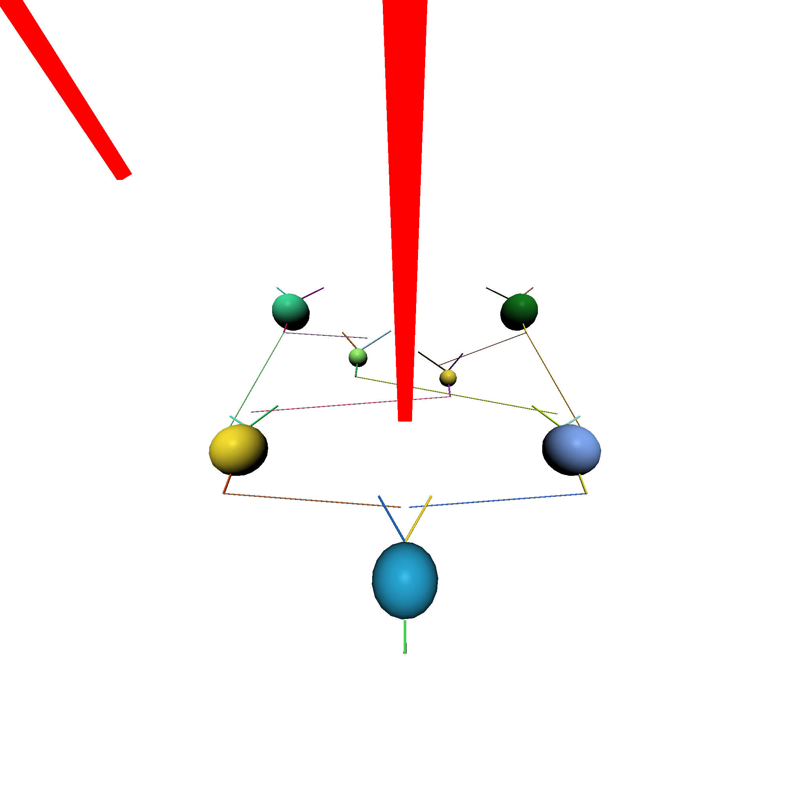

# Getting Started



The BrainGenix platform offers a built-in visualization tool which allows users to generate 3D visualizations of defined simulations for debugging purposes.

To take advantage of those features, please see the following example.


## Example

The following example code will generate a series of pictures that orbit the simulation centered at 0,0,0. Radius and offset for the vertical height can be configured to fit your needs.
The visualizer generates images based on a series of camera positions and look at positions, so it can be any arbitrary positions you desire.


!!! note

    You must have already defined a simulation with at least one compartment otherwise nothing will appear on your render.


```python


def PointsInCircum(r,n=100):
    return [(math.cos(2*math.pi/n*x)*r,math.sin(2*math.pi/n*x)*r) for x in range(0,n+1)]

VisualizerJob = BrainGenix.NES.Visualizer.Configuration()
VisualizerJob.ImageWidth_px = 2048
VisualizerJob.ImageHeight_px = 2048


# Render In Circle Around Sim
Radius = 20
Steps = 720
ZHeight = 0

for Point in PointsInCircum(Radius, Steps):

    VisualizerJob.CameraFOVList_deg.append(110)
    VisualizerJob.CameraPositionList_um.append([Point[0], Point[1], ZHeight])
    VisualizerJob.CameraLookAtPositionList_um.append([0, 0, ZHeight])

Visualizer = MySim.SetupVisualizer()
Visualizer.GenerateVisualization(VisualizerJob)


Visualizer.SaveImages(".Visualizations")

```


For more in-depth configuration options, please see other pages in this section.


!!! example

    Here is an example image produced by the visualizer.
    Please note that the red boxes represent electrodes placed in the sample.

    


---

*This documentation is provided by BrainGenix, a division of Carboncopies Foundation R&D. BrainGenix is a platform focused on advancing the field of whole-brain-emulation and computational neuroscience. BrainGenix is part of the CarbonCopies Foundation, a 501\(c)3 non-profit organization dedicated to researching and promoting whole brain emulation. Learn more about CarbonCopies at https://carboncopies.org. For any queries or feedback regarding BrainGenix projects or documentation, please write to us at contact@carboncopies.org.*