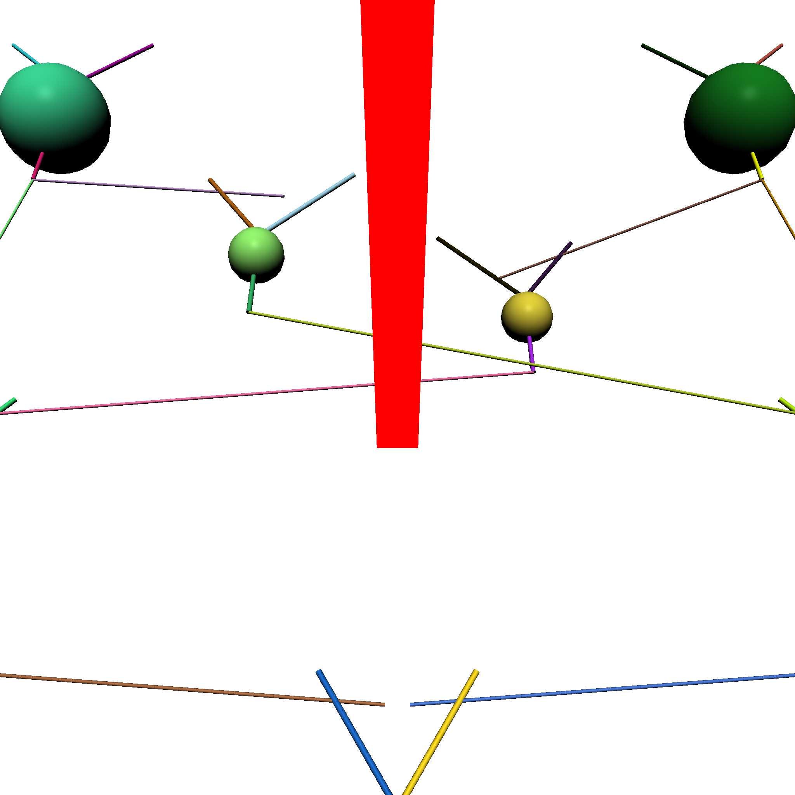
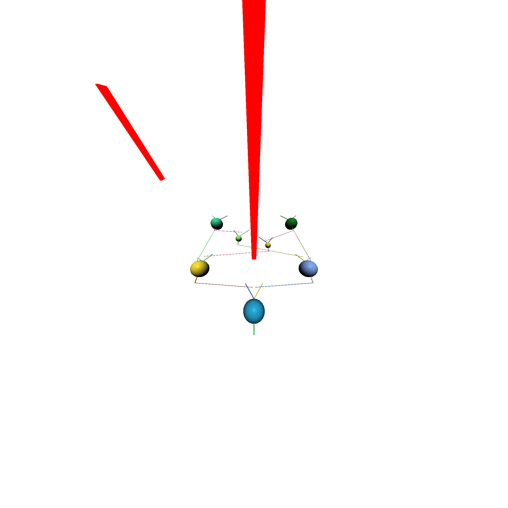

# Visualizer - Parameters

In this section, we will cover what all of the different options in the visualizer  are, and what they do. 

This section covers the main parameters of the Visualizer subsystem.

| Parameter      | Description                          |
| :---------- | :----------------------------------- |
| `ImageWidth_px`       | Resolution of the image width in pixels |
| `ImageHeight_px`       | Resolution of the image height in pixels |
| `CameraFOVList_deg`    | List for the FOV of each image to be rendered |
| `CameraPositionList_um`    | List for the position of the camera for each image to be rendered |
| `CameraLookAtPositionList_um`    | List for the position that the camera is looking towards for each image to be rendered |

!!! note

    The `CameraFOVList_deg`, `CameraPositionList_um`, and `CameraLookAtPositionList_um` list ***must*** be the same size.
    If you intend to render 5 images, each list must contain 5 items, likewise if you intend to render 900 images, they must have 900 items each.

---

!!! example

    === "CameraFOVList_deg"

        Changes the field of view of the visualizer output images.
        Larger values will increase the FOV, while smaller ones shrink it.

        !!! note

            It is possible to mix-and-match the FOV of images within the same render operation.
            Every image has to have an entry in the lists, so the FOV can change for each image by appending a different value into this list.

        ---

        Using an FOV of 50 will result in the following image.

        

        ---

        Likewise, setting it to `150` will result in the following image:
        

    === "Setting Image Locations"

        In order to adjust what's actually being rendered, you have two main options.

        Firstly, you can change the camera's position - this will of course change where the image is taken from.

        Secondly, you can change the LookAt value, which changes where the camera is pointed towards.
 
    === "Image Resolutions"

        To change the resolution (and aspect ratio) of produced images, simply alter the `ImageWidth_px` and `ImageHeight_px` parameters.

       
---

*This documentation is provided by BrainGenix, a division of Carboncopies Foundation R&D. BrainGenix is a platform focused on advancing the field of whole-brain-emulation and computational neuroscience. BrainGenix is part of the CarbonCopies Foundation, a 501\(c)3 non-profit organization dedicated to researching and promoting whole brain emulation. Learn more about CarbonCopies at https://carboncopies.org. For any queries or feedback regarding BrainGenix projects or documentation, please write to us at contact@carboncopies.org.*