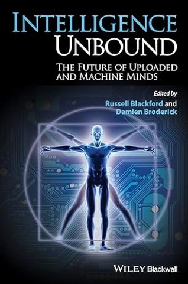

# INTELLIGENCE UNBOUND
## THE FUTURE OF UPLOADED AND MACHINE MINDS BY RUSSELL BLACKFORD

**2014**

Intelligence Unbound explores the prospects, promises, and potential dangers of machine intelligence and uploaded minds in a collection of state-of-the-art essays from internationally recognized philosophers, AI researchers, science fiction authors, and theorists. Compelling and intellectually sophisticated exploration of the latest thinking on Artificial Intelligence and machine minds Features contributions from an international cast of philosophers, Artificial Intelligence researchers, science fiction authors, and more Offers current, diverse perspectives on machine intelligence and uploaded minds, emerging topics of tremendous interest Illuminates the nature and ethics of tomorrow’s machine minds—and of the convergence of humans and machines—to consider the pros and cons of a variety of intriguing possibilities Considers classic philosophical puzzles as well as the latest topics debated by scholars. Covers a wide range of viewpoints and arguments regarding the prospects of uploading and machine intelligence, including proponents and skeptics, pros and cons.

# A TAXONOMY AND ETHICS OF MIND-UPLOADING
## BY KEITH WILEY

**2014**

Mind Uploading: The process of transferring one's mind from the brain to a new substrate, generally a computer. It is the stuff of science fiction, immediately recognizable in contemporary literature and cinema. However, it has also become increasingly respectable--or at least approachable--within technological, neurological, and philosophical circles. This book begins with a rich taxonomy of hypothetical procedures by which mind-uploading might be achieved, even if only in the realm of thought experiment. This is likely the most thorough collection of such procedures yet compiled and should form the basis of any reader's personal philosophy of mind and mind-uploading. It then offers one such philosophy of mind, along with an analysis and interpretation of the scenarios in the taxonomy through the lens of this philosophy. This book will be an important component of any curious reader's developing philosophy of mind and mind-uploading.

