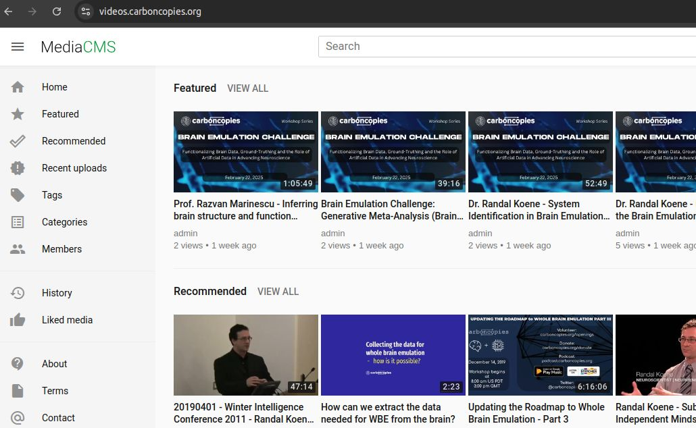
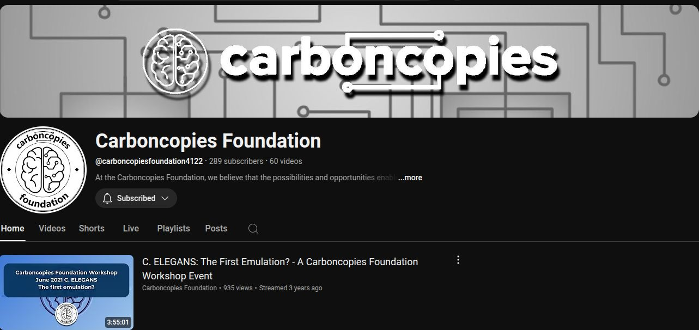

# Media

Please enjoy our video collection on whole-brain emulation and many related topics.

Visit our media server at https://videos.carboncopies.org.

Or visit our [Youtube channel](https://www.youtube.com/channel/UCuNZLgW-6Xcp6wfyb2Y_Thw).

A few videos from our [old Youtube channel](https://www.youtube.com/channel/UCMEGlHbLa0xaSlpHS5OKoyg/videos) have not yet been moved to the new one.

---

<iframe width="560" height="315" src="https://videos.carboncopies.org/embed?m=yY1QRzTQA" frameborder="0" allowfullscreen></iframe>

---

!!! note

    Links to featured media listed below will be restored shortly.

FUTURE SCIENCE PROJECT | An Interview with Randal Koene
2018

The above video was created by Mika Mautner, a student and researcher for Carboncopies. It features an interview with Randal Koene who describes the current state of neuroscience as it relates to Whole Brain Emulation or mind uploading.
YOUR ANIMAL LIFE IS OVER MACHINE LIFE HAS BEGUN. THE ROAD TO IMMORTALITY
THE GUARDIAN
2017

In California, radical scientists and billionaire backers think the technology to extend life – by uploading minds to exist separately from the body – is only a few years away.
THE FALLACY OF FAVORING GRADUAL REPLACEMENT MIND UPLOADING OVER SCAN AND COPY
INSTITUTE OF ETHICS AND EMERGING TECHNOLOGIES
2015

This paper demonstrates a chain of reasoning that establishes metaphysical equivalence between these two methods in terms of preserving personal identity.
The Neuroscientist Who Wants To Upload Humanity To A Computer
Popular science
2014

Read about Dr. Randal Koene recruiting top neuroscientists to help him make humans live forever.
Breakthrough philanthropy
Thiel foundation
2014

Watch the entire program of this innovative event, featuring the most visionary non-profits innovating in service of humanity.
Randal Koene on whole brain emulation
Machine learning research institute
2014

An interview with the Machine Learning Research Institute and Dr. Randal Koene on Whole Brain Emulation.
EXPERIMENTAL ENHANCEMENT OF NEUROPHYSIOLOGICAL FUNCTION
FRONTIERS IN SYSTEM NEUROSCIENCE
2014

Enhancing brain function entails controlling neuronal function. There are several methods available for this which led to some relevant experimental data. Read about them here.
WINTER INTELLIGENCE CONFERENCE
FUTURE OF HUMANITY INSTITUTE
2013

Watch Dr. Koene discuss Substrate Independent Minds.
SUBSTRATE-INDEPENDENT MINDS
ISSUES MAGAZINE
2012

In pursuing a Utopian world of perfect post-humans, we may irrevocably undermine what makes us human in the first place. Our lives are a composite of actions and experiences, and our minds depend on our bodies and the environment - but do they have to?
RANDAL KOENE ON SUBSTRATE INDEPENDENT MINDS
HUMANITY MEDIA
2011

In this interview, Dr. Randal Koene gives a wonderful overview of the current state and future prospects of R&D regarding substrate-independent minds.
CARBONCOPIES-REALISTIC ROUTES TO SUBSTRATE-INDEPENDENT MINDS
KURZWEIL ACCELERATING INTELLIGENCE
2010

What might brains and minds look like in the future? Read how Carboncopies is offering a networking platform and hub around which experts in the individual fields relevant to ASIM can gather and exchange ideas.
WHOLE BRAIN EMULATION, A ROADMAP
THE FUTURE OF HUMANITY INSTITUTE AND OXFORD UNIVERSITY
2008

Whole brain emulation (WBE), the possible future one‐to‐one modelling of the function of the human brain, is academically interesting and important for several reasons. Read about why in this roadmap WBE roadmap.

