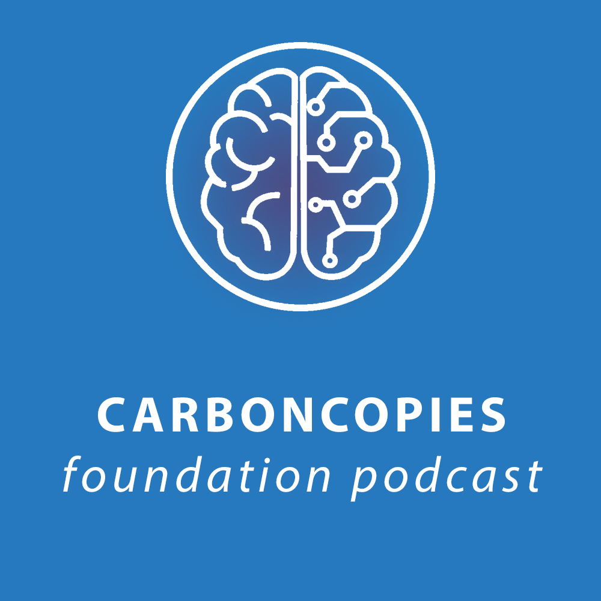

# Carboncopies Podcast

You can now access our workshops and the continuing conversation on whole brain emulation on Spotify.

Starting with Episode 10 of the Carboncopies Podcast, our music is Little Idea by [Scott Holmes Music](https://scottholmesmusic.com/), licensed under an [Attribution-NonCommercial 4.0 International License](https://creativecommons.org/licenses/by-nc/4.0).

[Listen on Spotify](https://open.spotify.com/show/6vfq3p1tSFaLtCR45goEOw)
