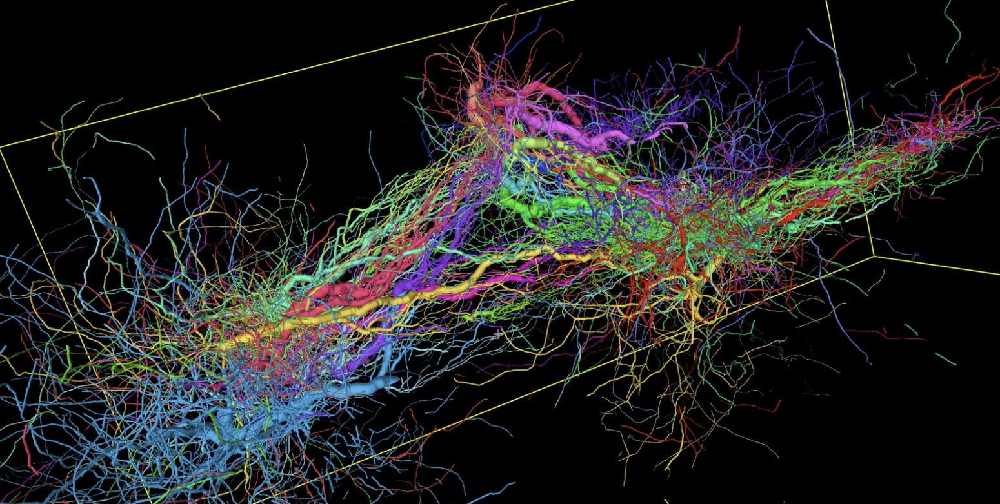
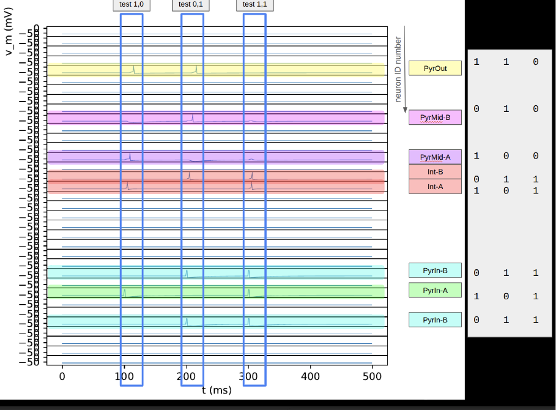
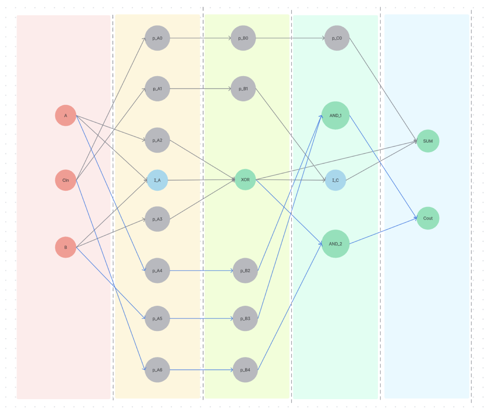

# Sponsorship

### About Us

At Carboncopies Foundation, we are at the forefront of computational neuroscience, pioneering technologies and methodologies to reconstruct the brain from scanned data. Our goal is not only to advance our understanding of the brain but also to contribute to disease research, the development of biologically inspired AI, and potentially achieve full brain emulation.

!!! note "Sample biological neural network "grown" in our software platform"
    

### Why Support Us?

By sponsoring Carboncopies, you will be directly contributing to cutting-edge research that has the potential to revolutionize our understanding of the brain and its functions. Your support will provide us with the necessary compute power to process and analyze complex neural data, enabling breakthroughs in:

=== "Disease Research"
    In the future, our platform's focus on brain emulation could offer unprecedented insights into the mechanisms of neurological diseases. By enabling the creation of detailed and functional models of brain structures and functions, it could allow researchers to simulate disease processes within brain tissues and observe their effects on neural circuits. This capability has the potential to lead to improved diagnostic tools, facilitating earlier and more accurate identification of neurological conditions. Understanding the details of what's going on in brain tissue could help combat brain diseases by providing a clearer picture of disease mechanisms.  

    Additionally, the platform could aid in the development of new treatments by providing a virtual environment to test therapeutic interventions. This might significantly reduce the time and cost associated with clinical trials in the future.

=== "Biologically Inspired AI"
    In the future, our platform's focus on brain emulation, informed by the brain's computational principles, could enable the development of AI systems that mimic human neural processes. This approach, known as neuromorphic engineering, could facilitate the creation of AI systems that are not only more efficient but also capable of learning and adapting in ways similar to biological brains. By leveraging insights from brain function and understanding detailed brain mechanisms, the platform could inform the development of advanced AI architectures. These architectures could process information akin to human cognition, leading to breakthroughs in adaptive learning and problem-solving capabilities.  

    The potential for human-AI interaction is immense, with biologically inspired AI systems capable of more natural and intuitive interactions with humans. This could lead to advancements in fields such as robotics, healthcare, and personalized assistants, where AI needs to understand and respond to human behavior and emotions.

=== "Brain Emulation"
    In the future, our platform's focus on brain emulation aims to achieve a comprehensive understanding of brain function by allowing researchers to explore how different regions of the brain interact and contribute to cognitive processes. By enabling the creation of detailed emulations of brain structures and observing brain tissue in action, it could offer unprecedented insights into human cognition and consciousness, potentially revolutionizing our understanding of the mind.  

    Emulating the brain through the platform could facilitate integration with other cutting-edge technologies, such as brain-computer interfaces and advanced neural prosthetics. This integration might lead to new therapeutic devices and technologies that restore or enhance brain function in the future.  

    Furthermore, brain emulation could open the door to future applications such as advanced neural prosthetics and novel brain-computer interfaces. These technologies have the potential to transform the lives of individuals with neurological disorders and injuries by restoring lost functions and improving quality of life in the future.

---

!!! note "Spike timing diagram generated by the platform"
    

### Collaborations

We are proud to collaborate with a range of prestigious institutions and organizations on our research initiatives, including but not limited to:

- U.Penn
- U.Oxford
- U.Melbourne
- U.Nottingham (Horizon Center)
- Brain Preservation Foundation
- Foresight Institute
- Janelia Research
- Allen Brain Institute
- Max Planck Institute (Juelich, Germany)
- EBRAINS (Human Brain Project)
- MIT Media Lab
- UCSC
- UC Berkeley
- USC (& Medical Center)

and many more. 

!!! note "Network topology of sample neural network in our platform"
    

### How Your Sponsorship Helps

We are currently seeking sponsors to help us secure the compute power needed to drive our platform forward. With your support, we can:

- Enhance our computational capabilities to handle larger and more complex datasets.
- Accelerate the development and training of our neural reconstruction systems.
- Expand our research initiatives and collaborations with leading experts in the field.

